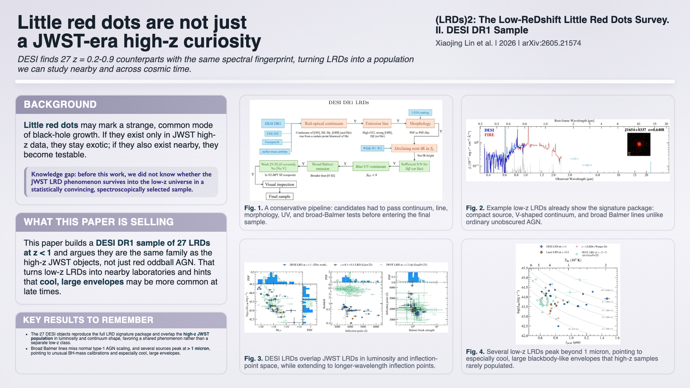

# coffee_break_poster

`coffee_break_poster` is a Codex skill that transforms an academic paper (either a local PDF or an arXiv doi weblink) into a concise, visually engaging poster optimized for coffee-break discussions. The output uses a 16:9 screen-friendly layout designed to quickly communicate the motivation, key results, and scientific significance of a paper to a broad astronomy audience.

Unlike traditional conference posters, the goal of `coffee_break_poster` is **not to overwhelm viewers with methodological details**. Instead, it aims to:

- Capture attention within ~30 seconds by highlighting the scientific background and knowledge gap (*why should people care?*);
- Communicate the central contribution within ~60 seconds (*what is the key selling point?*);
- Navigate the audience through the most important figures and conclusions within another ~60 seconds.

The idea for `coffee_break_poster` originated from the weekly astronomy coffee breaks at USTC, where discussions often benefit from a rapid visual summary rather than a full paper presentation.

Key features include:

- **Automatic paper ingestion** from local PDFs or arXiv sources;
- **PDF-to-Markdown and figure extraction** using [MinerU](https://mineru.net), producing AI-friendly text and image assets for LLM summary;
- **Figure-centered scientific summarization**, following the figure-driven reading style common in astrophysics;
- **Screen-adapted 16:9 poster layouts**, inspired by the MPIA [arxiv_display](https://github.com/mpi-astronomy/arxiv_display) project;
- **Iterative text and figure resizing** to avoid overflow and for balanced visual composition, inspired by [posterly](https://github.com/Chenruishuo/posterly/tree/main/).

The resulting poster is intended to serve as a conversation starter: a compact visual advertisement for a paper that encourages discussion, collaboration, and deeper exploration of the underlying science.


# Showcase

Example skill call:

```codex
$coffee_break_poster make a coffee-break poster for https://arxiv.org/abs/2605.21574
```

This produces a paper-specific work directory under `work/`, for example `work/arxiv-2605-21574/`, and renders a preview poster such as:




The poster is built around a few fixed ingredients:

- one 16:9 screen
- a compact text column on the left
- `2-4` figures on the right
- text blocks for `Background`, `Knowledge gap`, `What this paper is selling`, and `Key results to remember`

Typical outputs in the work directory include:

- extracted paper text and figures
- `poster.html`
- `layout.json`
- `poster_preview.png`
- `poster.pdf`


# Installation and Configuration

Install the repository locally:

```bash
git clone https://github.com/USTC-Astro/coffee_break_poster.git ~/.codex/skills/coffee_break_poster
cd ~/.codex/skills/coffee_break_poster
python -m pip install .
```

This makes the skill available to Codex and also installs the underlying helper CLI used beneath the skill.

Install Chromium once for layout checks and rendering:

```bash
python -m playwright install chromium
```

If you are developing on the toolchain itself, install the editable dev environment:

```bash
python -m pip install -e .[dev]
```

## MinerU configuration

For PDF and arXiv inputs, `coffee_break_poster` relies on MinerU to convert the paper into AI-friendly Markdown and figure assets. To enable that path, create a local config file:

```bash
cp config.yaml config.local.yaml
```

Then edit `config.local.yaml` and fill in your MinerU settings:

- `mineru.endpoint`: local MinerU service endpoint, default `http://localhost:8000`
- `mineru.cloud_url`: MinerU cloud API base URL
- `mineru.api_key`: your MinerU cloud API key

Environment variables still override local config:

- `MINERU_ENDPOINT`
- `MINERU_CLOUD_URL`
- `MINERU_API_KEY`

If you only work from an existing MinerU-style directory that already contains `paper.md` and `images/`, you do not need a MinerU API key.

# Usage

The normal way to use this project is to call the skill directly from Codex.

Example:

```codex
$coffee_break_poster make a coffee-break poster for https://arxiv.org/abs/2605.21574
```

You can also point it to a local PDF or an existing MinerU-style paper directory:

```codex
$coffee_break_poster turn ~/papers/my-paper.pdf into a one-screen coffee-break poster
```

```codex
$coffee_break_poster make a poster from ./my_paper_dir, keep the best 2-3 figures, and save outputs under work/
```

After a successful run, you should expect a paper-specific work directory under `work/<paper_slug>/` containing:

- extracted paper text and figures
- `poster.html`
- layout check output
- rendered preview files such as `poster_preview.png` and `poster.pdf`

## Supported inputs

The skill can work from four input shapes:

1. a MinerU-style directory containing `paper.md` and `images/`
2. a local `.pdf`
3. an arXiv identifier or link such as `2401.01234`, `arxiv:2401.01234`, `https://arxiv.org/abs/2401.01234`, or `https://doi.org/10.48550/arXiv.2401.01234`
4. a direct PDF URL

# Working Principle

Under the skill, `coffee_break_poster` runs a mixed deterministic + agent workflow.

## 1. Normalize the paper

The underlying tools first normalize the input into a working paper directory. For PDF and arXiv inputs, MinerU converts the paper into AI-friendly Markdown and extracts figure assets. For an existing MinerU-style directory, the skill reuses the provided `paper.md` and `images/`.

The normalized work directory typically contains:

- `paper.md`
- `images/`
- `source.json`
- later, `poster.html`, `layout.json`, and rendered previews

## 2. Inspect what was extracted

The deterministic inspection step inventories:

- paper title and section structure
- referenced figures and image files
- basic dimensions and candidate figure inventory

This gives Codex the raw material for figure choice and poster design, but it does **not** decide the scientific story on its own.

## 3. Build the scientific story

Codex then reads only the parts of the paper that matter for a coffee-break poster, usually:

- the abstract
- the conclusion / summary
- the local context around the strongest figures

At this stage, the skill makes the editorial decisions that the deterministic tools cannot make:

- what the real take-away is
- why a broad astronomy audience should care
- which `2-4` figures are worth remembering
- how to phrase the `Background`, `Knowledge gap`, `What this paper is selling`, and `Key results to remember` blocks

## 4. Scaffold and revise the poster

The toolchain scaffolds a starter `poster.html` in a 16:9 figure-first layout. Codex then edits that file directly, replacing placeholders with the actual scientific narrative and swapping in the chosen figures and captions.

The default layout uses four figure slots in a 2x2 grid. For three-figure posters, use the dedicated hero layout instead of leaving a 2x2 slot empty:

```bash
cbp scaffold PAPER_DIR --figure-count 3
```

That layout gives the strongest figure a full-width hero panel above two supporting figures, preserving the figure-forward emphasis without wasting space.

The layout is usually refined iteratively:

- shorten or tighten text when a card overflows
- swap figures if a panel is too weak or too dense
- adjust title, subtitle, and caption length
- rebalance text versus figure space until the whole poster fits on one screen

## 5. Check and render

Finally, the deterministic layout checker measures whether the poster fits cleanly. If there is overflow, clipped content, collapsed grid regions, or broken figure usage, Codex revises the poster and reruns the check.

```bash
cbp check PAPER_DIR/poster.html --json-out PAPER_DIR/layout.json
cbp diagnose PAPER_DIR/poster.html
cbp render PAPER_DIR/poster.html --png --pdf
```

`cbp render` runs the layout check first and refuses to overwrite preview outputs when the poster fails. `--force` is available only for debugging.

In short:

- the CLI/tool layer handles ingestion, inspection, checking, and rendering
- the skill/Codex layer handles scientific judgment, figure choice, writing, and layout iteration

That split is intentional: the mechanics are reproducible, while the poster quality depends on editorial choices that need an agent.

## Manual toolchain

Most users do not need the underlying CLI directly. It exists for debugging, development, and deterministic sub-steps beneath the skill. If you need it, the entrypoint is `cbp`.

## Repository layout

- `tools/`: deterministic CLI implementation and helpers
- `templates/`: HTML poster templates
- `examples/`: sample MinerU-style input
- `tests/`: regression tests for ingest, config, scaffold, and check behavior
- `work/`: generated local outputs
- `SKILL.md`: Codex skill instructions and editorial guidance

## Development and testing

Run the test suite with:

```bash
pytest
```

Useful checks while iterating on the toolchain:

```bash
cbp --help
cbp inspect examples/mineru_sample --json
cbp build examples/mineru_sample --workdir work
cbp diagnose work/<paper_slug>/poster.html
```

## Notes

- `config.local.yaml` is intentionally ignored by git because it can contain local endpoints and API keys.
- `config.yaml` is only a committed sample file. Copy it to `config.local.yaml` before editing.
- The scaffolded `poster.html` is a starting point, not a final product. Expect to rewrite text, pick figures, and rerun `cbp check` until the layout is clean.
