# (LRDs)2: The Low-ReDshift Little Red Dots Survey. II. DESI DR1 Sample

Xiaojing Lin ,1 Xiaohui Fan ,2 Zheng Cai ,1 Yichen Liu ,2 Fengwu Sun ,3 Fuyan Bian ,4, 5 Mingyu Li , Junjie Mao ,1 Jenny E. Greene ,6 Hanpu Liu ,6 Jiaxuan Li (李嘉轩) ,6 Weizhe Liu (刘伟哲) ,2 Yilun Ma ( 逸伦) ,6 ZeChang Sun ,1 and Zijian Zhang 7, 8

1Department of Astronomy, Tsinghua University, Beijing 100084, China 2Steward Observatory, University of Arizona, 933 N. Cherry Ave., Tucson, AZ 85721, USA 3Center for Astrophysics | Harvard & Smithsonian, 60 Garden St., Cambridge, MA 02138, USA 4European Southern Observatory, Alonso de C´ordova 3107, Casilla 19001, Vitacura, Santiago 19, Chile 5Chinese Academy of Sciences South America Center for Astronomy, National Astronomical Observatories, CAS, Beijing 100101, China 6Department of Astrophysical Sciences, Princeton University, 4 Ivy Lane, Princeton, NJ 08544, USA 7Kavli Institute for Astronomy and Astrophysics, Peking University, Beijing 100871, China 8Department of Astronomy, School of Physics, Peking University, Beijing 100871, China

(Received XXX; Revised YYY; Accepted ZZZ)

Submitted to ApJ

## ABSTRACT

JWST has revealed a substantial population of “Little Red Dots” (LRDs) at z > 4, challenging conventional AGN frameworks. However, the low-redshift regime remains largely unexplored. In the second paper of the (LRDs)2 series, we present a systematic selection from DESI DR1 and identify 27 LRDs at z = 0.2–0.9, yielding a number density lower limit of $7 . 5 \times 1 0 ^ { - 1 0 } \mathrm { c M p c ^ { - 3 } }$ . We conducted near-IR spectroscopic follow-up observations for 18 of them, revealing their full SED shapes and emission lines. These low-z LRDs share the hallmark properties of their high-z counterparts: compact morphology, V-shaped UV-optical continua, broad Balmer emission with extreme decrements (median Hα/Hβ ∼ 16), frequent Balmer absorption (67%), and blackbody-like optical-to-near-IR continua. All have low metallicity, occupy the same regions in the BPT diagram as high-z LRDs, and have softer ionizing spectra than typical AGNs. The consistency between low-z and high-z LRD properties indicates the same physical processes at work. The correlation between broad-line Balmer luminosity and L5100 deviates from that of local type-1 AGNs, limiting the direct application of local BH mass calibrations. Ionized [O III] outflows are ubiquitous (78%). One LRD at z = 0.196, J1717+3807, shows robust long-term variability in i and WISE bands. The optical-to-NIR continua of LRDs reveal a wide range of temperatures ∼2000–4700 K (peak 0.6–1.5 µm), with a subset showing cooler and larger envelopes than those at high z. Low-z LRDs serve not only as proximate laboratories for probing the nature of LRDs, but also trace the cosmic evolution of this population from the cosmic dawn to the present day.

Keywords: high-redshift — active galactic nuclei — black holes

## 1. INTRODUCTION

“Little Red Dots” (LRDs), first identified at z > 4 during early JWST operations (e.g., I. Labbe et al. 2025; J. Matthee et al. 2024; J. E. Greene et al. 2024), have emerged as one of the most intriguing and puzzling discoveries in recent years. These sources exhibit compact morphologies and broad Balmer emission lines with FWHMs exceeding 1000 km s−1, which likely originate from broad-line regions (BLRs) in the vicinity of black holes (BHs) in the galactic nuclei (e.g., J. Matthee et al. 2024; X. Lin et al. 2024, 2025; J. Zhang et al. 2025; D. D. Kocevski et al. 2025; R. E. Hviding et al. 2025). They also show unusual V-shaped spectral energy distributions (SEDs), characterized by blue UV continua and red optical continua (e.g., J. E. Greene et al. 2024;

L. J. Furtak et al. 2024), declining near-infrared continua (e.g., P. G. P´erez-Gonz´alez et al. 2024; H. B. Akins et al. 2024; D. J. Setton et al. 2025), frequent Balmer ab sorption superimposed on the broad emission lines (e.g., X. Lin et al. 2024; D. D. Kocevski et al. 2024), and, in some cases, extremely strong Balmer breaks that cannot be explained by normal stellar populations (e.g., D. J. Setton et al. 2024; B. Wang et al. 2024; A. de Graaff et al. 2025a; R. P. Naidu et al. 2025). Together, these enigmatic properties have sparked intense debate on the physical nature of this population. LRDs constitute a significant fraction of the galaxy population at high-redshift (X. Lin et al. 2024, 2025; J. Zhang et al. 2025). Their number densities are 10–100 times higher than the faint-end extrapolations of the high-z quasar luminosity function at $z \gtrsim 5 ( \mathrm { e . g . }$ , V. Kokorev et al. 2024; D. D. Kocevski et al. 2025; H. B. Akins et al. 2024). If LRDs are truly powered by BHs, they must represent a common and distinct phase of BH growth in the early Universe.

The distinctive features observed in the UV–optical spectra of LRDs have motivated extensive multiwavelength follow-up observations. These studies further re veal that LRDs differ markedly from previously known AGNs. LRDs are generally faint in the mid and far infrared (H. B. Akins et al. 2024; P. G. P´erez-Gonz´alez et al. 2024; C. C. Williams et al. 2024), submillimeter (C. M. Casey et al. 2024, 2025; D. J. Setton et al. 2025), X-ray (M. Yue et al. 2024; T. T. Ananna et al. 2024; A. Sacchi & A. Bogd´an´ 2025), and radio (G. Mazzolari et al. 2024; K. Perger et al. 2025), and most show little variability on rest-frame timescales of months (M. Kokubo & Y. Harikane 2024; Z. Zhang et al. 2025a; Z. Liu et al. 2026). Only a small fraction exhibits detectable variability, either on year-long or even century-long timescales (W. L. Tee et al. 2025; L. J. Furtak et al. 2025; X. Ji et al. 2025a; Z. Zhang et al. 2025b). Significant efforts have also been devoted to constraining their total bolometric luminosities (J. E. Greene et al. 2025), host-galaxy properties (e.g., C.-H. Chen et al. 2025; Y. Zhang et al. 2025; W. Q. Sun et al. 2026), and halo masses (e.g., J. Arita et al. 2025; M. Carranza-Escudero et al. 2025; E. Pizzati et al. 2025; J. Matthee et al. 2025; X. Lin et al. 2026a). Current evidence suggests that these quantities are modest compared to those of quasars at similar redshifts. One of the most debated topics concerns BH mass measurements. It remains uncertain whether scattering in dense gas contributes to the broadening of the Balmer lines (V. Rusakov et al. 2025; M. Brazzini et al. 2025; S.-J. Chang et al. 2026), and whether empirical single-epoch relations can reliably estimate BH masses (typically yielding $1 0 ^ { 6 } - 1 0 ^ { 9 } \ M _ { \odot } )$ . All of these issues are crucial for uncovering the nature of the central engine in LRDs.

To explain the puzzling observed properties of LRDs, a variety of theoretical models have been proposed. Early interpretations invoked ultra-massive host galax ies (I. Labbe et al. 2024), dusty AGNs (D. D. Kocevsk et al. 2024; J. E. Greene et al. 2024; Z. Li et al. 2025), or young nuclear stellar clusters (J. F. W. Baggen et al. 2024; M. Carranza-Escudero et al. 2025). More recent models explore accretion disks that emit blackbody-like continua (K. Inayoshi et al. 2025b; L. Zwick et al. 2025; C. Zhang et al. 2026; Y.-X. Chen et al. 2026) or BHs embedded in dense gas. The latter scenario has evolved rapidly, from a simple dense shell of hydrogen gas in front of an AGN (K. Inayoshi & R. Maiolino 2024; X. Ji et al. 2025a), to a cocoon-like or atmosphere-like en velope that enshrouds BHs (V. Rusakov et al. 2025; D. Kido et al. 2025; H. Liu et al. 2025; K. Inayoshi et al. 2025a; Y. Asada et al. 2026), often referred to as a “BHstar” (R. P. Naidu et al. 2025; A. de Graaff et al. 2025b), and further to clumpy envelope structures (M. Tang et al. 2026; X. Ji et al. 2026). Many theoretical studies interpret LRDs as undergoing super-Eddington accretion, representing a crucial phase in the growth of su permassive BHs (e.g., F. Pacucci & R. Narayan 2024; H. Liu et al. 2025; D. D. Vaida & R. J. Farber 2025; M. C. Begelman & J. Dexter 2026; P. Madau & R. Maiolino 2026).

With extensive JWST observations of z > 4 LRDs now accumulated, in-depth demographic analyses are underway to characterize their population-level prop erties (e.g., G. Barro et al. 2025; A. de Graaff et al. 2025b; P. G. P´erez-Gonz´alez et al. 2026). At the same time, searches for LRDs at cosmic noon and lower redshifts have yielded significant new discoveries. System atic searches using wide-field imaging surveys from both space and the ground have provided strong constraints on the LRD luminosity function and number density from z = 5 down to $z \sim 1$ (Y. Ma et al. 2025a,b; L. Bisigello et al. 2025). The discovery of local LRDs at $z \lesssim 0 . 3$ suggests that the conditions giving rise to LRDs, while rare in the local Universe, are not exclusive to the early Universe (R. Lin et al. 2025; X. Lin et al. 2026b; X. Ji et al. 2025b). Thanks to their proximity and brightness, these local systems enable observations that are challenging to obtain at high redshift, including high resolution spectroscopy spanning the full UV-to-mid-IR wavelength range, as well as resolved emission-line profiles and absorption features that directly probe the structure and physical conditions of the circum-BH environment. Transition-phase candidates that may bridge LRDs and conventional UV-luminous AGN have been identified at $z \sim 3 .$ though their interpretation remains debated (S. Fu et al. 2025; R. E. Hviding et al. 2026). Most recently, two cosmic noon LRDs have been reported to exhibit water absorption features, indicating cool BH envelopes $( \lesssim 3 0 0 0 { - } 4 0 0 0 ~ \mathrm { K } )$ and motivating the development of new theoretical models (B. Wang et al. 2026a).

All these low-z advances begin to reveal substantial diversity within the LRD population, spanning a wide range of SED shapes, BH envelope temperatures, and host-galaxy environments. These findings extend beyond what current theoretical frameworks have anticipated. They also open a unique window into the cosmic evolution of LRDs. Only by tracing their properties from $z > 6$ to $z \sim 0$ can we determine whether LRDs represent a transient yet universal phase of BH growth, how the physical conditions in their circum-BH environments evolve with cosmic time, and whether they eventually transition into conventional AGNs. However, the current low-z sample remains small. Most low-z LRDs in the JWST archive and those selected and confirmed from wide-field surveys lie at $z \ = \ 2 { - } 3$ (I. Juodˇzbalis et al. 2024; Y. Ma et al. 2025a; F. Loiacono et al. 2025; B. Wang et al. 2026a). Only a few LRDs are reported at $z < 0 . 5$ (R. Lin et al. 2025; X. Lin et al. 2026b; X. Ji et al. 2025b; K. Park et al. 2026). Some other low-z AGNs exhibiting partially LRD-like features have been proposed as LRD analogs (e.g., W. Ding et al. 2026; L. Bao et al. 2026), but several of their properties still differ markedly from those of JWST LRDs (e.g., morphology and emission-line properties). Expanding the low-z sample, particularly at $z < 2$ with characteristics fully consistent with those of JWST-discovered LRDs, is therefore crucial for bridging the gap between the local and high-redshift Universe.

This series of papers aims to conduct LowReDshift LRD surveys $( L R D s ) ^ { 2 }$ with systematic follow-up observations. In Paper I, X. Lin et al. (2026b) conducted pilot studies on a small sample of SDSS-selected local LRDs. Built upon Paper I, we aim to construct a wellcharacterized sample of low-z LRDs that captures the diversity and demographics of this population, complementing the rich high-z JWST LRD archive. Our goal is to characterize the cosmic evolution of LRDs, revealing their nature and the growth pathways of their BHs. As demonstrated by the SDSS selection in Paper I, it is highly efficient to select samples from existing large spectroscopic databases with additional SED constraints from wide-field imaging surveys from near-UV to near-IR, e.g., GALEX (L. Bianchi et al. 2017), Legacy Survey (A. Dey et al. 2019), WISE (E. L. Wright et al. 2010), etc. In addition to SDSS, the Dark Energy Spectroscopic Instrument (DESI) provides another ideal opportunity ( DESI Collaboration et al. 2024; DESI Collabo ration 2025). DESI is a five-year spectroscopic redshift survey conducted on the Mayall 4-meter telescope at Kitt Peak National Observatory. As the largest cosmological spectroscopic survey currently underway, DESI aims to target millions of galaxies, quasars, and stars to study dark energy and the expansion history of the Universe. DESI’s extensive spectroscopic database, covering optical wavelengths from 3600 to 9825 ˚A with high spectral resolution $( R = 2 0 0 0  – 5 5 0 0 )$ , is well suited for the selection of LRDs at $z < 1$ . Although DESI covers the optical continuum and emission lines, it does not capture the full optical–near-IR continuum shape, which is crucial for diagnosing blackbody-like emission in BH envelope models. We therefore conducted systematic near-IR follow-up spectroscopy to characterize the near-IR continuum and access key emission lines not covered by DESI. This is particularly important for LRDs at $z > 0 . 5$ , where Hα is redshifted beyond the DESI wavelength range and falls within the near-IR spectral coverage.

In this paper, we present our selection from the DESI $\mathrm { D R 1 ^ { 9 } }$ spectral database and introduce the first sample of 27 LRDs at $z ~ = ~ 0 . 2 – 0 . 9 .$ We conducted follow-up near-IR observations for 18 of them using LBT/LUCI, Magellan/FIRE, and Keck/NIRES, complementing their DESI optical spectra. The observing campaign is ongoing for the remaining targets. The paper is organized as follows. In Section 2, we present the datasets used in this work. In Section 3, we describe the selection criteria applied to DESI DR1, which yields 27 LRDs. In Section 4, we describe the near-IR follow-up observations. We outline the measurement methodology for the selected LRDs in Section 5, and in Section 6, we present their properties. In Section 7, we briefly discuss the implications of our results. More detailed analyses and physical modeling will be presented in future work. Throughout this paper, we adopt the AB magnitude system for all photometry. All wavelengths and line identifications are given in the vacuum frame. All equivalent widths (EWs) are reported in the rest frame. $L _ { 5 1 0 0 }$ is defined as the monochromatic luminosity $\lambda L _ { \lambda }$ evaluated at rest-frame 5100 ˚A. We adopt the cosmological parameters from Planck Collaboration et al. (2020).

## 2. DATA

## 2.1. DESI DR1

We refer to DESI Collaboration (2025) for details on DR1. In brief, DESI DR1 includes more than 18 million spectra of galaxies, quasars, and stars from its Main Survey observations between May 2021 and June 2022, along with 1.6 million from the Survey Validation program. In total, DR1 yields about 16 million extragalactic objects over $9 7 0 0 \mathrm { d e g ^ { 2 } }$ DESI’s spectra cover 3600–9825 ˚A at a resolution of $R = 2 0 0 0 { - } 5 5 0 0$ . Notably, at wavelengths $\lambda \gtrsim 6 0 0 0 \mathrm { \AA }$ , DESI achieves R > 4000. The high spectral resolution enables it to clearly resolve not only the emission line profiles but also the Balmer absorption features in LRDs.

In addition to the reduced spectra, DR1 also releases emline catalogs as an accompanying product of the pipeline. The emline catalog contains Gaussian fits to the major emission lines. DR1 also includes a set of value-added catalogs. Among these, the FastSpecFit Spectral Synthesis and Emission-Line Catalog10 (J. Moustakas et al. 2023, hereafter Fast-SpecFit) and Stellar Mass and Emission Line Catalog11 (H. Zou et al. 2024, hereafter stellar-massemline) provide modeled continua and emission line measurements. In the FastSpecFit catalog, the fitting is performed by FastSpecFit, a stellar continuum and emission-line modeling code that uses stellar pop ulation synthesis and emission-line templates to jointly model DESI optical spectrophotometry and ultravioletto-infrared broadband photometry. In the stellarmass-emline catalog, emission lines are measured by single Gaussian fits, with absorption correction through continuum fitting performed by starlight12. In the following selection, we use the emission line fits in the three catalogs, emline, FastSpecFit, and stellarmass-emline, to pre-select candidates. However, we note that these codes are designed for simplicity and speed rather than for precise spectral modeling. In particular, for populations such as LRDs, whose physical nature is still poorly understood, the modeled spectra are inaccurate, and discrepancies between the modeled and observed spectra are always present. For our survey, the DESI pipeline fits are used only for the initial selection. All spectral properties are re-measured and re-fitted using more tailored approaches, as described in Section 5.

## 2.2. Photometry

We compile photometric data from the following widefield sky surveys: FUV and NUV from GALEX DR6 (L. Bianchi et al. 2017); ugriz PSF photometry from SDSS DR17 (K. N. Abazajian et al. 2009; Abdurro’uf et al. 2022); grizy PSF photometry from Pan-STARRS DR2 (H. A. Flewelling et al. 2020); $G , G _ { \mathrm { B P } } .$ , and $G _ { \mathrm { R P } }$ mean photometry from GAIA DR3 ( Gaia Collabora tion et al. 2023); griz model photometry from Legacy Surveys DR10 (A. Dey et al. 2019) where PSF models are used for the three objects; Y JHK PSF photometry from UKIDSS DR11PLUS (A. Lawrence et al. 2007); and W1, W2, W3, W4 photometry from WISE (E. L. Wright et al. 2010). PSF photometry is adopted when available, as all DESI DR1 LRDs are compact and unresolved in ground-based imaging. GALEX photometry is taken from the GUV catalog (L. Bianchi 2020), while WISE photometry is incorporated into the Legacy Survey catalog based on unWISE images (E. F. Schlafly et al. 2019). All other data are retrieved from Astro Data $\mathrm { L a b ^ { 1 3 } }$ (M. J. Fitzpatrick et al. 2014; R. Nikutta et al. 2020).

For the selected targets, we retrieve multi-epoch opti cal gri photometry from the Zwicky Transient Facility Data Release 24 (ZTF DR24; E. C. Bellm et al. 2019; F. J. Masci et al. 2019), which spans from 2018-03-21 to 2025-10-21 (∼7.6 yr baseline). We also obtain multiepoch WISE W1, W2 photometry from the AllWISE Multiepoch Photometry Database (R. M. Cutri et al. 2021) and the NEOWISE-R Single Exposure Source Ta ble (A. Mainzer et al. 2014), covering 2010 January – 2024 July (with a 2011 March – 2013 December hiber nation gap between the cryogenic AllWISE mission and the NEOWISE-Reactivation phase). For faint sources with low S/N in individual exposures, we retrieve forced photometry WISE light curves from the Legacy Survey, which are up to year 6 of NEOWISE Reactivation.

## 2.3. SPHEREx

SPHEREx is a 20 cm all-aluminum space telescope equipped with six linear variable filters that enable spectrophotometric imaging in 102 spectral channels span ning 0.75– $- 5 . 0 \mu \mathrm { m }$ across the full sky (J. J. Bock et al. 2026). SPHEREx features a wide, dichroic field of view of $3 . 5 ^ { \circ } ~ \times ~ 1 1 ^ { \circ }$ , a spatial resolution of $6 . 2 { ^ { \prime \prime } }$ per pixel, and spectral resolution of $R \ : = \ : 3 5 { - } 4 1$ at 0.75– 3.82 µm and $R \ = \ 1 1 0 { - } 1 3 0$ at 3.82–5.0 µm. We retrieve the SPHEREx spectrophotometry for our sample from the NASA/IPAC Infrared Science Archive (IRSA), where the spectra are extracted via PSF-weighted forced photometry. We cross-validate the SPHEREx spectra against existing near-infrared and WISE photometry. We retain only the SPHEREx spectrophotometry that is well consistent with the existing IR photometry. For SPHEREx spectrophotometry with low S/N, we bin the spectra using a flux-conserving method to achieve $\mathrm { S / N } > 5$ per binned channel.

## 3. SAMPLE SELECTION

## 3.1. Selection Guidelines for Low-z LRDs

We aim to select sources whose observed characteristics strictly match those of the majority of high-z LRDs. Our selection prioritizes high completeness and efficiency for objects with observed properties fully consistent with representative JWST LRDs. It may exclude the most extreme or atypical LRDs, as well as transitional systems that share only part of the typical LRD characteristics. The resulting low-redshift sample serves as a laboratory for investigating the physical conditions that give rise to the LRD phenomenon. The empirical criteria defining LRDs are summarized below.

First, we require the selected objects to satisfy the defining characteristics of LRDs (e.g., J. E. Greene et al. 2024; R. E. Hviding et al. 2025):

• Broad Balmer emission lines;

• Compact morphology in the rest-frame optical;

• A V-shaped spectral energy distribution (SED), characterized by a blue UV continuum slope $( \beta _ { \mathrm { U V } } ~ < ~ 0 )$ and a red optical continuum slope $\left( \beta _ { \mathrm { o p t i c a l } } > 0 \right)$

We further include additional observational characteristics of LRDs, empirically concluded from the majority of high-z LRDs reported in the literature.

• The inflection point of the V-shaped continuum occurs near or redward of the Balmer break, and at any wavelength blueward of Hα.

This is empirically motivated by most high-z LRDs, as assembled in D. J. Setton et al. (2024); A. de Graaff et al. (2025b). A small fraction of LRDs show inflection points significantly redder than the Balmer limit, extending to ∼5000 ˚A (e.g., UNCOVER-A2744-20698, B. Wang et al. 2026b).

## • A declining rest-frame near-infrared continuum in fλ space.

This is motivated by the near-IR spectral shape of the majority of JWST LRDs, as revealed by either NIRSpec/Prism spectroscopy or NIRCam and MIRI photometry. Such a continuum shape has also motivated theoretical models invoking blackbody-like thermal emission to describe the overall SED.

## • Weak [N II] λ6585 emission.

This is motivated by the weak or undetected [N II] emission in high-z LRDs. The weakness of [N II] in LRDs likely results from low metallicity in the host galaxies or narrow-line regions. Motivated by the limited number of JWST LRDs with reported [N II] detections (R. Maiolino et al. 2024; I. Juodˇzbalis et al. 2024), we require selected sources to either have undetected [N II] emission or, if de tected, to lie within the galaxy/composite region of the [N II]-BPT diagram.

## • Negligible [Ne V] λ3427 emission.

This is motivated by the lack of strong high ionization lines in the rest-frame optical spectra of most high-z LRDs, and their ionizing spectra that are softer than those of typical type-1 AGNs and luminous quasars (X. Ji et al. 2025b; B. Wang et al. 2025). [Ne V], with an ionization potential of 97.1 eV, traces a very hard radiation field, typically associated with photons from the AGN accretion disk or corona. At the time of writing, [Ne V] has not been reported in LRDs. We thus exclude sources exhibiting [Ne V] emission.

The observational features described above guide the selection criteria adopted in this work. We note that relaxing any of the observational requirements above may introduce candidates that resemble, but are not fully consistent with, the bulk of high-z LRDs. For example, the X-ray Dot (R. E. Hviding et al. 2026) exhibits a Vshaped continuum with an inflection point around 2000 ˚A and has been proposed as an LRD in a transitional phase. Some V-shaped continuum sources with strong [N II] emission have been reported as LRD analogs (P. Rinaldi et al. 2025; W. Ding et al. 2026). Such systems have been proposed as transitional objects between LRDs and typical type-1 AGNs or luminous quasars, or as a later evolutionary stage of the LRD population. These subsets are beyond the scope of this work.

Furthermore, some high-ionization UV lines have been reported in deep JWST/NIRSpec spectra of LRDs (M. Tang et al. 2025, 2026; X. Ji et al. 2026). At the time of writing, the lines detected in LRDs with the high est ionization potential are N V λ1240 (77.5 eV) and [Ne IV]λλ2422, 2424 (63.5 eV), while [Ne V] λ3427 remains undetected (H. B. Akins et al. 2024; M. Tang et al. 2025, 2026). Although models invoking specific geometries of the circum–BH environment in LRDs may potentially explain high-EW [Ne V] emission (e.g., M. Tang et al. 2025, 2026; X. Ji et al. 2026), we do not include such sources in the final sample analyzed in this work. This subset is retained in the parent sample and excluded only at the final stage of selection. A detailed investigation of this subset is deferred to future studies.

## 3.2. Selection criteria

Guided by the criteria defined in Section 3.1, we begin our selection using DESI DR1. We first require objects to have $z > 0 . 0 0 1$ to exclude stars from the DR1 catalog. We then select objects with red optical continua and subsequently apply a selection based on strong emission lines. Both steps use the emline, FastSpecFit, and stellar-mass-emline catalogs. Next, we require the objects to exhibit PSF-like morphology. Finally, for the selected candidates, we perform manually refined, simplified fits to their spectra, requiring them to exhibit a blue UV continuum, broad Balmer emission, and weak [N II]. We summarize the selection procedure in Figure 1. Each step is described in detail below.

## 3.2.1. Red optical continuum criteria

In this step, we select candidates exhibiting a rising optical continuum that starts at any wavelength blueward of Hα. The red optical continuum selection criteria are summarized as follows:

• If Hα is present in the DESI spectrum:

(1) cont[O II] 3727 < contHδ < contHγ <   
cont[O III] 5008 < contHα; or

(2) cont[O II] 3727 > contHδ < contHγ <   
cont[O III] 5008 < contHα; or

(3) cont[O II] 3727 > contHδ > contHγ <   
cont[O III] 5008 < contHα; or

(4) cont[O II] 3727 > contHδ > contHγ >   
cont[O III] 5008 < contHα.

• If only Hβ is present in the DESI spectrum:

(1) cont[O II] 3727 < contHδ < contHγ <   
cont[O III] 5008; or

(2) cont[O II] 3727 > contHδ < contHγ <   
cont[O III] 5008; or

(3) cont[O II] 3727 > contHδ > contHγ <   
cont[O III] 5008.

Here, $\mathrm { c o n t } _ { [ \mathrm { l i n e } ] }$ denotes the continuum underlying the corresponding emission line. The continuum measurements are taken from the emline, FastSpecFit, and stellar-mass-emline catalogs. An object is consid ered to satisfy the above criteria if the estimates from either catalog meet the requirements.

In sequential comparisons, a single violation can be skipped. The comparison is instead performed between the adjacent continua, except in cases where there is only one single $\cdot _ { < } ,$ in the compound inequalities. For example, in case (1) for $\mathrm { H } \alpha ,$ if the condition con $\mathrm { t _ { H } } \delta < \mathrm { c o n t _ { H } } \gamma$ is not satisfied, we omit $\mathrm { c o n t } _ { \mathrm { H } \gamma }$ from the sequence. If the remaining ordering, cont[O II] 3727 < contHδ < cont[O III] 5008 ${ \bf \mathrm { < \ c o n t _ { H a } } }$ , is satisfied, the object is still considered to meet the criterion. This tolerance is in troduced to account for uncertainties in the continuum fitting, as the spectral modeling in the adopted pipelines and catalogs can be inaccurate. This tolerance also allows the blackbody peak to lie between [O III] 5008 and Hα.

## 3.2.2. Emission line criteria

We further require the objects to exhibit strong Balmer and [O III] emission lines. Specifically, objects must satisfy the emission-line criteria listed below in either the emline or FastSpecFit fits.

• Hα $\mathrm { E W } > 1 5 \mathrm { ~ \AA ~ }$ or Hβ EW > 5 ˚A

• Hα $\mathrm { S / N } > 5$ or Hβ S/N > 5;

• Hα flux $> 1 0 ^ { - 1 6 }$ erg s−1 cm−2 or Hβ flux $> 5 \times$   
$1 0 ^ { - 1 7 } \mathrm { { \ e r g \ s ^ { - 1 } \ c m ^ { - 2 } } } .$

• [O III] 5008 $\mathrm { E W } > 2 0 \mathrm { ~ \AA } ;$

• [O III] 5008 / [O II] 3727 (O32) > 5;

The criteria on Hα or Hβ ensure that the objects exhibit strong Balmer emission lines, thereby excluding quiescent galaxies that naturally show strong Balmer breaks or red optical continua. The criteria on [O III] EW and O32 further exclude post-starburst galaxies and AGNs hosted by old stellar populations. The threshold values adopted for the criteria above are determined through iterative optimization, aiming to be inclusive given the limited modeling power of the available catalogs.

Requiring strong [O III] emission introduces an inherent selection bias. JWST-discovered LRDs with extreme Balmer breaks, exceeding those of normal stellar popu lations, are found to exhibit very weak [O III] emission (e.g., the Cliff (A. de Graaff et al. 2025a); A2744-QSO1 (L. J. Furtak et al. 2024); MoM-BH∗-1 (R. P. Naidu et al. 2025)) and are therefore excluded by this criterion. The emission-line selection strategy is optimized for the large data volume of DESI DR1, balancing computational efficiency with the level of human inspection required. LRDs with extremely strong Balmer breaks are more efficiently identified through dedicated Balmerbreak–based selections, which are beyond the scope of this paper and will be addressed in future work.

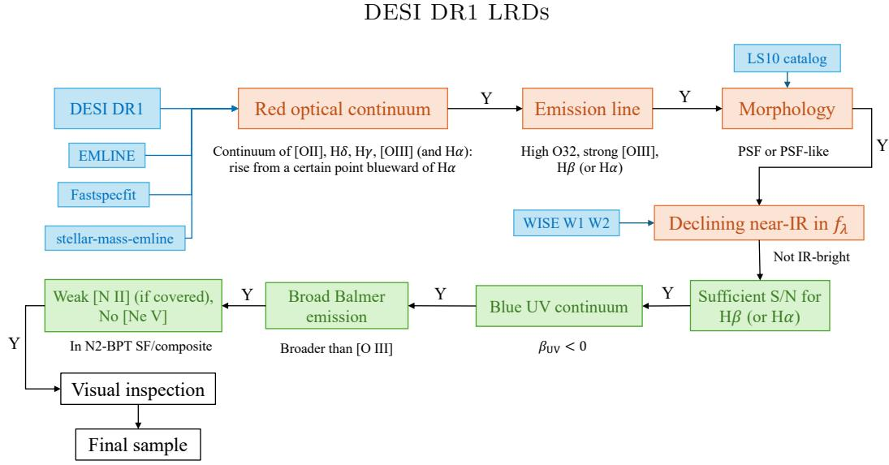  
Figure 1. Flowchart of the LRD selection process in DESI DR1. Blue boxes show input datasets, and orange and green boxes indicate each selection criterion (Section 3). Objects must satisfy each criterion $( \mathbf { \Sigma ^ {  } Y ^ { \prime \prime } } )$ to proceed to the next step.

## 3.2.3. Morphological criteria

For objects that satisfy the red optical continuum and strong emission line criteria described above, we retrieve their morphological information from Legacy Survey DR10.

We select PSF-like sources following the quasar selection procedure in E. Chaussidon et al. (2023). We first select objects classified as PSFs in the Legacy Sur vey catalog. To account for uncertainties in groundbased observations and morphological fitting, we also accept objects that are photometrically classified as extended but exhibit a small relative difference between the PSF and extended morphological models $\left( \Delta \left( \chi ^ { 2 } \right) / \chi ^ { 2 } < 0 . 0 1 5 \right)$

## 3.2.4. Near-IR criteria

For objects that satisfy the criteria above, we obtained their WISE W1 and W2 photometry from the Legacy Survey catalog, which includes unWISE measurements. We require that the W1 and W2 flux densities in fλ space lie below the reddest continuum level of their DESI spectra. This step effectively filters out WISE-bright sources. For sources undetected in WISE, we retain them in the sample and pass them on to subsequent selection steps. If they satisfy all subsequent criteria, they will be examined in a final visual inspection step to assess whether their rest-frame optical-to-near-IR SEDs exhibit blackbody-like shapes.

Up to this stage, all selections are based on publicly available catalogs. From DESI DR1, we identify approximately 16,000 targets at z < 1 with Hα or Hβ covered by DESI, and exhibiting red optical continua, strong emission lines, and compact morphology.

## 3.2.5. Criteria on UV continuum, broad lines and $\textit { \textbf { / N I I } }$

For the candidates selected above, we perform a refined selection by applying simplified fits to their DESI spectra.

First, we re-compute the S/N of Hα or Hβ by directly integrating the line flux in the reduced spectra, requiring an $\mathrm { S / N } > 1 5$ for the integrated flux within 4000 km $\mathrm { s } ^ { - 1 }$ This measurement, independent of the overall spectral modeling, provides an additional constraint beyond the relaxed emission-line requirements in Section 3.2.2.

We then apply median filtering to derive the restframe continuum blueward of 3500 ˚A. We require objects to have a UV continuum slope < 0 at rest-frame <3500 ˚A.

Thirdly, we compare the line profile of Hβ or Hα to that of [O III] 5008. We require the Balmer lines to exhibit significant, independent broad components relative to [O III] λ5008, with a single-component FWHM $> 1 0 0 0 \ \mathrm { k m \ s ^ { - 1 } }$ This criterion excludes compact, Vshaped emission-line galaxies that exhibit strong broad outflow components in both [O III] and Balmer lines, but whose Balmer lines do not display distinct broad components indicative of BLRs.

Finally, we apply a cut on [N II] λ6585 and Hα when Hα is within the spectral coverage. If [N II] is detected, we require that the source lie within the star-forming or composite region of the [N II]–BPT diagram (J. A. Baldwin et al. 1981). We further require non-detection or absence of [Ne V] λ3427 emission.

After applying the selection criteria described above step by step, we visually inspect the remaining objects

H

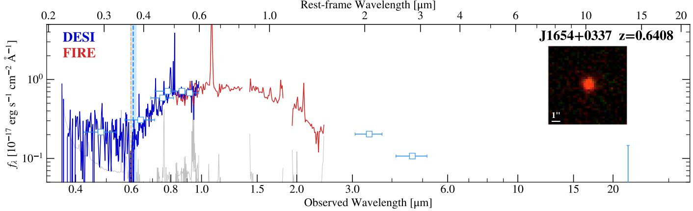

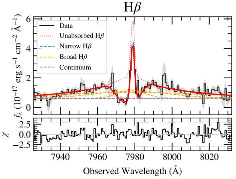

[O III]  
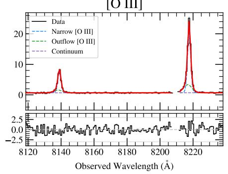

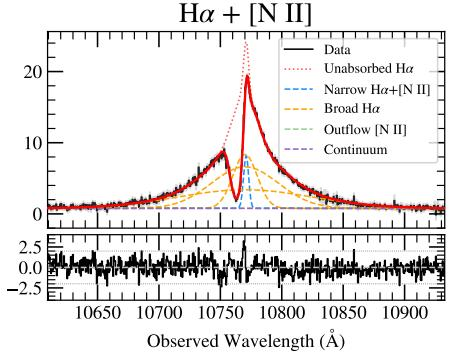

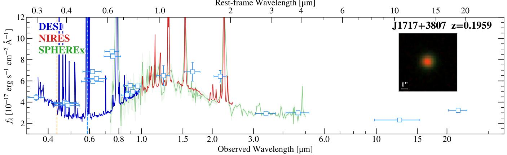

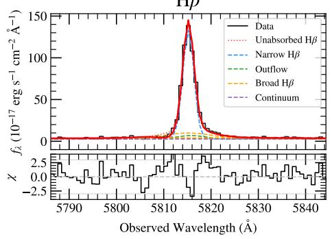

[O III]  
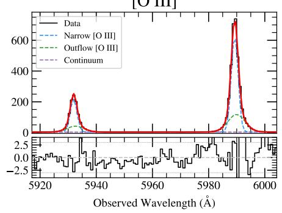

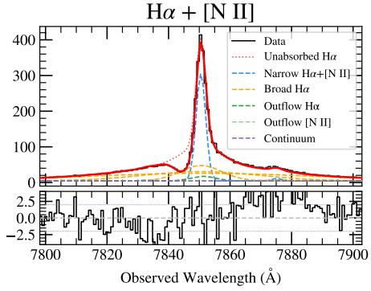  
Figure 2. Example DESI DR1 LRDs presented in this work. The top panel shows the overall SEDs, with the smoothed DESI spectra plotted as blue lines and the photometry as blue squares. The gray lines indicate the spectral uncertainties. The orange dashed lines mark the Balmer-limit wavelengths, and the blue dashed lines indicate the inflection-point wavelengths. The bottom panel shows the Hβ [O III]λλ 4960, 5008 and Hα line profiles, with the red curves denoting the best-fit total models and the dashed lines representing the best-fit individual components.

$( N \sim 5 0 0 0 )$ , excluding those with poor fits or noisy spectra, and ensure that their rest-frame near-IR continuum is consistent with a declining shape. For sources that cannot be reliably classified by visual inspection (e.g., $\beta _ { \mathrm { o p t i c a l } } \sim 0 )$ , we perform refined continuum fitting (see Section 5.1) and select objects with robust $\beta _ { \mathrm { U V } } < 0$ and $\beta _ { \mathrm { o p t i c a l } } > 0$

## 3.3. Final Sample

In the end, we obtain 27 objects that satisfy all defi nitions and selection criteria of LRDs at high confidence levels. Figure 2 shows two examples from our sample. Figure 3 presents an example of zoomed-in spectra that reveal abundant emission lines. The SEDs and emission lines of the full sample are presented in Appendix A.

Independently, K. Park et al. (2026) reported the selection of eight LRDs at $z ~ < ~ 0 . 4 5$ from DESI. Seven of those objects are included in our sample, except for J071635.74+543322.10. This object is selected as a candidate but excluded in the final tailored continuum fitting step, since we measure its optical slope to be $\beta _ { \mathrm { o p t } } = - 0 . 0 7 _ { - 0 . 0 2 } ^ { + 0 . 0 5 }$ . Hereafter, all objects are abbreviated in the form Jhhmm+ddmm for simplicity in the subsequent analysis.

## 3.3.1. DESI target bits

For the 27 LRDs selected above, 16 sources are assigned to the primary DESI targeting programs (with 10 also included in secondary programs), and 11 are exclu sively selected by secondary targeting programs. Their DESI target bits, which encode selections from different targeting criteria, are diverse, including primary program selections such as QSO, LRG, and ELG, as well as secondary program selections including WISE\_VAR\_QSO and PSF\_OUT\_DARK (A. D. Myers et al. 2023). For the primary program target bits, thirteen of the targets carry the QSO bit, having passed one of the multiple quasar selection criteria (E. Chaussidon et al. 2023). Five ob jects carry the LRG bit, consistent with the luminous red galaxy selection (R. Zhou et al. 2023), and two carry the ELG bit following the emission-line galaxy selection (A. Raichoor et al. 2023).

For the secondary program target bits, 21 objects carry the WISE\_VAR\_QSO bit, which flags quasar candidates selected from variability in their 10-year W1 and W2 light curves. However, this selection adopts a loose random forest probability cut $( p > 0 . 1$ , E. Chaussidon et al. 2023). This selection was tested during DESI Survey Validation as a complementary method to see if it can recover quasars missed by the primary optical and near-infrared color-based selection, rather than as a high-purity quasar sample. We present a more detailed variability analysis in Section 6.7. Eight objects carry the PSF\_OUT\_BRIGHT or PSF\_OUT\_DARK bits, which are assigned by a program targeting outlier point sources with unusual colors to recover missed quasars and iden tify rare or peculiar objects (A. D. Myers et al. 2023).

## 4. SPECTROSCOPIC FOLLOW-UP OBSERVATIONS

We followed up 18 of the DESI DR1 LRDs in the near-IR wavelength using three spectrographs: Magellan/FIRE, LBT/LUCI, and Keck/NIRES.

The Magellan/FIRE (R. A. Simcoe et al. 2013), a near-IR echelle spectrograph on the 6.5-m Magellan Baade Telescope, covers 0.8–2.5 µm. 13 objects from the sample were observed on October 2 and 17, November 21–22, 2025, and March 14, April 3-4, 2026, with 1–1.5 hours of integration per object. The seeing ranged from $0 . 6 { - } 0 . 9 ^ { \prime \prime }$ during the observing run, except on April 3–4, 2026, when it varied between 0.9 and $2 ^ { \prime \prime } .$ Slit widths of 0.′′75 or $1 ^ { \prime \prime }$ were used, adjusted to match the seeing conditions during each observation. The spectral resolutions of FIRE spectra reach $R \sim 3 0 0 0 - 6 0 0 0$

LBT/LUCI (W. Seifert et al. 2003) is a pair of independent multi-mode near-IR instruments for imaging and spectroscopy, mounted on the 2×8.4-m Large Binocular Telescope. Long-slit observations of three objects from our sample were conducted on December 23, 2025, and February 16, March 25, 2026. We adopted grating G200, with zJspec on LUCI1 to cover 0.9-1.2 µm and HKspec on LUCI2 to cover $1 . 5 0 { - } 2 . 4 0 \mu \mathrm { m }$ The seeing was approximately 0.′′8 on December 23, 2025, and 1- $2 ~ ^ { \prime \prime }$ on other nights. The slit width was $1 ^ { \prime \prime } .$ , reaching $R \sim 5 0 0 - 1 2 0 0$

Keck/NIRES (J. C. Wilson et al. 2004) is a nearinfrared echellette spectrograph mounted on the 10-m Keck II telescope. We conducted long-slit observations of two objects from our sample on April 27, 2026 with seeing of $0 _ { \cdot } ^ { \prime \prime } 6 { \pm } 0 _ { \cdot } ^ { \prime \prime } 2$ With a fixed slit width of 0.′′55, NIRES produces simultaneous J, H and K-band spectra in five orders from 0.94 to 2.45 µm with a characteristic spectral resolution $R \sim 2 7 0 0$

The Magellan/FIRE, LBT/LUCI, and Keck/NIRES spectra were reduced by pypeit (J. Prochaska et al. 2020). We performed flat-fielding, wavelength calibration, sky subtraction, spectral extraction, flux calibration, and telluric correction. We performed absolute flux calibration by scaling each spectrum with a constant factor or a linear polynomial to match the observed y, J, H, and K band flux.

The follow-up spectra reveal not only the SED shapes of the LRDs (Figure 2), but also key emission lines in the rest-frame optical and near-IR, particularly Hα for sources at $z \gtrsim 0 . 5$ (Figure 2, 3).

Observed Wavelength (Å)  
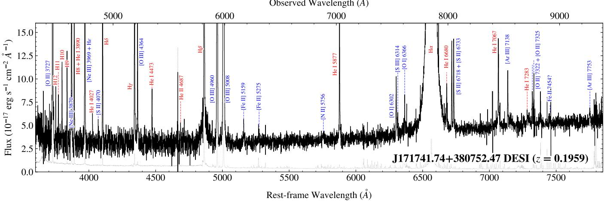

Observed Wavelength ( m)  
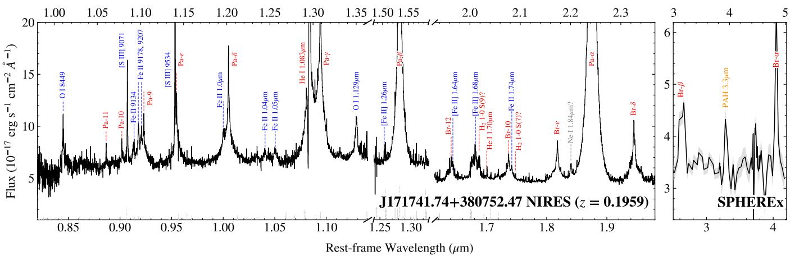  
Figure 3. Zoomed-in view of the DESI, Keck/NIRES, and SPHEREx spectra of J171741.74+380752.47. The spectra are shown as black lines, and the uncertainties are indicated by gray dotted lines or shaded regions. Emission lines are labeled

## 5. MEASUREMENTS

In this section, we describe our methodology and measurements to characterize the continuum shapes and emission-line profiles of the LRDs identified in DESI DR1.

## 5.1. Continuum parameterization

We measure the UV absolute magnitude at 1500 ˚A (M ) by jointly modeling the DESI spectra and broad band photometry at rest-frame wavelengths $< 3 5 0 0 \mathrm { \AA }$ The Mg II lines are masked, and the continuum is fitted with a power-law model normalized at rest-frame 1500 ˚A. We measure the Balmer break strength following A. de Graaff et al. (2025b), defined as the ratio of the continuum flux in the rest-frame 3620–3720 ˚A and 4000–4100 ˚A bands.

To depict the V-shaped continua of the selected LRDs, we parameterize their UV-optical continua using a simple broken power-law model, following D. J. Setton et al. (2024):

$$
f _ { \lambda } = \left\{ \begin{array} { l l } { f _ { \lambda _ { \mathrm { v } } } ( \lambda / \lambda _ { \mathrm { v } } ) ^ { k _ { \mathrm { b l u e } } } , } & { \lambda < \lambda _ { \mathrm { v } } } \\ { f _ { \lambda _ { \mathrm { v } } } ( \lambda / \lambda _ { \mathrm { v } } ) ^ { k _ { \mathrm { r e d } } } , } & { \lambda > \lambda _ { \mathrm { v } } } \end{array} \right.\tag{1}
$$

where $f _ { \lambda _ { \mathrm { v } } }$ is the flux at the inflection point $\lambda _ { \mathrm { v } } .$ , and $k _ { \mathrm { b l u e } }$ and $k _ { \mathrm { r e d } }$ are the power-law slopes of the continuum blueward and redward of $\lambda _ { \mathrm { v } } .$ respectively. We note that $k _ { \mathrm { b l u e } }$ is not equivalent to the UV continuum slope (β ) used in the $M _ { \mathrm { U V } }$ measurement. $k _ { \mathrm { b l u e } }$ is a locally fitted parameter describing the continuum in the vicinity (1000–1500 ˚A) of $\lambda _ { \mathrm { v } }$ , whereas $\beta _ { \mathrm { U V } }$ characterizes the overall shape of the rest-frame UV continuum.

The continuum fitting is performed iteratively in three steps. We first mask strong emission lines in the DESI spectrum, including Mg II, [O II], [Ne III], [O III], as well as all hydrogen and helium lines. We then bin the DESI spectrum into 300 bins and use emcee to fit the model to the binned continuum. In the first iteration, we apply a median filter to the binned continuum and identify the minimum flux point. We then fit the broken power-law model (Equation 1) within $\pm 2 0 0 0 \mathrm { \AA }$ of this minimum to obtain an initial estimate of $\lambda _ { \mathrm { v } } .$ In the second iteration, we refit the broken power-law model within ±2000 ˚A centered on this initial $\lambda _ { \mathrm { v } } .$ In the final iteration, we restrict the fitting window to ±1000–1500 ˚A centered on the second estimate of $\lambda _ { \mathrm { v } }$ to obtain locally optimized values of $\lambda _ { \mathrm { v } } , \ k _ { \mathrm { b l u e } } ,$ and $k _ { \mathrm { r e d } }$ . For comparison, we also apply the same parameterization to the three local LRDs reported by Paper I.

<table><tr><td>Name</td><td>z</td><td> $M _ { \mathrm { U V } }$   $\left( { \mathrm { m a g } } \right)$ </td><td> $L _ { 5 1 0 0 }$   $( 1 0 ^ { 4 3 } \mathrm { e r g s ^ { - 1 } } )$ </td><td> $\lambda _ { \mathrm { v } }$   $( \mathrm { \AA } )$ </td><td> $k _ { \mathrm { b l u e } }$ </td><td> $k _ { \mathrm { r e d } }$ </td><td>Balmer break Absorber strength</td><td></td></tr><tr><td colspan="7">Gold sample</td><td></td><td></td></tr><tr><td> $\mathrm { J 0 1 2 9 3 0 . 8 7 + 0 6 2 8 4 3 . 3 2 }$ </td><td>0.2467</td><td> $- 1 6 . 4 { \pm } 0 . 4 $ </td><td> $0 . 8 _ { - 0 . 1 } ^ { + 0 . 1 }$ </td><td> $6 1 7 9 _ { - 1 2 1 } ^ { + 1 1 4 }$ </td><td> $- 1 . 0 _ { - 0 . 4 } ^ { + 0 . 4 }$ </td><td> $\overline { { 1 . 5 _ { - 0 . 5 } ^ { + 0 . 5 } } }$ </td><td> $0 . 9 { \pm } 0 . 1 \ $ </td><td>Hα</td></tr><tr><td> $\mathrm { J 0 8 2 6 0 6 . 3 7 - 0 1 0 0 0 1 . 3 1 }$ </td><td>0.6273</td><td> $- 1 8 . 9 { \pm } 0 . 2 $ </td><td> $7 . 3 _ { - 0 . 7 } ^ { + 0 . 6 }$ </td><td> $3 7 4 9 _ { - 1 6 7 } ^ { + 1 1 2 }$ </td><td> $- 1 . 2 _ { - 0 . 4 } ^ { + 0 . 4 }$ </td><td> $1 . 6 _ { - 0 . 3 } ^ { + 0 . 3 }$ </td><td> $1 . 6 { \pm } 0 . 3 $ </td><td> $_ \mathrm { H \alpha + H \beta }$ </td></tr><tr><td> $\mathrm { J 0 8 2 9 2 1 . 3 7 + 1 3 1 2 3 7 . 4 4 }$ </td><td>0.3986</td><td> $- 1 8 . 6 { \pm } 0 . 2 $ </td><td> $3 . 9 _ { - 0 . 2 } ^ { + 0 . 2 }$ </td><td> $5 0 8 8 _ { - 6 8 } ^ { + 5 6 5 }$ </td><td> $- 1 . 5 _ { - 0 . 2 } ^ { + 0 . 2 }$ </td><td> $1 . 0 _ { - 0 . 1 } ^ { + 0 . 1 }$ </td><td> $0 . 7 { \pm } 0 . 1 $ </td><td> $\mathrm { H } \alpha$ </td></tr><tr><td> $\mathrm { J 0 9 4 4 1 1 . 3 1 - 0 2 4 9 0 8 . 6 5 }$ </td><td>0.6623</td><td> $- 2 0 . 1 { \pm } 0 . 1 $ </td><td> $1 6 . 6 _ { - 0 . 5 } ^ { + 0 . 6 }$ </td><td> $3 6 5 7 _ { - 9 } ^ { + 1 6 }$ </td><td> $- 2 . 1 _ { - 0 . 3 } ^ { + 0 . 3 }$ </td><td> $1 . 6 _ { - 0 . 1 } ^ { + 0 . 1 }$ </td><td> $1 . 7 { \pm } 0 . 2 $ </td><td> $_ \mathrm { H \alpha + H \beta }$ </td></tr><tr><td> $\mathrm { J 1 0 1 7 4 2 . 7 9 + 3 1 1 4 5 9 . 0 7 }$ </td><td>0.6706</td><td> $- 1 7 . 9 { \pm } 0 . 2 $ </td><td> $4 . 6 _ { - 0 . 2 } ^ { + 0 . 3 }$ </td><td> $4 0 5 3 _ { - 8 1 } ^ { + 8 0 }$ </td><td> $- 1 . 3 _ { - 0 . 2 } ^ { + 0 . 2 }$ </td><td> $2 . 0 _ { - 0 . 1 } ^ { + 0 . 1 }$ </td><td> $1 . 3 { \pm } 0 . 2 $ </td><td></td></tr><tr><td> $\mathrm { J 1 0 2 5 5 3 . 7 5 + 5 0 2 8 4 3 . 2 4 }$ </td><td>0.8824</td><td> $- 2 0 . 3 { \pm } 0 . 1 $ </td><td> $2 0 . 4 _ { - 1 . 5 } ^ { + 1 . 5 }$ </td><td> $\mathrm { 3 4 9 6 _ { - 6 3 } ^ { + 5 8 } }$ </td><td> $- 2 . 7 _ { - 0 . 3 } ^ { + 0 . 3 }$ </td><td> $2 . 7 _ { - 0 . 2 } ^ { + 0 . 2 }$ </td><td> $1 . 5 { \pm } 0 . 2 $ </td><td> $_ \mathrm { H \alpha + H \beta }$ </td></tr><tr><td> $\mathrm { J 1 0 4 2 4 2 . 4 3 + 3 7 2 1 4 7 . 6 3 }$ </td><td>0.6080</td><td> $- 1 9 . 1 { \pm } 0 . 2 $ </td><td> $8 . 2 _ { - 0 . 6 } ^ { + 0 . 6 }$ </td><td> $3 5 3 4 _ { - 1 3 1 } ^ { + 1 3 3 }$ </td><td> $- 2 . 0 _ { - 0 . 4 } ^ { + 0 . 4 }$ </td><td> $2 . 1 _ { - 0 . 3 } ^ { + 0 . 3 }$ </td><td> $1 . 3 { \pm } 0 . 3 $ </td><td></td></tr><tr><td> $\mathrm { J 1 3 2 1 3 7 . 0 0 - 0 2 1 4 1 7 . 0 4 }$ </td><td>0.2244</td><td> $- 1 6 . 8 { \pm } 0 . 6 $ </td><td> $0 . 4 _ { - 0 . 1 } ^ { + 0 . 1 }$ </td><td> $4 3 9 5 _ { - 1 2 5 } ^ { + 1 2 0 }$ </td><td> $- 2 . 6 _ { - 0 . 5 } ^ { + 0 . 5 }$ </td><td> $2 . 3 _ { - 0 . 4 } ^ { + 0 . 3 }$ </td><td> $0 . 6 { \pm } 0 . 1 $ </td><td> $\mathrm { H } \alpha$ </td></tr><tr><td> $\mathrm { J 1 4 2 3 3 7 . 5 9 + 5 2 0 2 1 6 . 0 5 }$ </td><td>0.6236</td><td> $- 1 6 . 2 { \pm } 0 . 5 $ </td><td> $6 . 4 _ { - 0 . 3 } ^ { + 0 . 2 }$ </td><td> $3 7 1 6 _ { - 5 3 } ^ { + 6 7 }$ </td><td> $- 0 . 5 _ { - 0 . 6 } ^ { + 0 . 4 }$ </td><td> $2 . 4 _ { - 0 . 1 } ^ { + 0 . 1 }$ </td><td> $3 . 1 { \pm } 1 . 5 $ </td><td> $_ \mathrm { H \alpha + H \beta }$ </td></tr><tr><td> $\mathrm { J 1 5 0 2 5 2 . 3 4 + 0 2 5 0 2 7 . 9 7 }$ </td><td>0.2906</td><td> $- 1 8 . 1 { \pm } 0 . 4 $ </td><td> $0 . 9 _ { - 0 . 1 } ^ { + 0 . 1 }$ </td><td> $3 7 6 2 _ { - 1 3 0 } ^ { + 1 6 7 }$ </td><td> $- 2 . 7 _ { - 0 . 5 } ^ { + 0 . 6 }$ </td><td> $0 . 9 _ { - 0 . 1 } ^ { + 0 . 1 }$ </td><td> $0 . 9 { \pm } 0 . 1 \ $ </td><td></td></tr><tr><td> $\mathrm { J 1 6 1 1 0 2 . 4 4 + 0 9 1 7 2 8 . 6 0 }$ </td><td>0.6952</td><td> $- 2 0 . 0 { \pm } 0 . 1 $ </td><td> $8 . 7 _ { - 0 . 9 } ^ { + 0 . 1 }$ </td><td> $3 6 2 0 _ { - 6 1 } ^ { + 5 9 }$ </td><td> $- 2 . 7 _ { - 0 . 3 } ^ { + 0 . 3 }$ </td><td> $1 . 8 _ { - 0 . 2 } ^ { + 0 . 3 }$ </td><td> $1 . 4 { \pm } 0 . 2 $ </td><td> $_ \mathrm { H \alpha + H \beta }$ </td></tr><tr><td>J162032.32+314817.02</td><td>0.4099</td><td> $- 1 4 . 8 { \pm } 1 . 0 $ </td><td> $0 . 2 _ { - 0 . 2 } ^ { + 0 . 2 }$ </td><td> $4 1 3 6 _ { - 2 8 3 } ^ { + 3 1 1 }$ </td><td> $- 2 . 4 _ { - 1 . 5 } ^ { + 1 . 4 }$ </td><td> $1 . 6 _ { - 0 . 5 } ^ { + 0 . 5 }$ </td><td> $1 . 2 { \pm } 1 . 1 $ </td><td></td></tr><tr><td> $\mathrm { J 1 6 4 1 0 2 . 6 5 + 0 7 0 8 0 6 . 4 7 }$ </td><td>0.5351</td><td> $- 1 7 . 7 { \pm } 0 . 4$ </td><td> $4 . 3 _ { - 1 . 0 } ^ { + 1 . 0 }$ </td><td> $3 9 3 9 _ { - 1 1 1 } ^ { + 1 4 2 }$ </td><td> $- 1 . 6 _ { - 0 . 6 } ^ { + 0 . 6 }$ </td><td> $3 . 1 _ { - 0 . 2 } ^ { + 0 . 3 }$ </td><td> $2 . 0 { \pm } 1 . 4 $ </td><td> $\mathrm { H } \alpha$ </td></tr><tr><td> $\mathrm { J 1 6 4 2 2 6 . 9 7 + 0 4 2 6 3 2 . 7 9 }$ </td><td>0.7291</td><td> $- 2 0 . 5 { \pm } 0 . 1 $ </td><td> $1 6 . 4 _ { - 0 . 7 } ^ { + 0 . 7 }$ </td><td> $\phantom { + } 3 5 4 2 _ { - 5 8 } ^ { + 5 3 }$ </td><td> $- 2 . 3 _ { - 0 . 2 } ^ { + 0 . 2 }$ </td><td> $1 . 9 _ { - 0 . 1 } ^ { + 0 . 1 }$ </td><td> $1 . 3 { \pm } 0 . 1 $ </td><td></td></tr><tr><td> $\mathrm { J 1 6 4 6 3 7 . 9 1 + 1 4 2 6 4 8 . 6 2 }$ </td><td>0.7071</td><td> $- 1 8 . 6 { \pm } 0 . 2 $ </td><td> $1 5 . 1 _ { - 0 . 7 } ^ { + 0 . 4 }$ </td><td> $3 5 3 8 _ { - 1 5 0 } ^ { + 1 4 4 }$ </td><td> $- 1 . 0 _ { - 0 . 4 } ^ { + 0 . 4 }$ </td><td> $2 . 3 _ { - 0 . 2 } ^ { + 0 . 2 }$ </td><td> $1 . 5 { \pm } 0 . 2 $ </td><td> $_ \mathrm { H \alpha + H \beta }$ </td></tr><tr><td> $\mathrm { J 1 6 5 4 5 0 . 3 6 + 0 3 3 7 4 1 . 7 4 }$ </td><td>0.6408</td><td> $- 1 8 . 3 { \pm } 0 . 2 $ </td><td> $1 1 . 3 _ { - 0 . 5 } ^ { + 0 . 6 }$ </td><td> $3 7 0 7 _ { - 7 0 } ^ { + 8 1 }$ </td><td> $- 1 . 4 _ { - 0 . 4 } ^ { + 0 . 4 }$ </td><td> $4 . 1 _ { - 0 . 2 } ^ { + 0 . 2 }$ </td><td> $2 . 7 { \pm } 0 . 8 $ </td><td> $_ \mathrm { H \alpha + H \beta }$ </td></tr><tr><td>J171741.74+380752.47</td><td>0.1959</td><td> $- 1 9 . 1 { \pm } 0 . 1 $ </td><td> $2 . 7 _ { - 0 . 1 } ^ { + 0 . 3 }$ </td><td> $4 9 2 0 _ { - 2 4 } ^ { + 2 3 }$ </td><td> $- 1 . 5 _ { - 0 . 0 } ^ { + 0 . 0 }$ </td><td> $1 . 6 _ { - 0 . 0 } ^ { + 0 . 0 }$ </td><td> $0 . 8 { \pm } 0 . 0 $ </td><td> $_ \mathrm { H \alpha + H \beta }$ </td></tr><tr><td> $\mathrm { J 2 1 2 7 2 5 . 8 8 - 0 4 4 8 0 8 . 9 2 }$ </td><td>0.5842</td><td> $- 1 7 . 5 { \pm } 0 . 5 $ </td><td> $6 . 6 _ { - 0 . 5 } ^ { + 0 . 6 }$ </td><td> $3 4 9 2 _ { - 1 6 5 } ^ { + 2 0 6 }$ </td><td> $- 2 . 4 _ { - 0 . 8 } ^ { + 0 . 8 }$ </td><td> $2 . 7 _ { - 0 . 8 } ^ { + 0 . 8 }$ </td><td> $1 . 7 { \pm } 0 . 7 $ </td><td> $_ \mathrm { H \alpha + H \beta }$ </td></tr><tr><td> $\mathrm { J 2 2 5 5 3 5 . 5 8 + 1 5 4 2 1 6 . 2 9 }$ </td><td>0.4273</td><td> $- 1 7 . 4 { \pm } 0 . 7 $ </td><td> $1 . 0 _ { - 0 . 2 } ^ { + 0 . 1 }$ </td><td> $3 9 6 5 _ { - 1 9 3 } ^ { + 2 6 1 }$ </td><td> $\underline { { - 2 . 6 _ { - 1 . 0 } ^ { + 1 . 0 } } }$ </td><td> $\underline { { 2 . 6 _ { - 0 . 4 } ^ { + 0 . 4 } } }$ </td><td> $1 . 2 { \pm } 0 . 8 $ </td><td> $\mathrm { H } \alpha$ </td></tr><tr><td colspan="7">Silver sample</td><td colspan="2"></td></tr><tr><td> $\mathrm { J 0 0 0 9 2 7 . 2 2 + 0 8 1 1 0 9 . 9 6 }$ </td><td>0.3720</td><td> $- 1 7 . 5 { \pm } 0 . 3 $ </td><td> $1 . 3 _ { - 0 . 1 } ^ { + 0 . 1 }$ </td><td> $\overline { { 3 7 5 2 _ { - 9 3 } ^ { + 1 5 5 } } }$ </td><td> $- 2 . 4 _ { - 0 . 4 } ^ { + 0 . 4 }$ </td><td> $\overline { { 0 . 2 _ { - 0 . 2 } ^ { + 0 . 3 } } }$ </td><td> $1 . 1 { \pm } 0 . 2 $ </td><td></td></tr><tr><td> $\mathrm { J 0 2 4 3 3 7 . 9 9 + 0 3 4 9 1 5 . 9 7 }$ </td><td>0.4584</td><td> $- 1 8 . 2 { \pm } 0 . 4 $ </td><td> $1 . 1 _ { - 0 . 2 } ^ { + 0 . 2 }$ </td><td> $3 8 6 9 _ { - 2 1 2 } ^ { + 2 3 8 }$ </td><td> $- 2 . 8 _ { - 0 . 7 } ^ { + 0 . 6 }$ </td><td> $0 . 4 _ { - 0 . 4 } ^ { + 0 . 4 }$ </td><td> $1 . 0 { \pm } 0 . 4 $ </td><td></td></tr><tr><td> $\mathrm { J 1 0 5 6 2 0 . 1 1 + 2 7 5 4 1 5 . 8 7 }$ </td><td>0.4617</td><td> $- 1 8 . 6 { \pm } 0 . 3 $ </td><td> $2 . 0 _ { - 0 . 2 } ^ { + 0 . 2 }$ </td><td> $4 4 5 6 _ { - 3 7 6 } ^ { + 3 6 2 }$ </td><td> $- 1 . 8 _ { - 0 . 3 } ^ { + 0 . 3 }$ </td><td> $0 . 1 _ { - 0 . 1 } ^ { + 0 . 2 }$ </td><td> $1 . 1 { \pm } 0 . 3 $ </td><td></td></tr><tr><td> $\mathrm { J 1 0 5 9 0 0 . 2 9 + 3 1 4 9 5 1 . 7 4 }$ </td><td>0.4990</td><td> $- 1 8 . 3 { \pm } 0 . 4 $ </td><td> $3 . 9 _ { - 0 . 6 } ^ { + 0 . 6 }$ </td><td> $3 3 8 4 _ { - 2 7 8 } ^ { + 2 7 8 }$ </td><td> $- 2 . 0 _ { - 1 . 2 } ^ { + 1 . 2 }$ </td><td> $0 . 4 _ { - 0 . 3 } ^ { + 0 . 4 }$ </td><td> $1 . 5 { \pm } 0 . 6 $ </td><td></td></tr><tr><td> $\mathrm { J 1 1 1 9 4 3 . 2 0 + 0 2 1 9 1 1 . 3 2 }$ </td><td>0.4682</td><td> $- 1 8 . 5 { \pm } 0 . 2 $ </td><td> $1 . 6 _ { - 0 . 2 } ^ { + 0 . 2 }$ </td><td> $5 3 8 7 _ { - 1 5 9 } ^ { + 8 4 }$ </td><td> $- 0 . 9 _ { - 0 . 4 } ^ { + 0 . 4 }$ </td><td> $0 . 8 _ { - 0 . 4 } ^ { + 0 . 5 }$ </td><td> $0 . 9 { \pm } 0 . 2 \ $ </td><td> $\mathrm { H } \alpha$ </td></tr><tr><td> $\mathrm { J 1 1 3 7 3 4 . 3 5 + 5 5 2 0 2 8 . 1 6 }$ </td><td>0.4358</td><td> $- 1 5 . 3 { \pm } 0 . 7 $ </td><td> $1 . 0 _ { - 0 . 2 } ^ { + 0 . 2 }$ </td><td> $4 3 1 9 _ { - 2 7 7 } ^ { + 4 2 1 }$ </td><td> $- 2 . 1 _ { - 0 . 9 } ^ { + 0 . 9 }$ </td><td> $0 . 1 _ { - 0 . 2 } ^ { + 0 . 3 }$ </td><td> $0 . 8 { \pm } 0 . 4 $ </td><td>Hα</td></tr><tr><td> $\mathrm { J 1 3 4 3 1 7 . 8 1 + 3 9 3 4 1 8 . 0 7 }$ </td><td>0.2933</td><td> $- 1 7 . 5 { \pm } 0 . 4 $ </td><td> $0 . 8 _ { - 0 . 1 } ^ { + 0 . 1 }$ </td><td> $5 4 3 7 _ { - 2 3 4 } ^ { + 4 8 }$ </td><td> $- 1 . 0 _ { - 0 . 4 } ^ { + 0 . 4 }$ </td><td> $0 . 4 _ { - 0 . 3 } ^ { + 0 . 4 }$ </td><td> $0 . 8 { \pm } 0 . 2 $ </td><td>Hα</td></tr><tr><td> $\mathrm { J 1 9 0 9 5 4 . 1 5 + 5 8 3 1 1 2 . 3 7 }$ </td><td>0.4273</td><td> $- 1 8 . 8 { \pm } 0 . 5 $ </td><td> $1 . 3 _ { - 0 . 2 } ^ { + 0 . 2 }$ </td><td> $3 9 3 3 _ { - 2 3 8 } ^ { + 2 1 9 }$ </td><td> $- 2 . 9 _ { - 0 . 6 } ^ { + 0 . 5 }$ </td><td> $0 . 3 _ { - 0 . 2 } ^ { + 0 . 2 }$ </td><td> $1 . 4 { \pm } 0 . 7$ </td><td>Hα</td></tr><tr><td colspan="9">ble 1. UV-optical continuum properties of the DESI DR1 LRD sample presented in this work. The Absorber colu licates the detected absorption superimposed on the broad emission lines:  $\mathrm { H } \alpha , \mathrm { H } \beta ,$  or Hα+Hβ (when absorption is detec</td></tr></table>

Table 1. UV–optical continuum properties of the DESI DR1 LRD sample presented in this work. The Absorber column indicates the detected absorption superimposed on the broad emission lines: Hα, Hβ, or Hα+Hβ (when absorption is detected in both). A dash (‘–’) indicates no absorption detected or no spectral coverage.

components each, also sharing the same FWHMs. The [O III]λλ 4960, 5008 and [N II]λλ6549, 6585 doublet flux ratios are fixed at 0.335 and 0.327, respectively. The continuum underlying Hβ and [O III]λλ 4960, 5008 is modeled as a linear function normalized at rest-frame 5100 ˚A, and the Hα continuum is assumed to be constant.

Starting from the initial models, the emission line profiles are adjusted iteratively during the fit to account for their diversity. The adjustments are summarized below.

## 5.2. Emission Line Measurements

To model the emission-line profiles, we perform a joint fit to Hβ, [O III]λλ 4960, 5008, Hα, and [N II]λλ6549, 6585. We assume that the narrow components of all these lines share the same FWHMs. The broad components of Hβ and Hα are initially modeled with three • If [O III]λλ 4960, 5008 cannot be well modeled by a single Gaussian profile, an additional Gaussian component is added to both [O III]λλ 4960, 5008 and [N II]λλ6549, 6585, with shared FWHMs and velocity offsets. This component accounts for outflows in the ionized gas. The doublet flux ratios are fixed.

• If a broad Gaussian component in Hα and/or Hβ exhibits an FWHM close to that of the outflowing component in [O III], we tie them to share the same FWHM and velocity offset. The luminosities of the outflow components in [O III], Hβ, and Hα are treated as independent.

• If one broad Gaussian component has a luminosity consistent with zero (i.e., the posterior probability of its intensity peaks at zero), we reduce the number of broad components accordingly.

In the fitting described above, the Bayesian Information Criterion (BIC) is used to compare different models and to determine whether an additional component should be included or removed in the [O III] or Balmer lines. If the BIC improves by more than 10%, we adopt the more complex model; otherwise, we retain the simpler model.

For Hβ or Hα lines showing absorption, we add an absorption component. The total Balmer line profile, including absorption, is parameterized as

$$
\begin{array} { r l r } { \mathrm { ~ } } & { { } } & { F _ { \lambda } = \Big ( 1 - C _ { f } + C _ { f } e ^ { - \tau ( \Delta v _ { \mathrm { a b s } } , \log N , b ) } \Big ) \cdot \left( c _ { \mathrm { c o n t } } + \phi _ { \mathrm { b r o a d } } \right) } \\ { \mathrm { ~ } } & { { } } & { + \phi _ { \mathrm { n a r r o w } } + \phi _ { \mathrm { o u t f l o w } } \mathrm { ~ } } \end{array}
$$

where $C _ { f }$ is the covering factor, $c _ { \mathrm { c o n t } }$ is the continuum, ϕbroad is the broad emission line profile, $\phi _ { \mathrm { n a r r o w } }$ is the narrow emission line profile, and ϕ represents the outflow component, if present. τ is the optical depth of the absorber, modeled as a Voigt profile as a function of the column density log N and Doppler parameter $b ,$ and determined by the transition and oscillator strength of Hβ or Hα. $\Delta v _ { \mathrm { a b s } }$ represents the velocity shift of the absorber relative to the emission line center, with negative values indicating a blueshift. In Equation 2, the absorber absorbs both the optical continuum $c _ { \mathrm { c o n t } }$ and the broad emission lines. This is motivated by the fact that the absorption trough can extend below the contin uum level, as seen in J165450.36+033741.74 (Figure 2). We treat $\mathrm { H } \beta$ and Hα absorbers, when both are present, as independent, i.e., with independent log $N , b , C _ { f }$ , and $\Delta v _ { \mathrm { a b s } }$ . This assumption is motivated by the fact that they can exhibit opposite velocity shifts, as observed in The Egg (J1025+1402) (Paper I, X. Ji et al. 2025b), Abell2744-QSO1 (X. Ji et al. 2025a; F. D’Eugenio et al. 2025a), and Irony (F. D’Eugenio et al. 2025b). If the posterior probability of $C _ { f }$ peaks at 1, we fix $C _ { f }$ to unity and refit the model.

The intrinsic profiles described above are then convolved to the spectral resolution. For DESI spectra, we convolve the intrinsic profile with the DESI line spread function (LSF) using its resolution matrices (A. S. Bolton & D. J. Schlegel 2010; J. Guy et al. 2023). For near-IR spectra, we convolve the profile with a Gaussian kernel corresponding to the spectral resolution $R ,$ as derived from sky line FWHMs. During the modeling, R is treated as a free parameter but is constrained within the range of skyline FWHMs across the slit/order. It ensures that the fitted results incorporate the uncertainty in R. The fitting is performed using emcee.

For other lines, including Mg IIλλ2796,2803, [O II]λλ3727, 3730, [Ne III]λ3870, [O III]λ4364, etc., we model them with simple Gaussian profiles convolved with LSFs using lmfit (M. Newville et al. 2025). A lin ear function is adopted for the underlying continuum. Doublets or lines with closely spaced wavelengths are fitted simultaneously. For [O III]λ4364, the [Fe II] λ4360 line is fitted simultaneously to remove its contamination. In cases of non-detection, we derive 3σ upper limits by integrating the RMS over a spectral window set by the FWHM of [Ne III], typically around 100 km $\mathrm { s } ^ { - 1 }$

## 5.3. Gold and Silver Samples

Based on the continuum parameterization described in Section 5.1, we classify our sample into two tiers: Gold and Silver.

• Gold: sources with $k _ { \mathrm { r e d } } > 0$ but at $\geq$ 3σ significance. In the DESI DR1 LRD sample in this work, 19 out of 27 sources are classified as Gold.

• Silver: sources with $k _ { \mathrm { r e d } } > 0 \mathrm { a t } < 3 \sigma$ significance. 8 out of 27 sources are classified as Silver.

The Gold/Silver classification reflects both the intrinsically bluer optical continuum slopes (while stil $\beta _ { \mathrm { o p t } } > 0 )$ and the $\mathrm { S } / \mathrm { N }$ of the measurements. All Silver objects meet our LRD selection criteria. Notably, three of the eight Silver sources exhibit clear Balmer absorption (e.g., J1909+5831), a feature commonly observed among established LRDs. This classification is primarily used to prioritize follow-up observations. Higher S/N data will place tighter constraints on their optical slopes.

We summarize the measured continuum properties and Balmer absorption identification of our sample in Table 1. The full fitting results, including best-fit parameters and associated uncertainties, are provided in Appendix B. We note that the two tiers of samples occupy the same distribution in parameter space. In the following analysis, we treat them as a whole.

## 6. RESULTS

In this section, we quantify the properties of the DESI LRDs. Both the Gold and Silver samples are included

in the analysis. The two tiers occupy the same regions of parameter space across all diagnostic diagrams.

## 6.1. Evidences of LRD Nature

We begin by establishing that the DESI sources are consistent with high-redshift LRDs. The principal ob servational signatures commonly associated with the majority of JWST LRDs are present in our sample, spanning morphology, continuum shape, Balmer-line and narrow-line properties. The consistency is summarized below and examined in detail in the subsections indicated.

(1) Compact morphologies;

(2) Continuum properties:

– V-shaped rest-frame UV-optical continua $( \beta _ { \mathrm { U V } } < 0 , \beta _ { \mathrm { o p t i c a l } } > 0 )$ (Section 6.3);

– Inflection points near or redward of the Balmer limit (Section 6.3);

– declining rest-frame near-IR continua (see Section 7.1);

(3) Balmer-line properties:

– Broad Balmer emission (Section 6.4.1);

Extremely high broad-line Balmer decrements (Section 6.4.2);

Frequent Balmer absorption (Section 6.4.3);

(4) Narrow emission-line properties:

– Low metallicity, similar to that of high-redshift galaxies (Section 6.5.1);

– Occupying the same region as high-z LRDs in the BPT diagram (Section 6.5.1);

– Softer ionizing spectra than typical quasars and type 1 AGNs (Section 6.5.2);

(5) Variability:

– The majority show no significant optical variability on rest-frame month timescales. (Section 6.7.1).

All of these properties are consistent with those of high-z LRDs and occupy the same distributions $( \mathrm { e . g . }$ the continuum and Balmer line luminosities). Note that although some of the commonalities between low- and high-z populations (e.g., continuum shape, morphology, broad emission lines) resulted from our adopted low−z LRD selection criteria (3.1), others (e.g., Balmer absorption, Balmer decrements, low metallicity, variability) are not part of the LRD selection. This overall consistency from continuum to line properties indicates that the fea tures observed in both high- and low-z LRDs are governed by similar underlying physical processes. Therefore, these DESI LRDs are representative of the LRD population, but just reside at $z < 1$

## 6.2. LRD number density at $z < 1$

We estimate the number density of LRDs from our DESI DR1 sample. The survey covers 9,739 $\mathrm { d e g ^ { 2 } }$ , and our selection is designed to identify LRDs with Hβ and/or Hα lines observable by DESI, i.e., $\mathrm { a t } ~ z ~ < ~ 1$ This corresponds to a total survey volume of $3 . 6 \times 1 0 ^ { 1 0 }$ $\mathrm { M p c ^ { 3 } }$ . Based on the full sample of 27 DESI DR1 LRDs, we derive a number density of $7 . 5 \times 1 0 ^ { - 1 0 } \ \mathrm { M p c ^ { - 3 } }$ . The estimate is in good agreement with the $5 \times 1 0 ^ { - 1 0 } \ \mathrm { M p c ^ { - 3 } }$ estimated from SDSS-selected LRDs at $z = 0 { \ - } 0 . 5$ (Paper I). According to Y. Ma et al. (2025a), the number density at $z < 1$ is about 4.6 orders of magnitude lower than at $z > 4 , 3 . 8$ orders of magnitude lower than at $z \approx 2 . 7 – 3 . 7$ , and 3.4 orders of magnitude lower than at $1 . 7 < z < 2 . 7$

However, the number density derived above should be considered a conservative lower limit. As noted by Paper I, LRDs identified in wide-field spectroscopic surveys such as SDSS and DESI are highly incomplete. In this work, the selection is limited by both the photometric pre-selection of DESI targets and the survey’s cosmology-driven targeting strategy (see Section 3.3.1). Future surveys beyond the limitation of SDSS/DESI pre-selection are needed to establish a complete sample of low-z LRDs.

## 6.3. Continuum shape and luminosity

We demonstrate the distribution of the continuum lu minosity of DESI DR1 LRDs in the left panel of Figure 4. Their $L _ { 5 1 0 0 }$ and $M _ { \mathrm { U V } }$ values span the same range as JWST-discovered LRDs at $z > 2$ 2, with $L _ { 5 1 0 0 }$ between $2 \times 1 0 ^ { 4 2 }$ and $2 \times 1 0 ^ { 4 4 } ~ \mathrm { e r g ~ s ^ { - 1 } }$ 1, and $M _ { \mathrm { U V } }$ from –20.5 to approximately –15 mag.

The middle panel of Figure 4 shows the distribution of V-shaped SED inflection points in LRDs. While many inflection points lie near the Balmer limit, a notable fraction occur at longer wavelengths. Five objects in our sample show inflection points > 4500 ˚A. Such behavior is also seen in certain $z > 2 ~ \mathrm { L R D s }$ (D. J. Setton et al. 2025; A. de Graaff et al. 2025b; G. Barro et al. 2025). The subset of long-wavelength inflection points benefits from our more relaxed optical continuum selection criteria in Section 3.2.1. A clear example is J1717+3807, which was targeted by SDSS eBOSS but missed in the selection of Paper I. This is because Paper I required the continuum under [O II] to be lower than that un der [O III] 5008 for the inflection point to lie near the

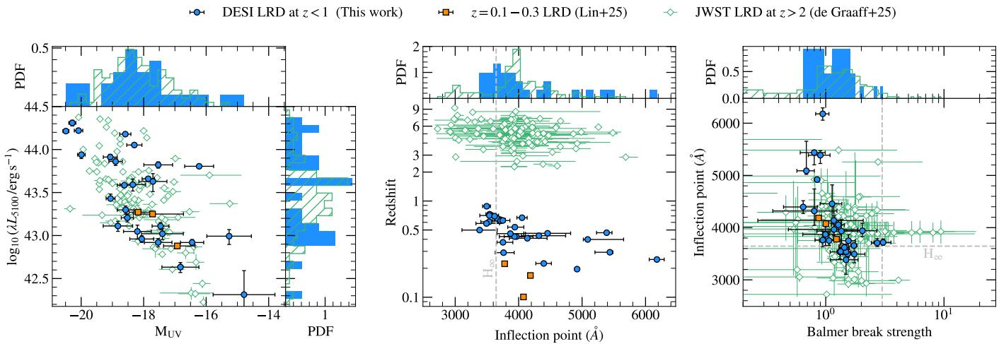  
Figure 4. $L e f t { \mathrm { : } }$ The distribution of $L _ { 5 1 0 0 }$ and $M _ { \mathrm { U V } }$ of LRDs across cosmic time. Middle: The distribution of V-shaped SED inflection points in LRDs. Right: The distribution of inflection points and Balmer break strengths. In each panel, LRDs at $z < 1$ from DESI DR1 are shown as blue circles. Local LRDs at $z = 0 . 1 – 0 . 3$ in Paper I are orange squares, and JWST-discovered LRDs at $z > 2$ (A. de Graaff et al. 2025b) are green. In the histogram, blue bars show the DESI DR1 LRD distribution, while green bars indicate JWST LRDs at $z > 2 .$ In the middle and right panels, the wavelengths of the Balmer limit are marked with gray dashed lines. In the right panel, we also include a gray dashed vertical line indicating a Balmer break strength of $^ { 3 , }$ the maximum expected for a dust-free stellar population.

Balmer limit, but such a condition is not met by this object. In J1717+3807, the inflection point occurs near [O III] 5008, and our more relaxed red optical continuum criteria allow it to be recovered in the sample.

For most DESI DR1 LRDs with inflection points near the Balmer limit, the Balmer break strength exceeds unity, as shown in the right panel of Figure 4. The maximum Balmer break strength in our sample reaches ${ \sim } 3 ,$ observed in J1423+5202 and J1654+0337. While we do not identify sources with break strengths as extreme as the most prominent high-z LRDs (e.g., The Cliff, A. de Graaff et al. 2025a, MoM-BH∗, R. P. Naidu et al. 2025), we caution that this is likely a selection effect arising from our requirement of strong [O III] emission (The Cliff with [O III] EW 7.3 ˚A, MoM-BH∗ with [O III] EW 3 ˚A). Additionally, sources with inflection points at longer wavelengths naturally exhibit weaker Balmer break strengths. In this case, the Balmer break alone loses its diagnostic power.

## 6.4. Balmer lines

## 6.4.1. Balmer emission

The left panel of Figure 5 shows the relation between Hα luminosity and $L _ { 5 1 0 0 }$ . The broad component $\left( L _ { \mathrm { H } \alpha , \mathrm { b r o a d } } \right)$ tightly correlates with $L _ { 5 1 0 0 }$ . The correlation between total Hα luminosity $\left( { L _ { \mathrm { H } \alpha , \mathrm { t o t a l } } } \right)$ and $L _ { 5 1 0 0 }$ is similar to that observed in high-z LRDs, but is primarily dominated by the broad-line emission. In contrast, the narrow Hα luminosity does not exhibit a strong increase with $L _ { 5 1 0 0 }$ at $L _ { 5 1 0 0 } > 3 \times 1 0 ^ { 4 2 } \mathrm { ~ e r g ~ s } ^ { - 1 }$ We fit the correlation between $L _ { \mathrm { H } \alpha , \mathrm { b r o a d } }$ and $L _ { 5 1 0 0 } .$ , yielding

$$
\begin{array} { l } { \displaystyle \log \left( \frac { L _ { \mathrm { H } \alpha , \mathrm { b r o a d } } } { 1 0 ^ { 4 2 } \mathrm { ~ e r g ~ s } ^ { - 1 } } \right) = ( 1 . 2 2 \pm 0 . 0 3 ) \eqno } \\ { \displaystyle \qquad + ( 1 . 2 7 \pm 0 . 0 7 ) \cdot \log \left( \frac { L _ { 5 1 0 0 } } { 1 0 ^ { 4 4 } \mathrm { ~ e r g ~ s } ^ { - 1 } } \right) } \end{array}\tag{3}
$$

For Hβ (right panel of Figure 5), although the total Hβ luminosity $\left( { L _ { \mathrm { H } \beta , \mathrm { t o t a l } } } \right)$ correlates with $L _ { 5 1 0 0 }$ , the correlation is dominated by the narrow component at $\log ( L _ { 5 1 0 0 } / \mathrm { e r g ~ s } ^ { - 1 } ) < 4 3 . 2$ , but by the broad component at higher $L _ { 5 1 0 0 }$ . While the narrow Hβ increases moderately with $L _ { 5 1 0 0 }$ , the broad $\mathrm { H } \beta$ luminosity $\left( L _ { \mathrm { H } \beta , \mathrm { b r o a d } } \right)$ exhibits a stronger correlation and can be parameterized as

$$
\begin{array} { l } { \log \left( \displaystyle \frac { L _ { \mathrm { H } \beta , \mathrm { b r o a d } } } { 1 0 ^ { 4 2 } \mathrm { ~ e r g ~ s } ^ { - 1 } } \right) = ( 0 . 1 9 \pm 0 . 0 3 ) \medskip } \\ { \medskip + ( 1 . 5 7 \pm 0 . 0 7 ) \cdot \log \left( \displaystyle \frac { L _ { \mathrm { 5 1 0 0 } } } { 1 0 ^ { 4 4 } \mathrm { ~ e r g ~ s } ^ { - 1 } } \right) } \end{array}\tag{4}
$$

The $L _ { \mathrm { H } \alpha , \mathrm { b r o a d } ^ { - } } L _ { 5 1 0 0 }$ and $L _ { \mathrm { H } \beta , \mathrm { b r o a d } }$ –L5100 relations for LRDs (Equations 3 and 4) do not follow the trends observed for type-1 AGNs in J. E. Greene & L. C. Ho (2005) as shown in Figure 5. For the $L _ { \mathrm { H } \alpha , \mathrm { b r o a d } ^ { - } } L _ { 5 1 0 0 }$ relation, the slope is close to that reported by J. E. Greene & L. C. Ho (2005) $( 1 . 1 5 7 { \pm } 0 . 0 0 5 )$ , but the normalization is three times higher. In contrast, the $L _ { \mathrm { H } \beta , \mathrm { b r o a d } ^ { - } } L _ { 5 1 0 0 }$ relation exhibits a steeper slope than Hα (right panel of Figure 5).

Total Broad $\star$ Narrow z > 2 JWST-LRDs (total) GH05 (total) Power-law fit (broad)

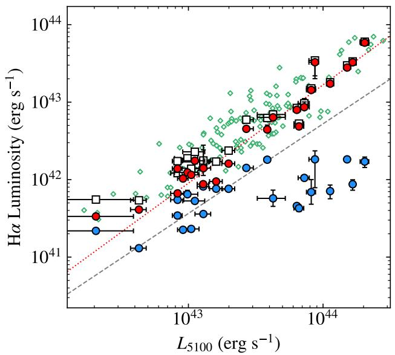

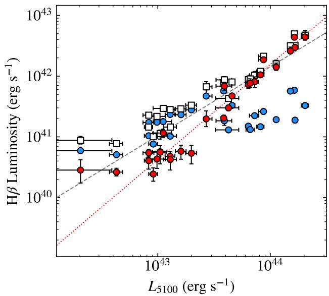  
Figure 5. Left: Hα luminosity of DESI DR1 LRDs versus $L _ { 5 1 0 0 } .$ Total (broad+narrow), broad, and narrow Hα luminosities are shown as white squares, red circles, and blue circles, respectively. The total Hα luminosity of $z > 2 \mathrm { L R D s }$ from A. de Graaff et al. (2025b) is shown as green diamonds. The correlation between total Hα luminosity and $L _ { 5 1 0 0 }$ for type-1 AGNs from J. E. Greene & L. C. Ho (2005) is shown as the gray dashed line. The correlation between broad Hα luminosity and $L _ { 5 1 0 0 }$ is shown as the red dashed line. Right: Same as the Left panel, but for $\mathrm { H } \beta .$

## 6.4.2. Balmer decrement

First, the two relations deviate from those of local type-1 AGNs in J. E. Greene & L. C. Ho (2005), indicating that single-epoch BH mass estimators (J. E. Greene & L. C. Ho 2005; A. E. Reines & M. Volonteri 2015) are not directly applicable to LRDs. These estimators rely on two key assumptions: (1) that $L _ { 5 1 0 0 }$ traces the broad-line region (BLR) size as in local type-1 AGNs, and (2) that the broad-line luminosity scales with $L _ { 5 1 0 0 }$ as in local type-1 AGNs. Neither assumption could hold in LRDs, particularly in the context of the BH-envelope framework discussed in recent studies.

Furthermore, the tight correlations between $L _ { \mathrm { H } \alpha , \mathrm { b r o a d } ^ { - } } L _ { 5 1 0 0 }$ and $L _ { \mathrm { H } \beta , \mathrm { b r o a d } ^ { - } } L _ { 5 1 0 0 }$ in LRDs suggest that the broad emission lines and optical continuum are closely coupled in their physical origin. The relation points to a potential new calibration for BH mass measurements. Why the $L _ { \mathrm { H } \alpha , \mathrm { b r o a d } ^ { - } } L _ { 5 1 0 0 }$ relation shares a similar slope as that in J. E. Greene $\&$ L. C. Ho (2005) remains an open question. Another key question is how these correlations fit within the physical picture of LRDs. In particular, within the leading BH–envelope framework, $L _ { 5 1 0 0 }$ is often located blueward of the peak of a blackbody-like continuum, whose temperature varies across sources. This question remains unclear and warrants further investigation.

We further examine the Balmer decrements in LRDs as shown in the left panel of Figure 6. The narrow lines exhibit relatively small $\mathrm { H } \alpha / \mathrm { H } \beta$ ratios, with a median value of 3.4, compared to the Case B value of 2.89. In contrast, the broad lines display much larger Balmer decrements, with a median value of 16.0. As already discussed in numerous studies of LRDs (e.g., Z. Li et al. 2025; D. J. Setton et al. 2025; C. M. Casey et al. 2025; K. Chen et al. 2025), such extreme values are difficult to explain solely by dust attenuation. For an observed $\mathrm { H } \alpha / \mathrm { H } \beta$ ratio of 16, the implied $A _ { V }$ under an SMC extinction law is 4.9, assuming an intrinsic ratio of 2.89. This high $A _ { V }$ would produce substantial dust-reprocessed emission in the IR, which is in conflict with the declining IR continuum that we ob serve. Instead, these extreme Balmer decrements may arise from radiative transfer effects in sufficiently highdensity gas $( n _ { \mathrm { H } } \gtrsim 1 0 ^ { 8 } – 1 0 ^ { 1 0 } \mathrm { c m } ^ { - 3 } )$ , without necessarily invoking dust attenuation (Z. Yan et al. 2025).

The total $\mathrm { H } \alpha / \mathrm { H } \beta$ ratios span a range comparable to that observed in high-z LRDs (left panel of Figure 6). Owing to the limited number of sources, we do not recover the statistically significant correlation between the total $\mathrm { H } \alpha / \mathrm { H } \beta$ ratio and $L _ { 5 1 0 0 }$ reported in high-z LRDs. Nevertheless, Figure 6 suggests that the apparent correlation in high-z LRDs likely reflects the varying contributions of narrow and broad line components. At lower $L _ { 5 1 0 0 } , ~ L _ { \mathrm { H } \beta , \mathrm { t o t a l } }$ is dominated by narrow-line emission, biasing the total Balmer decrement toward smaller values. In contrast, at higher $L _ { 5 1 0 0 }$ , the broad component dominates, resulting in a larger total decrement.

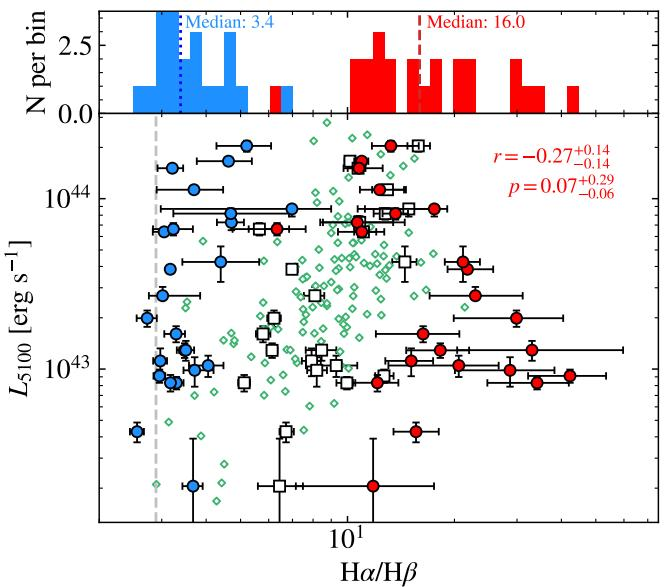

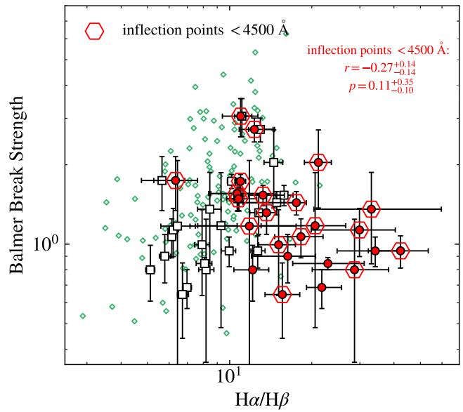  
Figure 6. $L e f t { \mathrm { : } }$ Balmer decrement of the broad and narrow components versus $L _ { 5 1 0 0 } .$ Total (broad+narrow), broad, and narrow Hα/Hβ are shown as white squares, red circles, and blue circles, respectively. The total $\mathrm { H } \alpha / \mathrm { H } \beta$ of $z > 2$ LRDs from $\mathrm { A } .$ de Graaff et al. (2025b) is shown as green diamonds. The top panel shows the narrow-line $\mathrm { H } \alpha / \mathrm { H } \beta$ distribution in blue and the broad-line distribution in red, with median values labeled. Right: Balmer decrement versus Balmer break strength. A subset of the DESI DR1 LRDs with inflection points blueward of 4500 ˚A are marked as the red hexagons.

Sources with the highest $L _ { 5 1 0 0 }$ exhibit relatively smaller broad-line $\mathrm { H } \alpha / \mathrm { H } \beta$ ratios (but still ∼10), whereas the ratios tend to increase toward lower $L _ { 5 1 0 0 }$ However, due to the large uncertainties in broad-line decomposition (mainly from Hβ when the lines are faint), Kendall’s $\tau ^ { 1 4 }$ test yields p-values greater than 0.05, indicating no statistically significant correlation. Likewise, we find no significant correlation between the Balmer break strength and the broad $\mathrm { H } \alpha / \mathrm { H } \beta$ ratio (Figure $6 ,$ right panel). Even when restricting the analysis to ob jects with inflection points blueward of 4500 ˚A, where the Balmer break remains a reliable diagnostic, no clear correlation emerges. A detailed analysis of the Balmer decrement and its connection to the SED shape, including the Balmer break, will require further modeling of the dense gas, incorporating the gas density (n ), column density $( N _ { \mathrm { H } } )$ , and other physical properties.

## 6.4.3. Balmer absorption

In the full sample, 18 out of 27 (67%) of the DESI LRDs exhibit absorption in either Hα or Hβ. Among the sources with $\mathrm { H } \beta$ absorption, nine also have spectral coverage of Hα, and all nine display absorption in Hα.

We examine the observed velocity shifts and EWs of the Hα and $\mathrm { H } \beta$ absorbers from the same sources in Figure 7. Although Hα and Hβ are treated as independent in the fitting procedure, their velocity shifts $( v _ { \mathrm { H } \beta , \mathrm { a b s } }$ and $v _ { \mathrm { H } \alpha , \mathrm { a b s } } )$ and EWs are positively correlated. This indicates that the gas producing both transitions is physically linked and kinematically coupled. In the bottom panel of Figure 7, the color-coded curves show the expected relations if the Hα and Hβ absorption arises from the same gas clouds under a single-layer assumption, i.e., Voigt profiles for Hα and Hβ with shared log N and $b ,$ and $C _ { f } ~ = ~ 1$ . The Hβ EWs are systematically larger than expected given the log N and b inferred from Hα. This suggests that the full series of Balmer absorption in LRDs originates from multiple gas clouds rather than a single gas cloud.

As described in Section 5.2, we model the optical depth of the Balmer absorbers using Voigt profiles, assuming a single-layer absorbing cloud. Here we highlight J1654+0337 and J1611+0917, shown in Figure 2 and Figure A.1. In both objects, the absorption troughs extend marginally below the continuum level. This indicates that the Balmer absorbers attenuate both the optical continuum and the broad emission lines, and that the covering fraction over the continuum source should be high. Such deep Hβ absorption, reaching below the continuum level, is also observed in LRD “Irony” at $z = 6 . 6 8$ (F. D’Eugenio et al. 2025b). This evidence motivates the assumption adopted in Equation 2, in which both the continuum and broad lines serve as the background source against the absorption.

<table><tr><td>Name</td><td> $v _ { \mathrm { H } \beta , \mathrm { a b s } }$   $\left( \mathrm { k m ~ s ^ { - 1 } } \right)$ </td><td> $\log { N _ { \mathrm { H } \beta } }$   $\left( \log \mathrm { c m } ^ { - 2 } \right)$ </td><td> $b _ { \mathrm { H } \beta }$   $\left( \mathrm { k m ~ s ^ { - 1 } } \right)$ </td><td> $C _ { f }$ </td><td> $\mathrm { E W } _ { \mathrm { H } \beta }$  (Å)</td><td> $v _ { \mathrm { H } \alpha , \mathrm { a b s } }$   $\left( \mathrm { k m ~ s ^ { - 1 } } \right)$ </td><td> $\mathrm { l o g } N _ { \mathrm { H } \alpha }$   $\left( \log \mathrm { c m } ^ { - 2 } \right)$ </td><td> $b _ { \mathrm { H } \alpha }$   $\left( \mathrm { k m ~ s ^ { - 1 } } \right)$ </td><td> $C _ { f }$ </td><td> $\mathrm { E W } _ { \mathrm { H } \alpha }$   $( \mathrm { \AA } )$ </td></tr><tr><td colspan="10">Gold sample</td></tr><tr><td> $\mathrm { J 0 1 2 9 + 0 6 2 8 }$ </td><td></td><td></td><td></td><td></td><td></td><td> $- 6 6 . 6 _ { - 5 . 9 } ^ { + 5 . 6 }$ </td><td> $\overline { { 1 3 . 3 _ { - 0 . 1 } ^ { + 0 . 1 } } }$ </td><td> $7 2 _ { - 4 } ^ { + 4 }$ </td><td>1</td><td> $\overline { { 2 . 8 _ { - 0 . 3 } ^ { + 0 . 3 } } }$ </td></tr><tr><td> $\mathrm { J 0 8 2 6 - 0 1 0 0 }$ </td><td> $6 2 _ { - 1 8 } ^ { + 2 3 }$ </td><td> $1 5 . 5 _ { - 0 . 5 } ^ { + 0 . 8 }$ </td><td> $1 2 0 _ { - 2 6 } ^ { + 3 9 }$ </td><td></td><td> $7 . 4 _ { - 0 . 9 } ^ { + 0 . 8 }$ </td><td> $- 7 8 . 4 _ { - 8 . 7 } ^ { + 7 . 4 }$ </td><td> $1 4 . 6 _ { - 0 . 6 } ^ { + 1 . 9 }$ </td><td> $8 0 _ { - 2 7 } ^ { + 2 1 }$ </td><td> $0 . 9 1 _ { - 0 . 0 6 } ^ { + 0 . 0 5 }$ </td><td> $6 . 4 _ { - 0 . 5 } ^ { + 0 . 5 }$ </td></tr><tr><td> $\mathrm { J 0 8 2 9 + 1 3 1 2 }$ </td><td></td><td></td><td></td><td></td><td></td><td> $- 2 1 . 7 _ { - 1 5 . 0 } ^ { + 1 2 . 1 }$ </td><td> $1 3 . 5 _ { - 0 . 2 } ^ { + 0 . 2 }$ </td><td> $2 6 9 _ { - 4 0 } ^ { + 3 0 }$ </td><td></td><td> $6 . 2 _ { - 2 . 1 } ^ { + 2 . 0 }$ </td></tr><tr><td> $\mathrm { J 0 9 4 4 - 0 2 4 9 }$ </td><td> $- 3 7 1 _ { - 4 } ^ { + 5 }$ </td><td> $1 3 . 9 _ { - 0 . 1 } ^ { + 0 . 1 }$ </td><td> $1 6 5 _ { - 2 0 } ^ { + 2 6 }$ </td><td></td><td> $1 . 6 _ { - 0 . 2 } ^ { + 0 . 3 }$ </td><td> $- 2 7 7 . 7 _ { - 2 1 . 6 } ^ { + 1 5 . 3 }$ </td><td> $1 8 . 4 _ { - 2 . 7 } ^ { + 0 . 1 }$ </td><td> $2 4 _ { - 9 } ^ { + 1 5 }$ </td><td> $0 . 3 8 _ { - 0 . 0 6 } ^ { + 0 . 0 4 }$ </td><td> $4 . 2 _ { - 1 . 7 } ^ { + 0 . 8 }$ </td></tr><tr><td> $\mathrm { J 1 0 2 5 + 5 0 2 8 }$ </td><td> $- 6 4 _ { - 1 0 } ^ { + 9 }$ </td><td> $1 4 . 7 _ { - 0 . 1 } ^ { + 0 . 1 }$ </td><td> $2 5 0 _ { - 2 4 } ^ { + 2 6 }$ </td><td></td><td> $6 . 9 _ { - 1 . 2 } ^ { + 1 . 6 }$ </td><td> $- 2 3 7 . 2 _ { - 8 . 7 } ^ { + 7 . 0 }$ </td><td> $1 5 . 0 _ { - 1 . 0 } ^ { + 1 . 4 }$ </td><td> $6 2 _ { - 1 4 } ^ { + 2 4 }$ </td><td> $0 . 8 3 _ { - 0 . 0 4 } ^ { + 0 . 0 7 }$ </td><td> $5 . 2 _ { - 0 . 2 } ^ { + 0 . 2 }$ </td></tr><tr><td> $\mathrm { J 1 3 2 1 - 0 2 1 4 }$ </td><td></td><td></td><td></td><td></td><td></td><td> $- 1 2 7 . 0 _ { - 0 . 2 } ^ { + 0 . 4 }$ </td><td> $1 3 . 0 _ { - 0 . 0 } ^ { + 0 . 1 }$ </td><td> $2 7 _ { - 3 } ^ { + 3 }$ </td><td></td><td> $1 . 3 _ { - 0 . 1 } ^ { + 0 . 1 }$ </td></tr><tr><td> $\mathrm { J 1 4 2 3 + 5 2 0 2 }$ </td><td> $- 5 5 _ { - 2 7 } ^ { + 1 5 }$ </td><td> $1 4 . 8 _ { - 0 . 4 } ^ { + 0 . 3 }$ </td><td> $2 6 6 _ { - 6 4 } ^ { + 8 8 }$ </td><td> $0 . 7 4 _ { - 0 . 2 8 } ^ { + 0 . 2 4 }$ </td><td> $5 . 1 _ { - 1 . 4 } ^ { + 2 . 9 }$ </td><td> $- 2 3 7 . 6 _ { - 1 2 . 2 } ^ { + 1 4 . 5 }$ </td><td> $1 3 . 7 _ { - 0 . 1 } ^ { + 0 . 3 }$ </td><td> $1 3 0 _ { - 3 0 } ^ { + 1 3 }$ </td><td> $0 . 8 4 _ { - 0 . 1 1 } ^ { + 0 . 0 8 }$ </td><td> $4 . 9 _ { - 0 . 3 } ^ { + 0 . 5 }$ </td></tr><tr><td> $\mathrm { J 1 6 1 1 + 0 9 1 7 }$ </td><td> $- 2 2 0 _ { - 1 0 4 } ^ { + 1 2 }$ </td><td> $1 4 . 6 _ { - 0 . 1 } ^ { + 0 . 1 }$ </td><td> $1 8 0 _ { - 3 } ^ { + 3 2 }$ </td><td> $0 . 9 7 _ { - 0 . 0 9 } ^ { + 0 . 0 3 }$ </td><td> $5 . 5 _ { - 0 . 3 } ^ { + 0 . 9 }$ </td><td> $- 1 9 0 . 9 _ { - 4 7 . 7 } ^ { + 1 3 . 1 }$ </td><td> $1 8 . 3 _ { - 4 . 3 } ^ { + 0 . 2 }$ </td><td> $4 4 _ { - 4 } ^ { + 5 5 }$ </td><td> $0 . 9 3 _ { - 0 . 0 3 } ^ { + 0 . 0 3 }$ </td><td> $1 0 . 0 _ { - 4 . 1 } ^ { + 1 . 5 }$ </td></tr><tr><td> $\mathrm { J 1 6 4 1 + 0 7 0 8 }$ </td><td></td><td></td><td></td><td></td><td></td><td> $- 1 1 1 . 6 _ { - 2 6 . 6 } ^ { + 3 0 . 3 }$ </td><td> $1 3 . 6 _ { - 0 . 4 } ^ { + 2 . 1 }$ </td><td> $1 0 0 _ { - 5 6 } ^ { + 4 1 }$ </td><td> $0 . 6 2 _ { - 0 . 1 5 } ^ { + 0 . 2 4 }$ </td><td> $3 . 0 _ { - 0 . 9 } ^ { + 1 . 0 }$ </td></tr><tr><td> ${ \mathrm { J } } 1 6 4 6 + 1 4 2 6$ </td><td> $- 2 2 3 _ { - 3 5 } ^ { + 3 4 }$ </td><td> $1 4 . 9 _ { - 0 . 1 } ^ { + 0 . 1 }$ </td><td> $4 6 0 _ { - 3 0 } ^ { + 4 6 }$ </td><td> $0 . 9 2 _ { - 0 . 1 1 } ^ { + 0 . 0 8 }$ </td><td> $1 2 . 0 _ { - 2 . 0 } ^ { + 1 . 5 }$ </td><td> $- 2 3 9 . 5 _ { - 1 1 . 6 } ^ { + 1 2 . 9 }$ </td><td> $1 3 . 9 _ { - 0 . 0 } ^ { + 0 . 1 }$ </td><td> $2 6 8 _ { - 2 8 } ^ { + 1 4 }$ </td><td>1</td><td> $1 0 . 4 _ { - 1 . 4 } ^ { + 0 . 8 }$ </td></tr><tr><td> $\mathrm { J 1 6 5 4 + 0 3 3 7 }$ </td><td> $- 8 2 _ { - 2 0 } ^ { + 1 6 }$ </td><td> $1 5 . 0 _ { - 0 . 2 } ^ { + 0 . 2 }$ </td><td> $2 2 1 _ { - 4 2 } ^ { + 4 5 }$ </td><td> $0 . 8 5 _ { - 0 . 1 0 } ^ { + 0 . 1 1 }$ </td><td> $7 . 4 _ { - 1 . 1 } ^ { + 1 . 3 }$ </td><td> $- 2 1 3 . 3 _ { - 1 4 . 1 } ^ { + 7 . 7 }$ </td><td> $1 3 . 7 _ { - 0 . 0 } ^ { + 0 . 0 }$ </td><td> $1 5 7 _ { - 2 6 } ^ { + 1 6 }$ </td><td>1</td><td> $7 . 0 _ { - 1 . 0 } ^ { + 0 . 6 }$ </td></tr><tr><td> $\mathrm { J 1 7 1 7 + 3 8 0 7 }$ </td><td> $- 2 3 6 _ { - 6 8 } ^ { + 2 1 2 }$ </td><td> $1 4 . 2 _ { - 0 . 2 } ^ { + 2 . 3 }$ </td><td> $1 4 1 _ { - 8 7 } ^ { + 8 2 }$ </td><td>1</td><td> $3 . 1 _ { - 1 . 2 } ^ { + 0 . 9 }$ </td><td> $- 2 1 2 . 9 _ { - 9 . 5 } ^ { + 1 1 . 4 }$ </td><td> $1 3 . 4 _ { - 0 . 0 } ^ { + 0 . 0 }$ </td><td> $1 4 7 _ { - 2 1 } ^ { + 1 9 }$ </td><td>1</td><td> $4 . 4 _ { - 0 . 5 } ^ { + 0 . 5 }$ </td></tr><tr><td> $\mathrm { J 2 1 2 7 - 0 4 4 8 }$   $\mathrm { J 2 2 5 5 + 1 5 4 2 }$ </td><td> $1 5 6 _ { - 5 4 } ^ { + 6 3 }$ </td><td> $1 4 . 0 _ { - 0 . 3 } ^ { + 0 . 3 }$ </td><td> $1 9 2 _ { - 6 9 } ^ { + 1 5 2 }$ </td><td>1</td><td> $2 . 3 _ { - 1 . 0 } ^ { + 1 . 8 }$ </td><td> $4 1 . 1 _ { - 3 . 6 } ^ { + 6 . 9 }$ </td><td> $1 4 . 8 _ { - 1 . 1 } ^ { + 2 . 2 }$ </td><td> $6 4 _ { - 2 2 } ^ { + 3 9 }$ </td><td> $0 . 5 8 _ { - 0 . 0 9 } ^ { + 0 . 1 4 }$ </td><td> $3 . 4 _ { - 0 . 6 } ^ { + 0 . 7 }$ </td></tr><tr><td></td><td></td><td></td><td></td><td></td><td></td><td> $2 7 . 5 _ { - 2 5 . 4 } ^ { + 4 4 . 9 }$ </td><td> $1 4 . 5 _ { - 0 . 4 } ^ { + 0 . 7 }$ </td><td> $1 1 9 _ { - 3 6 } ^ { + 3 6 }$ </td><td> $0 . 8 0 _ { - 0 . 0 6 } ^ { + 0 . 1 1 }$ </td><td> $7 . 6 _ { - 1 . 4 } ^ { + 1 . 8 }$ </td></tr><tr><td colspan="10">Silver sample</td></tr><tr><td> $\mathrm { J 1 1 1 9 + 0 2 1 9 }$ </td><td></td><td></td><td></td><td></td><td></td><td> $- 2 6 1 . 0 _ { - 3 3 . 1 } ^ { + 2 2 . 7 }$ </td><td> $\overline { { 1 4 . 3 _ { - 1 . 0 } ^ { + 2 . 5 } } }$ </td><td> $\overline { { 7 7 _ { - 3 3 } ^ { + 5 0 } } }$ </td><td> $\overline { { 0 . 4 1 _ { - 0 . 1 0 } ^ { + 0 . 2 1 } } }$ </td><td> $\overline { { { 2 . 3 _ { - 0 . 7 } ^ { + 0 . 9 } } } }$ </td></tr><tr><td> $\mathrm { J 1 1 3 7 + 5 5 2 0 }$ </td><td></td><td></td><td></td><td></td><td></td><td> $- 7 6 . 7 _ { - 2 2 . 0 } ^ { + 2 7 . 9 }$ </td><td> $1 3 . 3 _ { - 0 . 2 } ^ { + 2 . 0 }$ </td><td> $6 8 _ { - 3 3 } ^ { + 2 5 }$ </td><td></td><td> $3 . 0 _ { - 0 . 8 } ^ { + 1 . 4 }$ </td></tr><tr><td> $\mathrm { J 1 3 4 3 + 3 9 3 4 }$ </td><td></td><td></td><td></td><td></td><td></td><td> $- 1 4 7 . 9 _ { - 3 . 6 } ^ { + 4 . 2 }$ </td><td> $1 3 . 9 _ { - 0 . 7 } ^ { + 3 . 4 }$ </td><td> $3 6 _ { - 2 0 } ^ { + 1 9 }$ </td><td> $0 . 6 4 _ { - 0 . 0 5 } ^ { + 0 . 1 9 }$ </td><td> $1 . 8 _ { - 0 . 2 } ^ { + 0 . 4 }$ </td></tr><tr><td> $\mathrm { J 1 9 0 9 + 5 8 3 1 }$ </td><td></td><td></td><td></td><td></td><td></td><td> $- 2 4 . 4 _ { - 1 0 . 1 } ^ { + 8 . 5 }$ </td><td> $1 3 . 7 _ { - 0 . 2 } ^ { + 0 . 2 }$ </td><td> $1 5 9 _ { - 3 0 } ^ { + 3 8 }$ </td><td>1</td><td> $7 . 2 _ { - 1 . 9 } ^ { + 3 . 1 }$ </td></tr></table>

Table 2. Absorption properties of the sources with detected Balmer absorption.

Table 2 presents the physical parameters of the Balmer absorbers. The velocity shifts of the absorbers, $v _ { \mathrm { a b s } } ,$ range from −371 to +156 km $\mathrm { s } ^ { - 1 }$ , with most systems being blueshifted and a small fraction redshifted (2 Hα absorbers and 2 Hβ absorbers). Most Balmer absorbers have covering fractions $C _ { f } \approx 1$ , while only a small subset exhibits lower values ranging from 0.4 to 0.9. The column densities span log $N _ { \mathrm { H } \beta } / \mathrm { c m } ^ { - 2 } ) =$ $1 3 . 9 \mathrm { ~ - ~ } 1 5 . 5 $ and $\log ( N _ { \mathrm { H } \alpha } / \mathrm { c m } ^ { - 2 } ) = 1 3 . 0 - 1 8 . 4$ . The Doppler parameters of the Balmer absorbers b range from 24 to 460 km $\mathrm { s } ^ { - 1 }$ . b represents the quadrature sum of thermal and non-thermal motions, such as macroturbulence, microturbulence or bulk gas motion. For hydrogen at $T \sim 1 0 ^ { 4 } ~ \mathrm { K } ,$ the thermal contribution is only ${ \sim } 1 3$ km $\mathrm { s } ^ { - 1 }$ . The wide range of b values indicates that the absorbing gas exhibits a broad range of dynamical conditions $( b _ { \mathrm { n o n t h e r m a l } } { = } 2 0 { \mathrm { - } } 4 6 0 \ \mathrm { k m \ s ^ { - 1 } } )$ .

However, we emphasize that the conclusions above are based on Equation 2 and are subject to the caveats in herent in this formulation. Most importantly, it adopts a simplified single-layer approximation that cannot capture the complex physical gradients likely present within these absorbers. The Balmer absorbers, commonly interpreted as dense gas outflows (or inflows in redshifted systems), may have substructure along the line of sight. Analogous to stellar atmosphere modeling, the line cores and wings may originate from regions with different opacities, temperatures, and densities. A more physically realistic description would therefore require radiative transfer through multiple layers, particularly if the absorbers are associated with a dense envelope analo gous to a stellar atmosphere surrounding the BH. Fur thermore, Equation 2 assumes an identical covering fraction for both the continuum source and the BLR. This assumption may not hold, as the covering fractor depends sensitively on the relative geometry of the emit ting and absorbing regions, which remains poorly con strained. In the BH–envelope scenario, the spatial rela tionship among the central BH, the BLR, and the outflowing dense H I gas is unclear (e.g. see the models summarized in Y. Asada et al. 2026). Allowing different $C _ { f }$ for the continuum and BLR in our simplified fitting framework results in strong degeneracy, yielding no meaningful constraints.

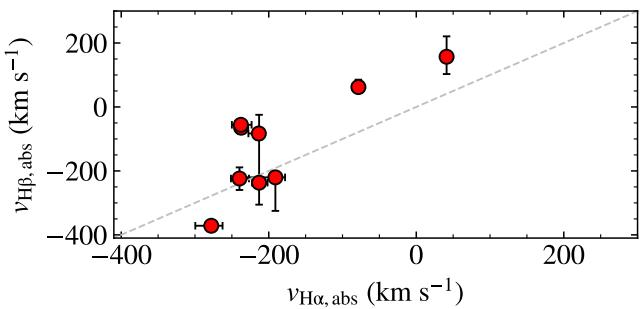

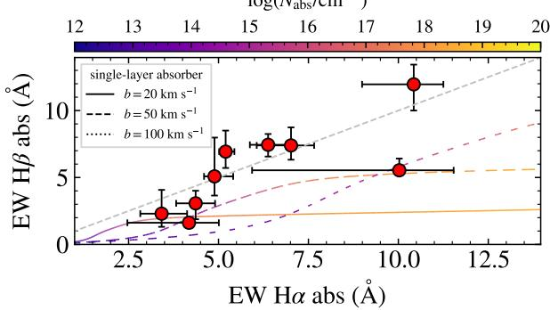  
Figure 7. Velocity shifts and EWs of Hα and Hβ absorption for sources in which both absorbers are detected. The gray dashed line indicates the one-to-one relation. In the bottom panel, the color-coded curves show the expected EWs of Hα and Hβ as a function of log N and $b ,$ assuming one gas cloud produces both transitions.

In Figure 8, we examine the relationship between the Balmer absorption features and the Balmer break strength and decrement. We characterize the absorbers using purely observational quantities: velocity offsets and EWs. We find no clear correlation between the velocity offsets or EWs of the Balmer absorbers and the Balmer break strength or decrement. However, we also caution that this conclusion is drawn from a small sample and is subject to considerable uncertainties, primarily driven by fitting degeneracies. A larger sample will be required to robustly constrain the connection between Balmer absorption properties and the continuum shape.

## 6.5. Emission line diagnostics

## 6.5.1. Metallicity and BPT diagram

We measure gas-phase metallicities using the direct $T _ { e }$ method. [O III]λ4364 line is detected at $\mathrm { S / N } > 5$ in 22 out of the 27 LRDs. We first determine the electron density $( n _ { e } )$ in the $\mathrm { O ^ { + } }$ zones using the [O II] λλ3727, 3730 doublet. In our sample, 20 sources have [O II] doublet ratios measured at $\mathrm { S / N } > 5 ,$ of which 17 have line ratios that fall within the density-sensitive regime. The [O II]-derived $n _ { e }$ spans a wide range, from

$8 6 _ { - 8 5 } ^ { + 1 1 4 }$ to $1 4 7 2 8 _ { - 3 4 5 8 } ^ { + 1 6 7 9 } \mathrm { c m } ^ { - 3 }$ , with a median of $2 9 0 \mathrm { c m } ^ { - 3 }$ Four sources in our sample have [S II] λλ6718, 6733 doublets with sufficient $\mathrm { S } / \mathrm { N }$ in the density-sensitive regime, yielding the [S II]-derived $n _ { e }$ ranging from $1 4 1 _ { - 1 4 0 } ^ { + 5 7 8 }$ to $\mathrm { 8 6 6 _ { - 7 7 4 } ^ { + 9 9 \bar { 2 } } c m ^ { - 3 } }$

We then estimate the electron temperature $\left( T _ { e } \right)$ by adopting $n _ { e }$ derived from [O II]. However, the measured [O III] λ5008/λ4364 ratios yield exceptionally high $T _ { e }$ values, ranging from 20,000 to 80,000 K. One possibility is that the [O III] λ5008, λ4364 lines are from a region with much higher density, where the $n _ { e }$ derived from [O II] is not representative of the conditions. The critical density of [O III] λ5008 is an order of magnitude higher than that of [O II] λ3727, and the critical density of [O III] λ4364 is three orders of magnitude higher. The $n _ { e }$ derived from [O II] traces the low-density zones, whereas the [O III] lines may originate from higher-density regions. If the true $n _ { e }$ in the $\mathrm { O ^ { + + } }$ regions significantly exceeds that inferred from [O II], the resulting $T _ { e }$ would be systematically overestimated.

Although the direct $T _ { e }$ method may not be fully appli cable, the weak or negligible [N II] emission observed in the BPT diagram (discussed below) independently in dicates that the selected LRDs are metal-poor. Adopting fiducial values of $T _ { e } ~ = ~ 1 5 , 0 0 0 \mathrm { K }$ and the median $N _ { e } = 2 9 0 \mathrm { c m } ^ { - 3 }$ provides an order-of-magnitude metallicity estimate of 12+log $\mathrm { ( O / H ) = 7 . 7 – 8 . 1 }$ , with a median of 7.8, corresponding to approximately 0.13 $Z _ { \odot }$

In the BPT diagram (Figure 9, J. A. Baldwin et al. 1981), DESI LRDs occupy a region characterized by their low metallicity and high ionization parameters (log U), a regime that can be shared by both AGNs and galaxies with similar properties (R. L. Sanders et al. 2023; A. E. Shapley et al. 2025). In the [N II] and [S II] diagrams (left and middle panels of Figure 9), all LRDs lie within the star-forming region or near the boundary between the Seyfert and H II loci. In contrast, in the [O I] diagram, most LRDs fall in the Seyfert region or near the Seyfert–H II boundary. However, this does not necessarily imply AGN-dominated narrow-line emission. Indeed, we find that emission-line galaxies at $z > 1 . 4$ (A. E. Shapley et al. 2025) can occupy the same parameter space as the LRDs.

## 6.5.2. He II 4687

The ionization potential of $\mathrm { H e ^ { + + } }$ is high (54.4 eV), making He II 4687 a powerful diagnostic of the ionizing spectrum. Figure 10 shows the He II $4 6 8 7 / \mathrm { H } \beta$ versus [N II] 6585/Hα diagram. Low-z LRDs, including the DESI LRDs presented here and those reported by Paper I, together with the high-z LRDs from B. Wang et al. (2025), consistently show He II 4687/Hβ ratios lower than those of typical type-1 AGNs. The He II λ4687/Hβ ratios span the range between star-forming galaxies and AGNs (M. Shirazi & J. Brinchmann 2012; F. Bian et al. 2020).

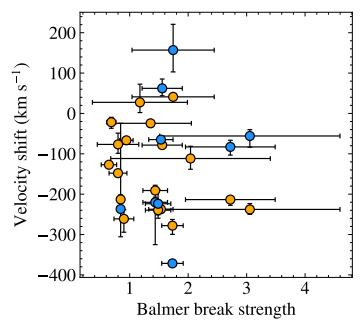

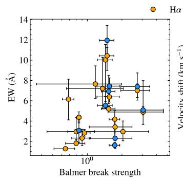

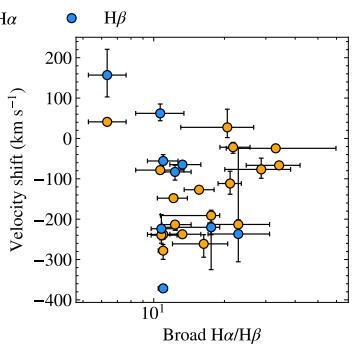

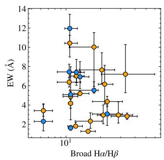  
Figure 8. The velocities and EWs of Balmer absorption versus their Balmer break strength and decrement.

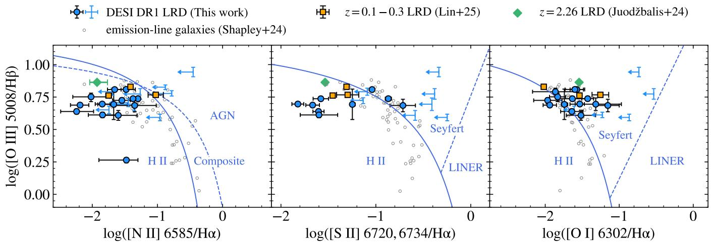  
Figure 9. BPT diagram for the narrow emission lines in LRDs. DESI DR1 LRDs are shown in blue. The $z < 0 . 3$ LRDs from Paper I are shown as orange squares, and the $z = 2 . 2 6$ LRD from I. Juodˇzbalis et al. (2024) is shown as a green diamond. The emission-line galaxies $\mathrm { a t } ~ z = 1 . 4 – 7 . 5$ from A. E. Shapley et al. (2025) are shown as gray circles. The classification boundaries for different ionization mechanisms (G. Kauffmann et al. 2003; L. J. Kewley et al. 2006) are shown as blue solid and dashed lines. The corresponding regions are labeled.

In the left panel of Figure 11, we show an example of an individual He II detection from our sample. To estimate the average He II strength, we stack the He II 4687 lines of all DESI LRDs after subtracting their local continua and normalizing by the narrow Hβ flux. The right panel of Figure 11 shows the resulting mean stacked He II line, yielding a stacked value of log(He II/Hβ) $= - 1 . 4 5 \pm 0 . 0 9$ As shown in Figure 10, the stacked value exceeds that of most star-forming systems, including high-z analogs and extremely metal-poor galaxies, but remains below that of typical AGNs. This suggests that, on average, DESI LRDs have an ionizing spectrum harder than that of most star-forming galaxies, yet softer than that of typical AGNs, as discussed in B. Wang et al. (2025).

## 6.5.3. Mg II λλ2796, 2803

We detect clear Mg II λλ2796, 2803 emission lines in six DESI DR1 LRDs (Figure 12). The Mg II doublet exhibits marginally resolved narrow components with FWHMs of ∼100–200 km $\mathrm { s } ^ { - 1 }$ , comparable to narrow components of [O III] and the Balmer lines. We do not detect broad components in the DESI spectra. The Mg II emission is redshifted by $2 7 { - } 1 5 8 \mathrm { k m s ^ { - 1 } }$ relative to the systemic redshift defined by [O III] 5008, consistent with its resonant nature. The EWs of Mg II 2796 lines range from 4 to 15 ˚A, consistent with those of low-mass star-forming galaxies exhibiting high [O III] 5008/[O II] 3727 ratios (Figure 13).

In summary, based on the BPT diagram and the Mg II λλ2796, 2803 doublet, we conclude that the narrow emission lines in low-z LRDs, from the UV to the optical, are consistent with low metallicity and high log U, which can be produced by either AGNs or galaxies. On the other hand, the He II diagnostic diagram reveals an ionizing spectrum that is harder than that of most star-forming galaxies, yet still softer than that of typical AGNs.

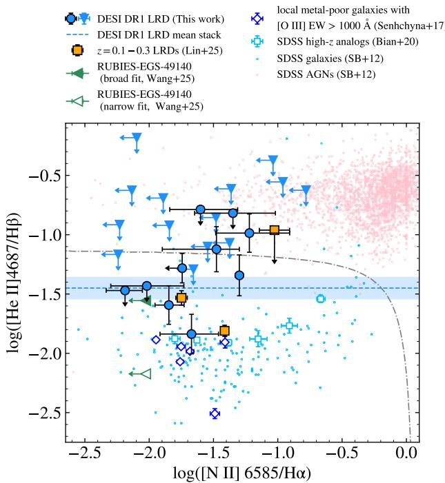  
Figure 10. He II 4687/Hβ versus [N II] 6585/Hα for LRDs over a wide range of redshifts. The DESI sample in this work is shown as blue circles and triangles, where the latter denote sources for which only upper limits are available for both line ratios. The mean stacked He II/Hβ ratio of the DESI LRDs is shown as a blue dashed horizontal line, with the shaded region as the associated uncertainty. Local LRDs at $z = 0 . 1 – 0 . 3$ from Paper I are shown as orange squares. He II emission in JWST-discovered LRD RUBIES-EGS-49140 (B. Wang et al. 2025) is shown as a filled green triangle when measured with a narrow+broad profile, and as an unfilled green triangle when measured with only a narrow Gaussian. We also include SDSS-selected galaxies (light blue circles) and AGNs (pink circles) compiled by M. Shirazi & J. Brinchmann (2012), as well as high-z galaxy analogs (light blue squares) from F. Bian et al. (2020) and extremely metal-poor galaxies with [O III] λ5008 EW > 1000 ˚A (blue diamonds) from P. Senchyna et al. (2017). The dash-dotted line marks the theoretical maximum starburst line from M. Shirazi & J. Brinchmann (2012).

## 6.6. [O III] ionized outflow

In our sample, we find a remarkably high incidence rate of [O III] outflows: 78% (21 out of 27) of the LRDs exhibit significant broad [O III] components, with velocity offsets to the narrow lines ranging from −73 to 48 km $\mathrm { s } ^ { - 1 }$ and FWHMs from 173 to 592 km $\mathrm { s } ^ { - 1 }$ . Similar ionized outflows have also been reported in high-redshift LRDs discovered with JWST/NIRSpec grating observations, but statistics are lacking (e.g., I. Juodˇzbalis et al. 2024; F. D’Eugenio et al. 2025b). The incidence rate of outflows in DESI LRDs is significantly higher than in typical high-z galaxies. For galaxies at $z \ = \ 3 { \ - } 9 ,$ the [O III] outflow incidence is reported to be roughly 30% by Y. Xu et al. (2025) and 25–40% by S. Carniani et al. (2024). The outflow incidence rate in DESI LRDs is comparable only to that observed in the most extreme starburst galaxies. For instance, in low-mass $( M _ { * } = 1 0 ^ { 4 } – 1 0 ^ { 7 } M _ { \odot } )$ galaxies with high specific starformation rates $( \mathrm { s S F R } \approx 1 0 0 \mathrm { - } 1 0 0 0 \ \mathrm { G y r } ^ { - 1 } )$ in the local Universe, the incidence rate of ionized outflows is approximately 67% (Y. Xu et al. 2022).

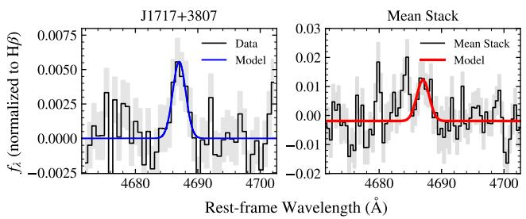  
Figure 11. Left: Example of an individual He II 4687 detection in one of the DESI LRDs. Right: Mean stacked He II 4687 spectrum for all the DESI LRDs. Both spectra are normalized by the narrow Hβ flux.

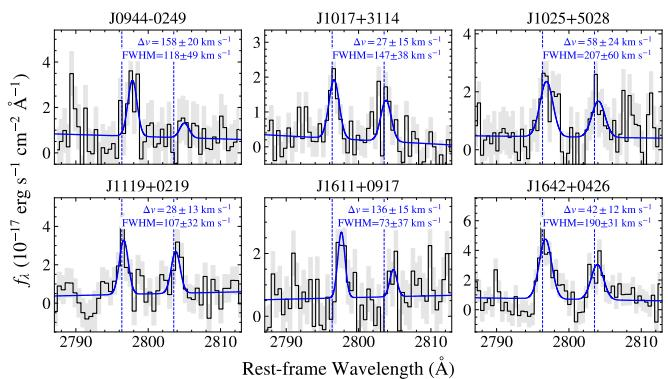  
Figure 12. Six DESI DR1 LRDs are detected with Mg IIλλ2796, 2803. The DESI spectra are shown in black, with grey shaded regions indicating the uncertainties. The best-fit Mg II doublets are shown in blue. The rest-frame wavelengths of Mg II at the redshift determined by [O III] 5008 are indicated by blue dashed vertical lines.

The outflows in DESI LRDs also exhibit elevated [O III]λ5008/Hβ ratios, which, together with their high incidence rate, point to a connection with AGN activity. Stellar-driven outflows typically exhibit relatively strong Balmer-line components, placing the outflowing gas in the non-AGN region of the BPT diagram. In contrast, in our joint fits of [O III] and Balmer lines, the Balmer-line outflow is negligible in 22 objects and detected in only five. This implies that the outflowing gas has high ionization parameters, although fitting degeneracies may be present. For sources with negligible Hβ outflows, the outflowing gas has very high log([O III]λ5008/Hβ) ratios, placing it firmly in the AGN region of the BPT diagram. Among the five objects with measurable Balmer outflows, log([O III]λ5008/Hβ) of the outflowing component ranges from 0.78 to 1.46, again keeping them within the AGN region or close to the AGN–starforming boundary. This suggests that the outflowing gas is photoionized by AGN radiation.

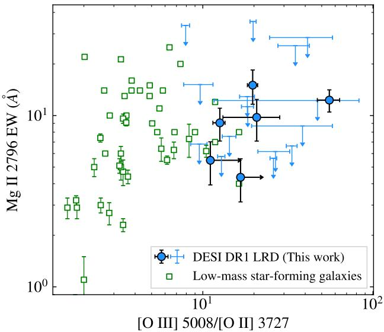  
Figure 13. [O III] 5008/[O II] 3727 versus Mg II 2796 EW for DESI DR1 LRDs and low-mass star-forming galaxies at $z \ < \ 1$ The blue circles represent DESI DR1 LRDs, while the blue upper limits indicate upper limits on the Mg II 2796 EW. The green squares denote low-mass star-forming galaxies at $z < 1$ , whose Mg II 2796 EWs are drawn from Lyman continuum leakers compiled in Y. I. Izotov et al. (2016, 2018, 2022, 2025); A. Henry et al. (2018); X. Xu et al. (2023).

However, the outflow velocities are relatively modest. The mechanisms responsible for their kinematics (e.g., winds, slow shocks) are still uncertain. We compute the outflow velocity following D. S. Rupke et al. (2005), defined as

$$
v _ { \mathrm { o u t } } = \left| \Delta v _ { [ \mathrm { O \ I I I } ] , \mathrm { o u t } } \right| + 2 \sigma _ { [ \mathrm { O \ I I I } ] , \mathrm { o u t } } ,\tag{5}
$$

where $\Delta v _ { [ \mathrm { O \ I I I } ] , \mathrm { o u t } }$ is the velocity offset of the outflow component relative to the narrow [O III] lines, and $\sigma _ { [ \mathrm { O \ I I I } ] , \mathrm { o u t } }$ is the velocity dispersion of the outflow component. The derived $v _ { \mathrm { o u t } }$ values for the DESI LRDs span 170–577 km $\mathrm { s } ^ { - 1 }$ , with a median of 267 km $\mathrm { s } ^ { - 1 }$ As shown in Figure 14, these velocities are comparable to those measured in low-mass galaxies with high specific star-formation rates (Y. Xu et al. 2022), but are lower than those of galactic outflows at $z ~ = ~ 3 { - } 9$ (S.

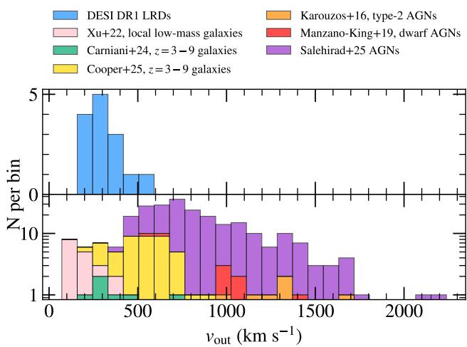  
Figure 14. The distribution of outflow velocity $v _ { \mathrm { o u t } }$ in DESI DR1 LRDs in this work, local low-mass galaxies with high sSFR (Y. Xu et al. 2022), $z = 3 - 9$ galaxies (S. Carniani et al. 2024; R. A. Cooper et al. 2025), and AGNs (M. Karouzos et al. 2016; C. M. Manzano-King et al. 2019; S. Salehirad et al. 2025). All the literature $v _ { \mathrm { o u t } }$ values are calculated with the definition in Equation 5, using the reported velocity offsets and FWHMs. The $v _ { \mathrm { o u t } }$ values for AGNs in S. Salehirad et al. (2025) correspond to sources classified as AGNs in all three BPT diagrams ([N II], [S II], and [O I]).

Carniani et al. 2024; R. A. Cooper et al. 2025). We caution, however, that observational limitations may bias the high-z outflow statistics, as weak outflows could be missed in faint galaxies observed with JWST/NIRSpec at $R \lesssim 2 7 0 0$ . The $v _ { \mathrm { o u t } }$ values in the DESI LRDs are also significantly lower than those of the AGN-driven outflows (M. Karouzos et al. 2016; C. M. Manzano-King et al. 2019; W. Liu et al. 2020; S. Salehirad et al. 2025; W. Liu et al. 2024), which can reach $v _ { \mathrm { o u t } } > 1 0 0 0$ km $\mathrm { s } ^ { - 1 }$

## 6.7. Variability

## 6.7.1. Optical Variability

We assess the significance of optical variability in the DESI LRDs using ZTF gri light curves. First, we rescale the per-epoch uncertainties by $f _ { \mathrm { e r r } } = \sqrt { \langle \chi ^ { 2 } / \nu \rangle _ { \mathrm { s t a r } } } ,$ the median over non-variable PSF reference stars $( \chi ^ { 2 } / \nu <$ 1.5 against a constant-flux model) within ±0.5 mag of the target on the same ZTF readout channel (∼0.7 $\deg ^ { 2 } )$ . For each light curve, we perform a $\chi ^ { 2 }$ test against a constant-flux model. We then compute the fractional variability amplitude (S. Vaughan et al. 2003),

$$
F _ { \mathrm { v a r } } = \frac { 1 } { \langle f \rangle } \sqrt { S ^ { 2 } - \overline { { \sigma _ { \mathrm { e r r } } ^ { 2 } } } }
$$

where $S ^ { 2 }$ is the sample flux variance and $\overline { { \sigma _ { \mathrm { e r r } } ^ { 2 } } }$ the mean squared photometric error. We estimate $\sigma _ { F _ { \mathrm { v a r } } }$ from 1000 bootstrap resamples. We additionally require the measurement to be leave-one-out (LOO) robust: $F _ { \mathrm { v a r } }$ recomputed with any single epoch removed must remain at $\geq 5 0 \%$ of the all-epoch value; light curves failing this test are flagged as outlier-driven. As a robustness check, we repeat the analysis after dropping the LOO-identified outlier from the target and from every reference simultaneously, so the comparison remains fair. Finally, we compare each target’s $F _ { \mathrm { v a r } }$ against the empirical $F _ { \mathrm { v a r } }$ distribution of reference stars matched to the target in both brightness and number of epochs (within a factor of two). In addition to $F _ { \mathrm { v a r } } ,$ we apply a linear-trend F - test (P. R. Bevington & D. K. Robinson 2003) that compares a linear fit to a constant-flux model and returns a p-value for the trend, following the approach used to identify long-term mid-IR fading in changing-look AGN (D. Stern et al. 2018). The test reveals smooth, monotonic variability that $F _ { \mathrm { v a r } }$ alone cannot distinguish from noise. A source is classified as exhibiting robust variability if it meets all of the following criteria: (a) p-value of the $\chi ^ { 2 }$ test $< 0 . 0 1 ;$ (b) S/N of $F _ { \mathrm { v a r } } { \mathrm { i s } } > 3$ and LOOrobust; (c) either $F _ { \mathrm { v a r } }$ lies above the 95th percentile of the reference-star $F _ { \mathrm { v a r } }$ distribution, or a weighted lineartrend F -test yields $p _ { \mathrm { t r e n d } } < 0 . 0 1$ and $p _ { \mathrm { t r e n d } }$ is smaller than the 5th percentile of the trend p-value distribution of the reference stars. Together, these criteria ensure that the light curve both deviates from a constant-flux model and differs significantly from those of non-variable reference sources.

Of the 27 DESI LRDs in this work, 13 have light curves suitable for variability analysis, spanning 4.1–7.5 years in the observed frame (median 6.9 years), corresponding to 3.1–6.3 years in the rest frame (median 4.1 years). In the remaining 14, 10 lack ZTF DR24 detections due to their faintness, and 4 have fewer than 10 usable epochs in any filter. Among the 13 sources, only the i-band light curve of J1717+3807 robustly satisfies all the criteria. J1717+3807’s i-band light curve (512 exposures) faded between 2018 and 2022 at a rate of $( 7 . 5 { \pm } 1 . 0 ) \times 1 0 ^ { - 3 }$ mag $\mathrm { y r } ^ { - 1 }$ . In contrast, its g and r fluxes (rest-frame ∼3970 and 5375 ˚A) are flat over the same window. J1646+1426’s i-band light curve marginally passes the criteria, but it is based on only 23 exposures. It has $F _ { \mathrm { v a r } } = 0 . 3 3$ at 3.8σ and only marginally exceeds the 95th percentile of its reference-star distribution (95.6th percentile). We thus classify it as tentative and note that its statistical significance requires further confirmation. Its light curve is shown in Appendix C. The remaining 11 show no significant evidence of variability.

## 6.7.2. Infrared Variability

We apply the same assessment to the WISE W1 and W2 light curves.

Among the 27 DESI LRDs, three satisfy all the statistical criteria above and are classified as WISE-variable (in W1 and/or W2). J1717+3807 is the most significant variable source in both bands, with $F _ { \mathrm { v a r } } = 0 . 0 3 3 \pm 0 . 0 0 5$ in W1 (7.2σ) and $F _ { \mathrm { v a r } } = 0 . 0 4 5 \pm 0 . 0 0 6$ in W2 (7.9σ). Both light curves exhibit coherent monotonic fading over the ∼14-year baseline, with rates of $( 8 . 8 \pm 0 . 5 ) \times 1 0 ^ { - 3 }$ mag yr−1 in W1 and $( 1 1 . 3 \pm 0 . 5 ) \times 1 0 ^ { - 3 } \mathrm { \ m a g y r ^ { - 1 } }$ in W2, as shown in Figure 15. J1646+1426 is classified as marginally variable only in W2, with $F _ { \mathrm { v a r } } = 0 . 1 6 \pm 0 . 0 5$ (3.0σ), and shows stochastic variability. J1909+5831 is classified as variable in W1, with $F _ { \mathrm { v a r } } ~ = ~ 0 . 5 1 \pm 0 . 1 0$ (5.2σ). It exhibits a brightening but with low S/N photometry. Its light curve is extracted from the Legacy Survey DR9 per-visit forced photometry on the unWISE coadded images, as it is too faint to be reliably detected in individual WISE single-exposure frames. The variability should be re-evaluated with more robust photometric methods to ensure a reliable measurement. The light curves of J1646+1426 and J1909+5831 are shown in Appendix C. The remaining 24 of the 27 sources do not show statistically significant variability.

## 6.7.3. The variability of J1717+3807

From 2018 to 2022 (rest-frame 3.3 years), J1717+3807’s i-band magnitude faded by $0 . 0 5 \pm 0 . 0 1$ mag, then rose by $0 . 0 2 \pm 0 . 0 1$ mag by 2024 (rest-frame 1.6 years). From 2010 to 2024 (rest-frame 11.7 years), the 31 epochs of WISE W1 show a smooth fading of $0 . 1 2 3 \pm 0 . 0 0 6$ mag, and W2 fades by $0 . 1 5 9 \pm 0 . 0 0 6$ mag. In contrast, its ZTF g and r light curves over the overlapping 2018–2026 window are consistent with constant flux.

We construct the structure function (SF; P. A. Hughes et al. 1992; S. Collier & B. M. Peterson 2001; A. Bauer et al. 2009; S. Koz lowski et al. 2010) and fit it with a power law (N. Palanque-Delabrouille et al. 2011):

$$
\mathrm { S F } \big ( \Delta t _ { \mathrm { r e s t } } \big ) = A \left( \frac { \Delta t _ { \mathrm { r e s t } } } { 1 \mathrm { y r } } \right) ^ { \gamma } .\tag{6}
$$

As shown in the right panel of Figure 15, J1717+3807’s ZTF i band shows a weakly significant rise. Both W1 and W2 exhibit an SF slope index of $\gamma \simeq 1$ , significantly steeper than the expectation from a damped random walk model $( \gamma \sim 0 . 5$ on timescales shorter than the characteristic timescales; C. L. MacLeod et al. 2010). The SF of J1717+3807 indicates that its variability is dominated by a long-term trend with a characteristic timescale longer than the observing baseline (∼ 10 years), while showing little variability on days-tomonths timescales.

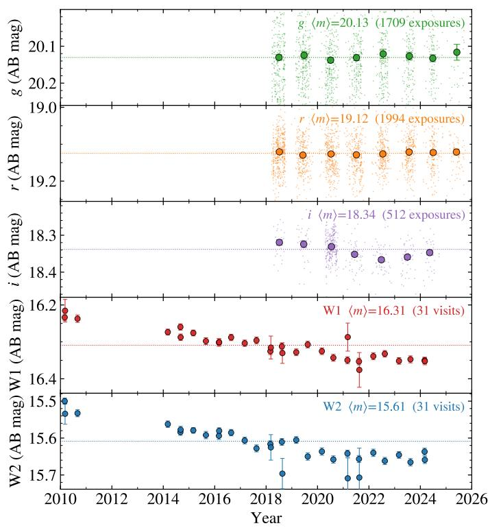

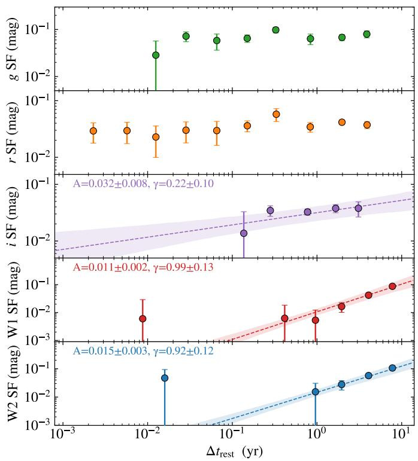  
Figure 15. Left: The ZTF gri and WISE W1 W2 light curves of J1717+3807 over ≳10 years. Right: The structure function (SF) of the light curves (light dots), the binned SF (filled dots), along with the best-fit power-law (dashed lines).

J1717+3807’s g and r bands are largely dominated by the blue UV component, which may be attributed to the host galaxy and explain the lack of significant variability. Its i band contains its Hα emission and the rising red optical continuum (Figure 2). The i-band variability may be driven by variations in either the Hα emission line, the continuum emission, or a combination of both. Dedicated spectroscopic monitoring is required to distinguish between the scenarios. Furthermore, the long-term variability is reminiscent of the gravitationally lensed, multiply imaged LRD RXCJ2211-RX1 (Z. Zhang et al. 2025b) which shows significant color and bright ness change over a timescale of ∼ 20 yr in the rest frame. Within the BH-envelope framework, the i-band continuum of J1717+3807 is interpreted as the ascending portion of the thermalized blackbody emission from the envelope. Monitoring over another decade-long baseline could reveal whether the i-band brightness continues to increase or instead exhibits periodic variability potentially associated with envelope pulsations, as discussed in Z. Zhang et al. (2025b).

J1717+3807’s WISE W1 and W2 bands, corresponding to rest-frame wavelengths of ∼2.8 and 3.9 µm, probe an excess above the tail of the same blackbody component (Figure 2). At these wavelengths, emission from hot dust at ∼1000 K may be significant or even dominant (see the SED fits in X. Lin et al. 2026b). Variability in the hot dust component could contribute to the observed WISE variability.

J1717+3807’s significant variability contrasts with the behavior of the other three z < 0.3 LRDs in Paper I (see also C. J. Burke et al. 2025). We compare the spectral properties of J1717+3807 with those of the other three z < 0.3 LRDs in Section 7.4. We defer a comprehensive analysis of the variability behavior of J1717+3807 to future work (Zhang, Z. in prep).

## 7. DISCUSSION

In this section, we provide a brief, qualitative discussion of the current sample and its implications. We defer more in-depth analysis and detailed modeling of LRDs to future works, pending more complete spectral data from our ongoing follow-up observations.

## 7.1. H-R diagram of LRDs

As widely discussed in recent literature, the opticalto-near-infrared spectra of LRDs exhibit blackbody-like emission. This has motivated certain models in which BHs are enshrouded by atmosphere-like envelopes that

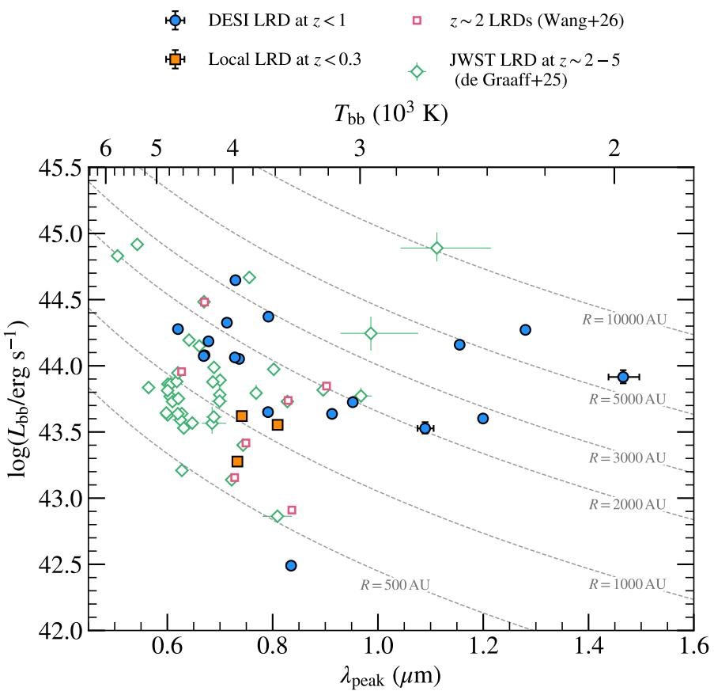  
Figure 16. H–R diagram of LRDs: the peak wavelength $\left( \lambda _ { \mathrm { p e a k } } \right)$ of the optical-to-near-infrared, blackbody-like continuum as a function of its luminosity $\left( L _ { \mathrm { b b } } \right)$ . The top axis indicates the effective temperature of a blackbody peaking at $\lambda _ { \mathrm { p e a k } }$ , based on Wien’s displacement law. Dashed gray lines mark loci of constant blackbody radius (in AU), derived by combining $L _ { \mathrm { b b } } = 4 \pi R ^ { 2 } \sigma T ^ { 4 }$ with Stefan-Boltzmann law. The JWST LRD sample is compiled from A. de Graaff et al. (2025b) and B. Wang et al. (2026a).

emit thermal radiation (e.g., K. Inayoshi et al. 2025a; X.   
Ji et al. 2025a; D. Kido et al. 2025; H. Liu et al. 2025).

In our sample, 17 sources have near-IR spectra with sufficient $\mathrm { S } / \mathrm { N }$ to cover the optical-to-IR continuum and locate the blackbody peak. We first fit the continuum blueward of the inflection points using a power-law model and subtract this component from the spectrum. The resulting residual spectrum is then fitted with a modified blackbody model. The results are shown in Figure B.1, and summarized in Table B.3. We emphasize that this modified blackbody is used only to estimate the peak wavelength and to calculate the total luminosity of the blackbody component. We do not ascribe any physical interpretation to its modification factor.

Figure 16 shows the Hertzsprung–Russell (H–R) diagram of LRDs: the distribution of the peak wavelength $\left( \lambda _ { \mathrm { p e a k } } \right)$ and the total luminosity of the blackbody component $\left( L _ { \mathrm { b b } } \right)$ , with the former indicative of the temperature of the blackbody. The value of $\lambda _ { \mathrm { p e a k } }$ spans 0.6–1.5 µm. Assuming a single-temperature blackbody, Wien’s displacement law yields temperatures $( T _ { \mathrm { b b } } )$ of

1977—4673 K. The H-R diagram does not show a sequence or correlation between $\lambda _ { \mathrm { p e a k } } \left( T _ { \mathrm { b b } } \right)$ and $L _ { \mathrm { b b } }$

Five objects show $\lambda _ { \mathrm { p e a k } } > 1$ µm corresponding to tem peratures below 3000 K, which is 19% of our DESI sample. Such a temperature exceeds the range predicted by most current BH envelope models (e.g., D. Kido et al. 2025; K. Inayoshi et al. 2025a; M. C. Begelman & J. Dexter 2026; A. D. Santarelli et al. 2026; H. Umeda et al. 2026). The non-negligible fraction of these low temperature envelopes poses a challenge to existing the oretical models. In contrast, at high-z, only one LRD at z ≈ 4.4 is reported with $\lambda _ { \mathrm { p e a k } } > 1 \mu \mathrm { m }$ in A. de Graaff et al. (2025b). Two additional sources at $z = 3 . 5$ and $z = 4 . 1$ are reported to be consistent with $\lambda _ { \mathrm { p e a k } }$ ≈ 1 µm within 1σ. The three $\mathrm { \ h i g h - } \lambda _ { \mathrm { p e a k } }$ LRDs only represent 8% of the 40 LRDs at $z = 2 . 3 - 4 . 5$ in A. de Graaff et al. (2025b). While the simple statistics appear to suggest that cool envelopes are more prevalent in the low-z Universe, both the high-z and low-z samples are subject to selection effects that have not been quantified.

Figure 16 also illustrates the loci of a constant black body radius as a function of $L _ { \mathrm { b b } }$ and $\lambda _ { \mathrm { p e a k } }$ , assuming spherical blackbody emission. For cool LRDs with $\lambda _ { \mathrm { p e a k } } \gtrsim 1$ µm at both high and low z, the resulting radii are all $R \gtrsim 2 0 0 0 ~ \mathrm { A U }$ . In this low-temperature regime, the cooler envelopes imply larger envelope radii. If cool envelopes are indeed more common at low z in the population, this would suggest that low-z LRDs tend to host larger envelopes. However, before drawing any firm conclusions, selection effects should be carefully quantified.

In reality, the optical-to-near-IR continua of LRDs are unlikely to originate from a single blackbody. Many LRDs show significant deviations from a singletemperature blackbody, or can be more properly described by multi-temperature components (A. de Graaff et al. 2025b; B. Wang et al. 2026a). Variations of temperature and opacity are unsurprising or even expected in the dense gas envelope, which can distort the spectral shape (e.g., H. Liu et al. 2026). To measure the effective temperature, more realistic models are required to account for gas layers with different temperatures and radiative transfer effects within a genuine atmospheric structure.

## 7.2. Long-wavelength inflection points

As noted in Section 6.3, the inflection points do not always occur at the Balmer limit. In our sample, five of the 27 objects (19%) exhibit inflection points at $\lambda > 4 5 0 0 \textup { \AA }$ (see Table 1), a higher fraction than that observed among the $z > 2$ LRDs identified by A. de Graaff et al. (2025b) (13/116 objects, ≈11%). Given the currently limited sample size and incomplete selections at both high and low redshift, it is unclear whether this trend reflects selection effects or potential cosmic evolution. Nevertheless, this suggests that selecting LRDs from spectroscopic libraries such as DESI, SDSS, or JWST/NIRSpec based solely on inflection points near the Balmer limit is insufficient.

Inflection points at wavelengths near $_ \mathrm { H } \beta + [ \mathrm { O }$ III] are also seen in three of the four LRDs at $z \sim 2$ in B. Wang et al. (2026a), which are thought to host cooler BH atmospheres at around 3000–4000 K. Four of the five objects in our sample with inflection points > 4500 ˚A have $\lambda _ { \mathrm { p e a k } } > 1 \mu \mathrm { m }$ . If converting their $\lambda _ { \mathrm { p e a k } }$ using a single blackbody, the resulting temperature would be $T < 3 0 0 0$ K, placing them as the coolest LRDs known so far.

Figure 17 illustrates the correlation between the inflection points and blackbody peak wavelengths for both the low-z and high-z LRD samples. In the low-z sample, the Kendall τ analysis reveals a clear trend in which longer inflection points correspond to redder blackbody peaks, except for the outlier J0129+0628. The longer inflection points, therefore, indicate cooler envelopes. The correlation in the high-z sample is less robust. Although the p-value is 0.01, it is associated with large uncertainties. The clearer correlation seen in the low-z LRDs is primarily driven by the larger fraction of cool LRDs, as discussed in Section 7.1. The observed inflection point wavelength is determined by a combination of the temperature of the BH envelope and the relative contribution from the host galaxy. If the envelope temperature is too low, the gas cannot produce an effective Balmer break. Variations in the relative strengths of the galaxy and envelope emission will also shift the location of the inflection points.

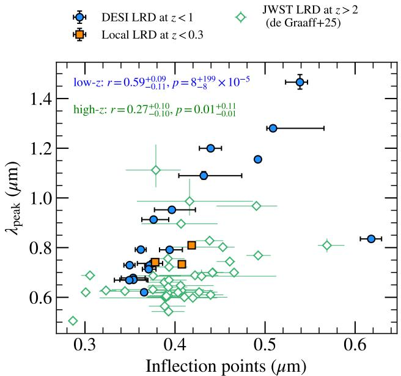  
Figure 17. The correlation between the inflection points and blackbody peak wavelengths $\left( \lambda _ { \mathrm { p e a k } } \right)$ of low-z and high-z LRDs. The results of the Kendall τ correlation analysis for both the high-z and low-z samples are shown.

## 7.3. Constraints on the ionizing source of narrow lines

In Section 6.5, we present diagnostics of narrow emission lines in DESI LRDs. The ionizing spectra of DESI LRDs are harder than in most star-forming galaxies, but softer than in typical type-1 AGNs. If the narrow lines originate from H II regions in the host galaxies, the galaxies should be among the most extreme systems dominated by young massive stars.

However, a scenario powered solely by stellar popula tions poses challenges in explaining the He II strength (Figure 10). The He II emission in DESI LRDs is stronger than that observed in high-z analog galaxies and in metal-poor starburst galaxies. For reference, in BPASS v2.2 models (E. R. Stanway & J. J. Eldridge 2018), at $Z = 0 . 1 Z _ { \odot }$ and log $U = - 2$ , the maximum log(He II/Hβ) is −2.1. In the most extreme case, log $U = - 1$ , a metallicity of $5 \times 1 0 ^ { - 4 } Z _ { \odot }$ , and an age of 25 Myr, the maximum log(He $\mathrm { I I } / \mathrm { H } \beta )$ in the BPASS models reaches −1.5. All detected He II in low-z LRDs have $\log ( \mathrm { H e \ I I / H \beta } ) \gtrsim - 1 . 8$ , with a stacked value ≈ 1.45 and three exceeding −1.5. This suggests that the observed He II emission exceeds what can be produced even by the most extreme young stellar populations. A stellar origin for He II would therefore require the host galaxies of DESI LRDs to have even more extreme ionization parameters. To further boost the He II-ionizing photon budget, additional non-stellar sources, such as X-ray binaries (D. Schaerer et al. 2019), would be required at fractions much higher than in typical starforming galaxies. Shock excitation could also enhance He II emission. However, the [S II] BPT diagram argues against this interpretation. The [S II] lines are highly sensitive to shocks: once shocks contribute more than ∼20%, sources are expected to shift toward the LINER region due to enhanced [S II] emission produced during the cooling of shocked gas (I.-T. Ho et al. 2014). The location of LRDs in the [S II] BPT diagram instead indicates that shocks do not play a significant role.

A more natural interpretation is that the narrow lines are powered by a combination of AGN and host galaxy. The presence of AGN photons could also explain the high incidence and elevated ionization parameters of [O III] outflows. In the BH envelope scenario, one possibility is that photons from the central accretion disk are reprocessed by the envelope, producing a softer ionizing spectrum than that emitted directly from the disk. Another possibility is that AGN photons escape through low-opacity channels, or that the envelope is clumpy, leading to a mixture of AGN emission, stellar light, and thermally reprocessed envelope emission. This geometry is also suggested by recent deep UV spectroscopic observations of Abell2744-QSO1 (X. Ji et al. 2026; M. Tang et al. 2026).

For line diagnostics in Section 6.5, statistical high-z LRD measurements obtained in the same way are still lacking, preventing a robust comparison between highz and low-z samples. In the He II diagram, the de tected He $\mathrm { I I } / \mathrm { H } \beta$ ratios in the DESI LRDs are higher than the narrow-line fit of RUBIES-EGS-49140 from B. Wang et al. (2025). In the stacked NIRSpec/PRISM spectra of high-z LRDs from B. Wang et al. (2025), He II 4687 is not detected. In the stacked PRISM spectra of P. G. P´erez-Gonz´alez et al. (2026), a broad He II 4687 component $\mathrm { ( F W H M > 2 0 0 0 ~ k m s ^ { - 1 } ) }$ is detected and attributed to either Wolf–Rayet stars or AGN activity, although the PRISM resolution is low. In contrast, we do not find significant broad He II 4687 emission in our DESI LRD sample. In the absence of a statistical sample of individual high-z He II 4687 measurements with sufficient spectral resolution, it remains unclear whether low-z LRDs exhibit systematically different He II 4687 emission strengths and profiles. Similarly, it has been reported that JWST AGNs lack prominent fast outflows (R. Maiolino et al. 2025), although [O III] outflows have been detected in several high-z LRDs (I. Juodˇzbalis et al. 2024; F. D’Eugenio et al. 2025b; R. A. Cooper et al. 2025). A larger sample of NIRSpec grating observations of their [O III] lines is required to assess the incidence rate.

## 7.4. Highlight: J1717+3807

Among all the DESI DR1 LRDs presented in this work, we highlight J1717+3807 as a particularly promis ing target for further follow-up. Indeed, it will be observed by JWST GO 12316 (PI: Franz Bauer).

J1717+3807 is the brightest and lowest-redshift LRD in our DESI sample $( m _ { r } \approx 1 9 $ mag and $m _ { i } \approx 1 8 \ \mathrm { m a g } )$ comparable in brightness to the three $z < 0 . 3 \ \mathrm { L R D s }$ reported in Paper I $( \mathrm { J 1 0 2 5 + 1 4 0 2 }$ , The Egg; J1047+0739; J1022+0841), while the remaining DESI LRDs are typically 2–3 mag fainter.

J1717+3807 shows different properties from the three bright $z ~ < ~ 0 . 3$ LRDs. Its V-shaped inflection point occurs at ∼4920 ˚A, near Hβ+ [O III], whereas the other three systems inflect near the Balmer break $( 3 7 0 4 \mathrm { - } 4 1 6 8 \mathring \mathrm { A } )$ . Its optical–near-IR continuum peaks at ${ \sim } 1 . 1 6 \mu \mathrm { m } .$ while the other three objects peak at 7330–8094 ˚A. Both the inflection point and peak wavelength are significantly redder (longer) in J1717+3807. The envelope temperature $T _ { \mathrm { b b } }$ is cooler (∼2500 K con verted from Wien’s displacement law) than those of the other three (∼4000 K from Wien’s displacement law and ∼4500 K when fitted with theoretical atmospheric models as shown in H. Liu et al. 2026).

As discussed in Section 6.7, its i-band and WISE flux fade on time-scales of years. It is in contrast with the lack of significant variability seen in the other three $z < 0 . 3 \mathrm { L R D s }$ (C. J. Burke et al. 2025) but is reminiscent of the $\sim 2 0 \mathrm { y r }$ variability observed in RXCJ2211-RX1 at $z \sim 4$ (Z. Zhang et al. 2025b). It is worth exploring whether the presence of variability is linked to the envelope temperature and therefore to its instability (M. Cantiello et al. 2026). A large sample of bright LRDs spanning a wide range of temperatures is needed to in vestigate the connection.

## 8. SUMMARY

This paper is the second in our series on low-z LRD surveys, extending the sample presented in Paper I. We aim to build a statistical sample of low-z LRDs to complement the high-z JWST samples and to probe the cosmic evolution of this population.

In this work, we present our selection of LRDs based on DESI DR1, currently the largest publicly available spectroscopic dataset. We compile multi-wavelength photometry and conduct spectroscopic follow-up observations from Magellan/FIRE, LBT/LUCI and Keck/NIRES. Our findings are summarized as follows.

• We select 27 LRDs from DESI DR1 at $z =$ 0.2–0.9. These sources are consistent with JWSTdiscovered high-z LRDs in morphology, contin uum properties, Balmer emission and absorption line properties, and narrow-line properties. Across all these diagnostics, they occupy distributions consistent with those of high-z LRDs, suggesting that the same underlying physical processes are at work. The discovery significantly expands the sample of known LRDs at $z < 1$

• The selection in DESI DR1 yields an incomplete number density of $7 . 5 \times 1 0 ^ { - 1 0 } \ \mathrm { M p c ^ { - 3 } } \ \mathrm { a t } \ z < 1$ which should be regarded as a conservative lower limit (Section 6.2).

• DESI LRDs exhibit a wide range of continuum shapes, with inflection points spanning from near the Balmer limit to just blueward of Hα (∼ 6200 ˚A). Their luminosities $( M _ { \mathrm { U V } } , ~ L _ { 5 1 0 0 } )$ occupy a distribution similar to that of high-z LRDs discovered by JWST (Section 6.3).

• The broad Hα and Hβ luminosities are strongly correlated with $L _ { 5 1 0 0 }$ . These relationships are well described by power laws but deviate from those observed in local type-1 AGNs. This discrepancy cautions against the direct application of local scaling relations when estimating the black hole masses of LRDs. On the other hand, it also suggests an alternative scaling relation may be at play. (Section 6.4.1).

• The Balmer decrement $( \mathrm { H } \alpha / \mathrm { H } \beta )$ of narrow lines has a median value of 3.4, while that of broad lines is 16.0. Such extreme broad-line Balmer decrements point to radiative transfer effects in dense gas rather than dust attenuation alone. No statistically significant correlation is found between the broad-line Balmer decrement and either $L _ { 5 1 0 0 }$ or the Balmer break strength (Section 6.4.2).

• Eighteen of the 27 LRDs (67%) exhibit Hα and/or Hβ absorption. The velocity shifts and EWs of Hα and Hβ are highly correlated. However, the Hβ EWs are systematically higher than those expected from the Voigt-profile parameters of the Hα absorber, under the assumption that a single cloud produces both transitions. This implies that the Balmer absorption in LRDs originate from multiple rather than single gas cloud. The absorbers span velocity shifts from −371 to $+ 1 5 6 \mathrm { k m s ^ { - 1 } }$ (mostly blueshifted), column densities of log( $N _ { \mathrm { H } \beta } / \mathrm { c m } ^ { - 2 } ) = 1 3 . 9 \ – 1 5 . 5$ and $\log ( N _ { \mathrm { H } \alpha } / \mathrm { c m } ^ { - 2 } ) = 1 3 . 0 { - } 1 8 . 4$ , and Doppler parameters $b = 2 4 { - } 4 6 0 \mathrm { k m s ^ { - 1 } }$ , revealing a wide range of absorber dynamical states. Most absorbers have covering factors near unity. We do not find a significant correlation between the Balmer absorber velocity or EW and either the Balmer break strength or the Balmer decrement. (Section 6.4.3).

• All DESI LRDs exhibit low metallicity in their narrow-line regions or host galaxies, with a median value of $1 2 + \log ( \mathrm { O / H } ) = 7 . 8$ . In the BPT diagrams, DESI LRDs fall within the star-forming regions in the [N II] and [S II] diagrams, but occupy the Seyfert region in the [O I] diagram. They occupy the same parameter space in the BPT diagram as emission-line galaxies at $z > 1 . 4$ (Section 6.5).

• In the He II 4687 diagram, the He $\mathrm { I I } / \mathrm { H } \beta$ ratios of DESI LRDs lie between those of star-forming galaxies and AGNs. Their mean stacked He $\mathrm { I I } / \mathrm { H } \beta$ value $( \log ( \mathrm { H e \ I I / H \beta ) = - 1 . 4 5 \pm 0 . 0 9 ) }$ exceeds that of most galaxies, including high-z analogs and extremely metal-poor galaxies, but remains below typical AGNs. This indicates that DESI LRDs have an ionizing spectrum harder than most starforming galaxies, yet softer than typical AGNs (Section 6.5).

• Narrow Mg II emission with FWHM∼ 100 − $2 0 0 \mathrm { k m s ^ { - 1 } }$ is detected in six DESI LRDs. Their EWs range from 4 to 15 ˚A, consistent with those of low-mass starburst galaxies (Section 6.5).

• Broad [O III] outflows are detected in 21 of 27 DESI LRDs (78%), an incidence rate much higher than that of star-forming galaxies, implying an AGN origin. However, the outflow velocities are relatively modest $( v _ { \mathrm { o u t } } \sim 1 7 0 – 5 7 7 \mathrm { k m s ^ { - 1 } }$ , median $2 6 7 \mathrm { k m s ^ { - 1 } } )$ , lower than those of galactic outflows $\mathrm { a t } ~ z ~ > ~ 3$ and below most AGN-driven outflows (Section 6.6).

• Among sources with light curves of sufficient S/N for variability analysis, the majority show no significant variability or only tentative low-S/N variability requiring confirmation. The only robustly variable source is $\mathrm { J 1 7 1 7 + 3 8 0 7 }$ Its i-band flux faded by $0 . 0 5 \pm 0 . 0 1$ mag over 3.3 yr in the rest frame, followed by a brightening of $0 . 0 2 { \pm } 0 . 0 1$ mag. Its WISE W1 and W2 light curves show monotonic fading of $0 . 1 2 3 { \pm } 0 . 0 0 6$ and $0 . 1 5 9 { \pm } 0 . 0 0 6$ mag, respectively, over a rest-frame baseline of 11.7 yr (Section 6.7).

• Seventeen LRDs have sufficient wavelength coverage to characterize the optical-to-near-infrared continuum. Their continua are well described by modified blackbody-like spectra peaking at 0.6– $1 . 5 \mu \mathrm { { m } , }$ corresponding to temperatures of ∼2000– 4700 K under Wien’s law assuming a single blackbody. Five objects peak at $> 1 \mu \mathrm { m }$ , corresponding to temperatures below 3000 K. The fraction of low-temperature LRDs at $z \textless 1$ (19%) is higher than that in $z = 2 - 5$ LRDs (8%), although the selection effect is not yet quantified (Section 7.1).

• The H–R diagram of LRDs $( \lambda _ { \mathrm { p e a k } }$ or $T _ { \mathrm { b b } }$ versus $L _ { \mathrm { b b } } )$ does not reveal a clear sequence or correlation between $\lambda _ { \mathrm { p e a k } } \left( T _ { \mathrm { b b } } \right)$ and $L _ { \mathrm { b b } }$ . In the low- ${ \it \cdot T } _ { \mathrm { b b } }$ $( \lambda _ { \mathrm { p e a k } } > 1 \mu \mathrm { m } , T _ { \mathrm { b b } } < 3 0 0 0 ~ \mathrm { K } )$ regime, the cooler envelopes imply larger envelope radii (Section 7.1).

• A correlation between longer-wavelength SED inflection points and cooler envelopes is suggested for low-z LRDs (Section 7.2).

• The ionizing spectra of DESI LRDs, which are softer than those of typical AGNs but harder than those of star-forming galaxies, are most likely explained by a combination of AGN and host-galaxy emission. In the BH envelope framework, one possibility is that AGN photons are reprocessed by the envelope, or that they escape through low-opacity channels or a clumpy envelope structure. (Section 7.3).

• Finally, among all the DESI LRDs in this work, we highlight J1717+3807 as a particularly promising target for further follow-up studies. As the brightest and lowest-redshift object in our sample, it presents different properties from the other three bright $z ~ < ~ 0 . 3$ LRDs: longer inflection points (near Hβ+[O III]), redder blackbody peaks $( \lambda _ { \mathrm { p e a k } } \approx 1 . 1 6 \mu \mathrm { m } )$ , indicative of a very cool BH envelope $( T _ { \mathrm { b b } } \sim 2 5 0 0 \mathrm { K } )$ , and significant variability in i, WISE W1, and W2 bands over a baseline of ∼ 10 yr (Section 7.4).

The most pressing question surrounding LRDs concerns the nature of their central engine, their BH masses, and their role in BH growth. BH mass estimates, as a key to deciphering LRDs’ nature, remain uncertain. The correlation between the Balmer luminosity and $L _ { 5 1 0 0 }$ suggests that empirical BH mass estimators calibrated for local type-1 AGNs may not be directly applicable, and instead points toward a potential new calibration relation for BH mass estimates in LRDs. Furthermore, establishing whether these systems trace a common path way of BH assembly requires a comprehensive characterization of their structure and geometry, the physical conditions of the absorbing gas, their variability, and the interplay between the central engine and its circum-BH environment and host galaxy. Addressing these questions requires mapping the full diversity of the population and its evolution across cosmic time. Only by tracing these properties from $z > 6 \mathrm { \ t o \ } z \sim 0$ can we establish whether LRDs mark a transient yet universal phase of BH growth, or a phenomenon confined to spe cific physical conditions.

While JWST has delivered large statistical samples of LRDs at $z > 2 ,$ the low-redshift regime $( z < 1 )$ remains a largely open frontier for the community. Our current sample of 27 objects from DESI DR1, along with those from SDSS in Paper I, does not yet span the full parameter space. Future DESI data releases (∼5× more spectra), ongoing and upcoming spectroscopic surveys (e.g., 4MOST, PFS, MUST), wide-field imaging surveys (e.g., CSST, Euclid, Roman, LSST, SPHEREx), and growing JWST/NIRSpec archival datasets at $z > 2$ , will collectively enable the assembly of LRD samples across cosmic time. In addition to the LRD population, our understanding of the low-z AGN population remains limited, particularly for low-metallicity and low-luminosity systems, as well as the broader population that shares only some of the properties of LRDs. It is also critical to understand how these characteristics arise, how LRDs connect to other AGN populations, and how they fit into the broader picture of BH growth.

As the second paper in our low-redshift LRD survey series, (LRDs)2, this work establishes the selection framework in DESI DR1 and presents an initial census. In subsequent papers, we will expand to larger and more complete samples, extend wavelength coverage through ongoing follow-up observations, and develop physically motivated models.

## DATA AVAILABILITY

The DESI DR1 spectra and the measurements presented in this work are publicly available on Zenodo at https://doi.org/10.5281/zenodo.20309303.

## ACKNOWLEDGMENTS

We thank Xihan Ji and Franz Bauer for constructive and friendly discussions. We thank the LCO, LBT, and Keck staff for their kind support during our observing runs. We thank Jenny Powers for her expert assistance with LBT observations and Greg Doppmann for his expert assistance with Keck observations.

This research used data obtained with the Dark Energy Spectroscopic Instrument (DESI). DESI construction and operations are managed by the Lawrence Berkeley National Laboratory. This material is based upon work supported by the U.S. Department of Energy, Office of Science, Office of High-Energy Physics, under Contract No. DE–AC02–05CH11231, and by the National Energy Research Scientific Computing Center, a DOE Office of Science User Facility under the same contract. Additional support for DESI was provided by the U.S. National Science Foundation (NSF), Division of Astronomical Sciences under Contract No. AST-0950945 to the NSF’s National Optical-Infrared Astronomy Research Laboratory; the Science and Technology Facilities Council of the United Kingdom; the Gordon and Betty Moore Foundation; the Heising-Simons Foundation; the French Alternative Energies and Atomic Energy Commission (CEA); the National Council of Humanities, Science and Technology of Mexico (CONAHCYT); the Ministry of Science and Innovation of Spain (MICINN), and by the DESI Member Institutions: www.desi.lbl.gov/collaborating-institutions. The DESI collaboration is honored to be permitted to conduct scientific research on I’oligam Du’ag (Kitt Peak), a mountain with particular significance to the Tohono O’odham Nation. Any opinions, findings, and conclusions or recommendations expressed in this material are those of the author(s) and do not necessarily reflect the views of the U.S. National Science Founda tion, the U.S. Department of Energy, or any of the listed funding agencies.

The Legacy Surveys consist of three individual and complementary projects: the Dark Energy Camera Legacy Survey (DECaLS; Proposal ID #2014B-0404; PIs: David Schlegel and Arjun Dey), the Beijing-Arizona Sky Survey (BASS; NOAO Prop. ID #2015A-0801; PIs: Zhou Xu and Xiaohui Fan), and the Mayall z-band Legacy Survey (MzLS; Prop. ID #2016A-0453; PI: Arjun Dey). DECaLS, BASS, and MzLS together include data obtained, respectively, at the Blanco telescope, Cerro Tololo Inter-American Observatory, NSF’s NOIRLab; the Bok telescope, Steward Observatory, University of Arizona; and the Mayall telescope, Kitt Peak National Observatory, NOIRLab. Pipeline processing and analyses of the data were supported by

NOIRLab and the Lawrence Berkeley National Laboratory (LBNL). The Legacy Surveys project is honored to be permitted to conduct astronomical research on Iolkam Du’ag (Kitt Peak), a mountain with particular significance to the Tohono O’odham Nation.

NOIRLab is operated by the Association of Universi ties for Research in Astronomy (AURA) under a cooperative agreement with the National Science Foundation. LBNL is managed by the Regents of the University of California under contract to the U.S. Department of Energy.

This project used data obtained with the Dark Energy Camera (DECam), which was constructed by the Dark Energy Survey (DES) collaboration. Funding for the DES Projects has been provided by the U.S. Department of Energy, the U.S. National Science Foundation, the Ministry of Science and Education of Spain, the Science and Technology Facilities Council of the United Kingdom, the Higher Education Funding Council for England, the National Center for Supercomputing Applications at the University of Illinois at Urbana-Champaign, the Kavli Institute of Cosmological Physics at the University of Chicago, the Center for Cosmology and Astro-Particle Physics at the Ohio State University, the Mitchell Institute for Fundamental Physics and Astronomy at Texas A&M University, Financiadora de Estudos e Projetos, Funda¸c˜ao Carlos Chagas Filho de Amparo \`a Pesquisa do Estado do Rio de Janeiro, Conselho Nacional de Desenvolvimento Cient´ıfico e Tecnol´ogico, and the Minist´erio da Ciˆencia, Tecnologia e Inova¸c˜ao, the Deutsche Forschungsgemeinschaft, and the Collaborating Institutions in the Dark Energy Survey. The Collaborating Institutions are Argonne National Laboratory, the University of California at Santa Cruz, the University of Cambridge, Centro de Investigaciones Energ´eticas, Medioambientales y Tecnol´ogicas-Madrid, the University of Chicago, University College London, the DES-Brazil Consortium, the University of Edinburgh, the Eidgen¨ossische Technische Hochschule (ETH) Z¨urich, Fermi National Accelerator Laboratory, the University of Illinois at Urbana-Champaign, the Institut de Ci\`encies de l’Espai (IEEC/CSIC), the Institut de F´ısica d’Altes Energies, Lawrence Berkeley National Laboratory, the Ludwig-Maximilians-Universit¨at M¨unchen and the associated Excellence Cluster Universe, the University of Michigan, NSF’s NOIRLab, the University of Nottingham, the Ohio State University, the University of Pennsylvania, the University of Portsmouth, SLAC National Accelerator Laboratory, Stanford University, the University of Sussex, and Texas A&M University.

BASS is a key project of the Telescope Access Program (TAP), which has been funded by the National Astronomical Observatories of China, the Chi nese Academy of Sciences (the Strategic Priority Research Program “The Emergence of Cosmological Structures”, Grant #XDB09000000), and the Special Fund for Astronomy from the Ministry of Finance. BASS is also supported by the External Cooperation Program of Chinese Academy of Sciences (Grant #114A11KYSB20160057), and the Chinese National Natural Science Foundation (Grant #12120101003, #11433005).

The Legacy Survey team makes use of data products from the Near-Earth Object Wide-field Infrared Survey Explorer (NEOWISE), which is a project of the Jet Propulsion Laboratory/California Institute of Technology. NEOWISE is funded by the National Aeronautics and Space Administration.

The Legacy Surveys imaging of the DESI footprint is supported by the Director, Office of Science, Office of High Energy Physics of the U.S. Department of Energy under Contract No. DE-AC02-05CH1123, by the National Energy Research Scientific Computing Center, a DOE Office of Science User Facility under the same contract, and by the U.S. National Science Foundation, Division of Astronomical Sciences under Contract No. AST-0950945 to NOAO.

This research uses services or data provided by the Astro Data Lab, which is part of the Community Science and Data Center (CSDC) Program of NSF NOIRLab. NOIRLab is operated by the Association of Universities for Research in Astronomy (AURA), Inc. under a cooperative agreement with the U.S. National Science Foundation.

This research is based on observations made with the Galaxy Evolution Explorer, obtained from the MAST data archive at the Space Telescope Science Institute, which is operated by the Association of Universities for Research in Astronomy, Inc., under NASA contract NAS 5–26555.

This work has made use of data from the European Space Agency (ESA) mission Gaia (https://www. cosmos.esa.int/gaia), processed by the Gaia Data Processing and Analysis Consortium (DPAC, https://www. cosmos.esa.int/web/gaia/dpac/consortium). Funding for the DPAC has been provided by national institutions, in particular the institutions participating in the Gaia Multilateral Agreement.

This work is based in part on data obtained as part of the UKIRT Infrared Deep Sky Survey.

The Pan-STARRS1 Surveys (PS1) and the PS1 public science archive have been made possible through contributions by the Institute for Astronomy, the University of Hawaii, the Pan-STARRS Project Office, the Max-Planck Society and its participating institutes, the Max Planck Institute for Astronomy, Heidelberg and the Max Planck Institute for Extraterrestrial Physics, Garching, The Johns Hopkins University, Durham University, the University of Edinburgh, the Queen’s University Belfast, the Harvard-Smithsonian Center for Astrophysics, the Las Cumbres Observatory Global Telescope Network Incorporated, the National Central University of Taiwan, the Space Telescope Science Institute, the National Aeronautics and Space Administration under Grant No. NNX08AR22G issued through the Planetary Science Division of the NASA Science Mission Directorate, the National Science Foundation Grant No. AST-1238877, the University of Maryland, Eotvos Lorand University (ELTE), the Los Alamos National Laboratory, and the Gordon and Betty Moore Foundation.

This publication makes use of data products from the Spectro-Photometer for the History of the Universe, Epoch of Reionization and Ices Explorer (SPHEREx), which is a joint project of the Jet Propulsion Laboratory and the California Institute of Technology, and is funded by the National Aeronautics and Space Administration.

This paper includes data gathered with the 6.5 meter Magellan Telescopes located at Las Campanas Observatory, Chile.

The LBT is an international collaboration among institutions in the United States, Italy and Germany. LBT Corporation partners are: The University of Arizona on behalf of the Arizona university system; Isti tuto Nazionale di Astrofisica, Italy; LBT Beteiligungsgesellschaft, Germany, representing the Max-Planck Society, the Astrophysical Institute Potsdam, and Heidelberg University; The Ohio State University, and The Research Corporation, on behalf of The University of Notre Dame, University of Minnesota and University of Virginia.

Some of the data presented herein were obtained at Keck Observatory, which is a private 501(c)3 non-profit organization operated as a scientific partnership among the California Institute of Technology, the University of California, and the National Aeronautics and Space Administration. The Observatory was made possible by the generous financial support of the W. M. Keck Foundation.

The authors wish to recognize and acknowledge the very significant cultural role and reverence that the summit of Maunakea has always had within the Native Hawaiian community. We are most fortunate to have the opportunity to conduct observations from this mountain.

Facility: Mayall (DESI), Mayall (Mosaic-3), Blanco (DECam), Bok (90Prime), GALEX, Pan-STARRS, Gaia, WISE, NEOWISE, Magellan:Baade (FIRE), LBT (LUCI), Keck:II (NIRES), SPHEREx, Astro Data Lab

## APPENDIX

## A. DESI DR1 LRD SAMPLE

Figures A.1 and A.2 present the SEDs and emission-line fits of the entire DESI DR1 LRD sample, excluding the four sources already shown in Figures 2. The Gold sample (Figure A.1) comprises sources with $k _ { \mathrm { r e d } } > 0$ at ≥ 3σ significance, while the Silver sample (Figure A.2) includes those with $k _ { \mathrm { r e d } } > 0$ at < 3σ significance (see Table 1).

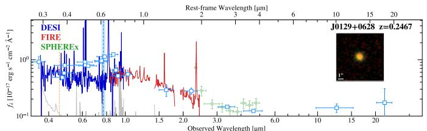

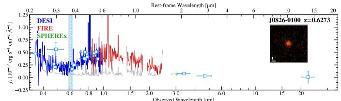

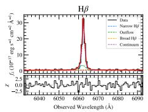

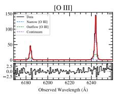

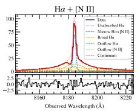

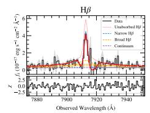

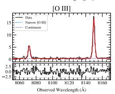

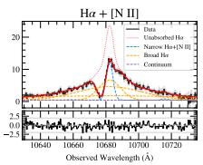

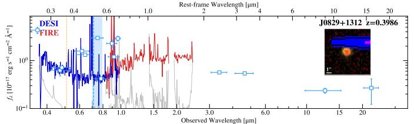

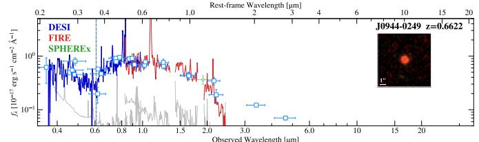

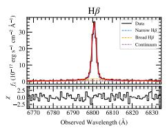

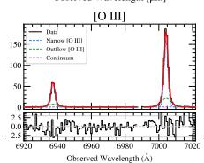

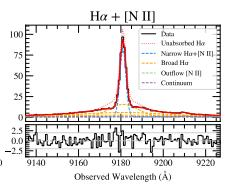

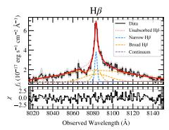

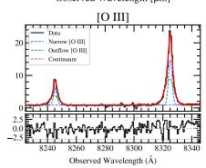

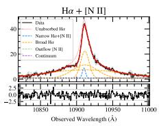

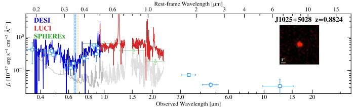

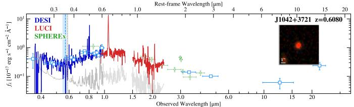

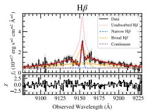

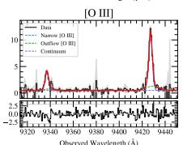

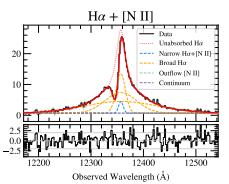

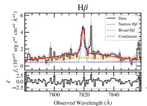

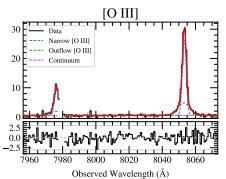

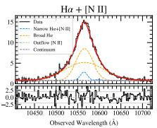  
Figure A.1. Gold sample: DESI DR1 LRDs with $k _ { \mathrm { r e d } } > 0$ at ≥ 3σ significance. Similar to Figure 2.

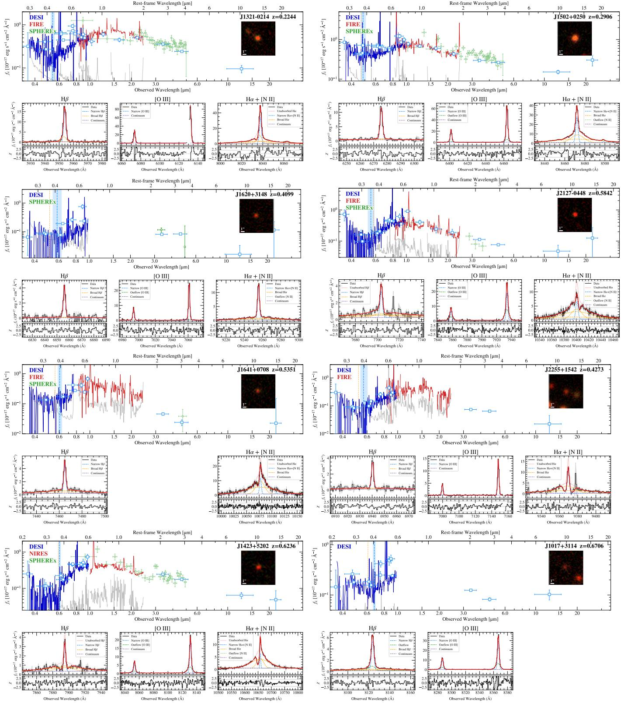  
Figure A.1. Continued.

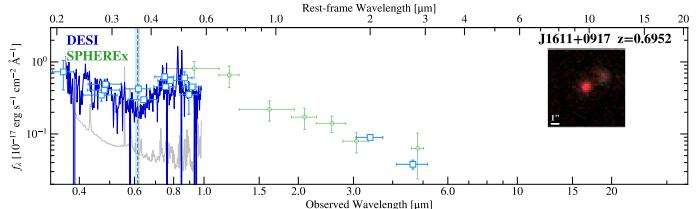

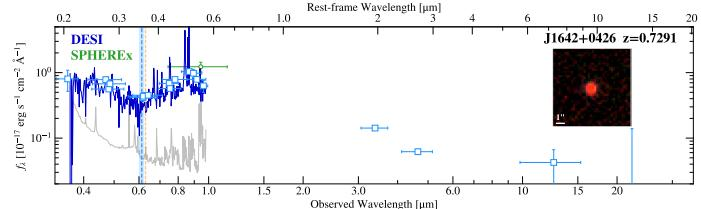

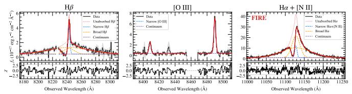

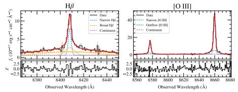

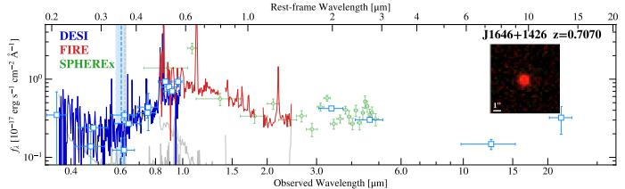

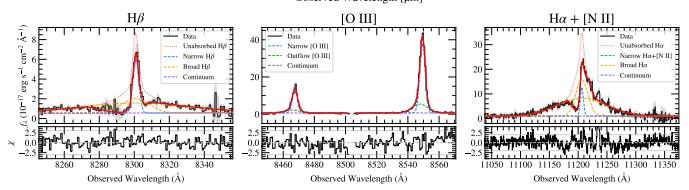  
Figure A.1. Continued. The continuum of J161102.44+091728.60 does not have sufficient S/N to reliably constrain its SED shape; we therefore use only its Hα emission in the analysis.

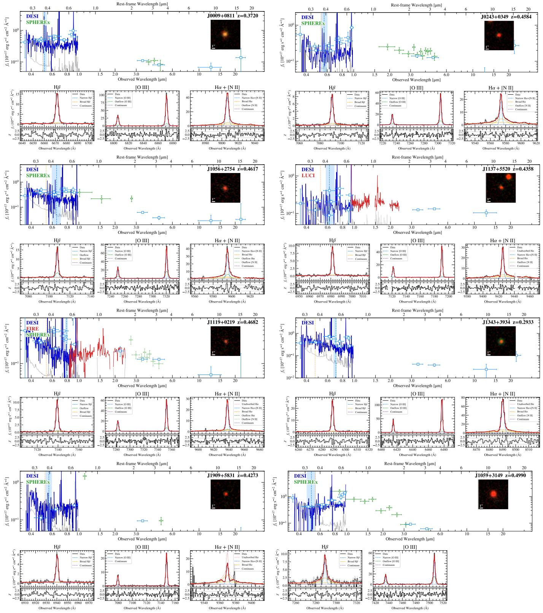  
Figure A.2. Silver sample: DESI DR1 LRDs with $k _ { \mathrm { r e d } } > 0 \mathrm { a t } <$ 3σ significance. Similar to Figure 2. Classification into the Silver tier does not preclude LRD nature; three of these eight sources exhibit Balmer absorption features characteristic of LRDs.

B. THE MEASURED PROPERTIES

$$
\mathrm { F W H M _ { n } }
$$

$$
\left( \mathrm { k m ~ s ^ { - 1 } } \right)
$$

$$
L _ { [ \mathrm { O I I I } ] , \mathrm { n } }
$$

$$
( 1 0 ^ { 4 0 } ~ \mathrm { e r g ~ s ^ { - 1 } } )
$$

$$
L _ { \mathrm { H } \beta , \mathrm { n } }
$$

$$
\mathrm { F W H M _ { H \beta , b } ^ { * } }
$$

$$
( 1 0 ^ { 4 0 } ~ \mathrm { e r g ~ s ^ { - 1 } } )
$$

$$
L _ { \mathrm { H } \beta , \mathrm { b } } ^ { * }
$$

$$
L _ { \mathrm { H } \alpha , \mathrm { n } }
$$

$$
( 1 0 ^ { 4 0 } ~ \mathrm { e r g ~ s ^ { - 1 } } )
$$

$$
( 1 0 ^ { 4 0 } ~ \mathrm { e r g ~ s ^ { - 1 } } )
$$

$$
\mathrm { F W H M _ { H \alpha , b } ^ { * } }
$$

$$
\underline { { ( \mathrm { k m ~ s } ^ { - 1 } ) } }
$$

$$
5 0 _ { - 1 } ^ { + 1 }
$$

$$
\left( \mathrm { k m ~ s ^ { - 1 } } \right)
$$

$$
\mathrm { J 0 1 2 9 + 0 6 2 8 }
$$

$$
L _ { \mathrm { H } \alpha , \mathbf { b } } ^ { * }
$$

$$
( 1 0 ^ { 4 0 } ~ \mathrm { e r g ~ s ^ { - 1 } } )
$$

$$
\mathrm { J 0 8 2 6 - 0 1 0 0 }
$$

$$
\overline { { 4 5 . 3 _ { - 1 . 2 } ^ { + 1 . 1 } } }
$$

$$
8 5 _ { - 3 } ^ { + 2 }
$$

$$
\mathrm { J 0 8 2 9 + 1 3 1 2 }
$$

$$
9 6 _ { - 1 } ^ { + 1 }
$$

$$
8 7 . 5 _ { - 1 . 8 } ^ { + 1 . 4 }
$$

$$
1 0 . 4 _ { - 0 . 4 } ^ { + 0 . 4 }
$$

$$
2 8 3 . 0 _ { - 3 . 6 } ^ { + 3 . 5 }
$$

$$
2 2 . 3 _ { - 0 . 9 } ^ { + 1 . 2 }
$$

$$
4 . 1 _ { - 1 . 1 } ^ { + 0 . 9 }
$$

$$
\overline { { 1 0 4 5 _ { - 3 0 8 } ^ { + 6 6 0 } } }
$$

$$
5 7 . 0 _ { - 0 . 9 } ^ { + 1 . 1 }
$$

$$
\overline { { { 3 4 . 4 _ { - 1 . 1 } ^ { + 1 . 0 } } } }
$$

$$
8 5 _ { - 6 } ^ { + 5 }
$$

$$
\mathrm { J 0 9 4 4 - 0 2 4 9 }
$$

$$
9 1 . 2 _ { - 7 . 1 } ^ { + 6 . 8 }
$$

$$
8 0 . 9 _ { - 1 6 . 1 } ^ { + 1 6 . 3 }
$$

$$
7 4 4 _ { - 2 7 } ^ { + 2 7 }
$$

$$
6 8 9 _ { - 2 4 0 } ^ { + 3 5 7 }
$$

$$
1 0 5 . 2 _ { - 8 . 3 } ^ { + 6 . 8 }
$$

$$
1 8 . 8 _ { - 1 . 7 } ^ { + 1 . 5 }
$$

$$
\overline { { 1 3 8 . 7 _ { - 1 . 5 } ^ { + 1 . 5 } } }
$$

$$
2 0 . 4 _ { - 1 . 9 } ^ { + 2 . 3 }
$$

$$
6 2 4 _ { - 5 6 } ^ { + 7 6 }
$$

$$
1 8 0 . 7 _ { - 2 . 0 } ^ { + 2 . 3 }
$$

$$
6 7 7 _ { - 1 5 2 } ^ { + 1 2 8 }
$$

$$
7 9 _ { - 1 } ^ { + 2 }
$$

$$
2 9 7 . 5 _ { - 8 . 4 } ^ { + 1 0 . 1 }
$$

$$
6 9 1 _ { - 9 7 } ^ { + 1 0 1 }
$$

$$
8 6 1 . 5 _ { - 6 6 . 0 } ^ { + 1 4 4 . 1 }
$$

$$
9 2 2 _ { - 1 2 4 } ^ { + 1 2 2 }
$$

$$
8 7 . 1 _ { - 1 4 . 2 } ^ { + 1 2 . 4 }
$$

$$
4 4 3 . 2 _ { - 3 4 . 1 } ^ { + 6 2 . 6 }
$$

$$
5 5 2 _ { - 2 0 } ^ { + 2 2 }
$$

$$
\mathrm { J 1 0 2 5 + 5 0 2 8 }
$$

$$
3 2 . 9 _ { - 1 . 0 } ^ { + 1 . 0 }
$$

$$
9 9 _ { - 5 } ^ { + 6 }
$$

$$
1 6 2 . 5 _ { - 1 0 . 9 } ^ { + 1 0 . 4 }
$$

$$
3 2 6 1 . 9 _ { - 1 2 2 . 9 } ^ { + 9 0 . 2 }
$$

$$
4 7 . 3 _ { - 4 . 4 } ^ { + 4 . 3 }
$$

$$
\mathrm { J 1 0 4 2 + 3 7 2 1 }
$$

$$
8 2 _ { - 3 } ^ { + 3 }
$$

$$
1 2 8 . 8 _ { - 4 . 1 } ^ { + 4 . 4 }
$$

$$
1 9 9 5 _ { - 2 3 3 } ^ { + 1 9 7 }
$$

$$
\mathrm { J 1 3 2 1 - 0 2 1 4 }
$$

$$
4 7 _ { - 1 } ^ { + 1 }
$$

$$
3 2 . 8 _ { - 2 . 6 } ^ { + 2 . 9 }
$$

$$
1 7 0 . 7 _ { - 2 7 . 2 } ^ { + 2 4 . 9 }
$$

$$
2 7 . 8 _ { - 0 . 2 } ^ { + 0 . 2 }
$$

$$
6 9 9 _ { - 4 1 } ^ { + 3 6 }
$$

$$
4 4 1 . 7 _ { - 5 0 . 8 } ^ { + 8 7 . 2 }
$$

$$
\mathrm { J 1 4 2 3 + 5 2 0 2 }
$$

$$
5 8 5 0 . 5 _ { - 7 5 . 9 } ^ { + 7 7 . 1 }
$$

$$
1 4 . 7 _ { - 1 . 1 } ^ { + 1 . 1 }
$$

$$
7 1 _ { - 2 } ^ { + 2 }
$$

$$
6 9 . 0 _ { - 2 0 . 8 } ^ { + 3 1 . 2 }
$$

$$
8 9 . 8 _ { - 1 . 6 } ^ { + 2 . 3 }
$$

$$
1 5 0 2 _ { - 1 5 4 } ^ { + 1 5 1 }
$$

$$
1 0 5 . 1 _ { - 8 . 0 } ^ { + 8 . 5 }
$$

$$
\mathrm { J 1 5 0 2 + 0 2 5 0 }
$$

$$
6 1 2 _ { - 7 5 } ^ { + 1 3 9 }
$$

$$
\mathrm { J 1 6 2 0 + 3 1 4 8 }
$$

$$
1 4 3 4 . 6 _ { - 3 7 . 2 } ^ { + 3 4 . 8 }
$$

$$
5 . 1 _ { - 0 . 2 } ^ { + 0 . 2 }
$$

$$
1 3 . 0 _ { - 0 . 3 } ^ { + 0 . 3 }
$$

$$
7 3 _ { - 2 } ^ { + 2 }
$$

$$
\mathrm { J 1 6 4 1 + 0 7 0 8 }
$$

$$
1 8 8 0 _ { - 2 1 9 } ^ { + 2 4 2 }
$$

$$
4 1 . 6 _ { - 1 . 0 } ^ { + 0 . 9 }
$$

$$
2 7 2 _ { - 6 } ^ { + 6 }
$$

$$
2 . 6 _ { - 0 . 4 } ^ { + 0 . 4 }
$$

$$
7 9 _ { - 4 } ^ { + 1 }
$$

$$
4 5 . 7 _ { - 2 . 4 } ^ { + 1 . 7 }
$$

$$
\mathrm { J 1 6 4 2 + 0 4 2 6 }
$$

$$
4 1 . 0 _ { - 0 . 6 } ^ { + 0 . 6 }
$$

$$
1 5 . 0 _ { - 0 . 7 } ^ { + 0 . 6 }
$$

$$
2 1 1 _ { - 5 } ^ { + 8 }
$$

$$
4 8 . 1 _ { - 1 . 3 } ^ { + 0 . 6 }
$$

$$
1 2 4 8 _ { - 6 5 } ^ { + 8 8 }
$$

$$
6 3 _ { - 2 } ^ { + 2 }
$$

$$
{ \mathrm { J } } 1 6 4 6 + 1 4 2 6
$$

$$
7 2 . 5 _ { - 1 0 . 0 } ^ { + 1 1 . 2 }
$$

$$
6 6 _ { - 6 } ^ { + 6 }
$$

$$
8 2 _ { - 2 } ^ { + 2 }
$$

$$
2 2 . 5 _ { - 0 . 4 } ^ { + 0 . 4 }
$$

$$
7 9 5 . 0 _ { - 2 8 . 3 } ^ { + 2 1 . 4 }
$$

$$
7 . 6 _ { - 0 . 3 } ^ { + 0 . 3 }
$$

$$
6 9 5 _ { - 1 5 } ^ { + 1 5 }
$$

$$
3 6 . 7 _ { - 0 . 7 } ^ { + 0 . 7 }
$$

$$
1 2 8 1 _ { - 2 7 5 } ^ { + 5 1 5 }
$$

$$
\mathrm { J 1 7 1 7 + 3 8 0 7 }
$$

$$
1 2 9 _ { - 2 } ^ { + 4 }
$$

$$
5 9 _ { - 3 } ^ { + 3 }
$$

$$
\mathrm { J 2 1 2 7 - 0 4 4 8 }
$$

$$
1 2 8 _ { - 2 } ^ { + 1 }
$$

$$
2 . 4 _ { - 0 . 6 } ^ { + 0 . 6 }
$$

$$
1 8 2 . 7 _ { - 1 0 4 . 0 } ^ { + 5 2 . 4 }
$$

$$
2 6 . 2 _ { - 1 . 6 } ^ { + 1 . 0 }
$$

$$
6 0 7 _ { - 5 2 } ^ { + 1 1 8 }
$$

$$
1 0 3 . 2 _ { - 1 . 0 } ^ { + 1 . 0 }
$$

$$
8 1 1 _ { - 3 3 } ^ { + 9 5 2 }
$$

$$
5 . 9 _ { - 0 . 4 } ^ { + 0 . 4 }
$$

$$
1 4 1 6 _ { - 2 6 0 } ^ { + 3 4 7 }
$$

$$
3 3 5 . 9 _ { - 5 . 3 } ^ { + 5 . 2 }
$$

$$
2 1 . 8 _ { - 0 . 6 } ^ { + 0 . 5 }
$$

$$
1 3 1 4 _ { - 1 3 8 } ^ { + 1 3 0 }
$$

$$
1 3 . 0 _ { - 0 . 8 } ^ { + 0 . 8 }
$$

$$
1 3 4 8 _ { - 3 8 4 } ^ { + 4 4 5 }
$$

$$
2 . 8 _ { - 1 . 1 } ^ { + 1 . 4 }
$$

$$
7 0 _ { - 4 } ^ { + 4 }
$$

$$
1 3 7 1 _ { - 3 2 8 } ^ { + 3 5 8 }
$$

$$
3 8 0 . 2 _ { - 6 . 3 } ^ { + 4 . 4 }
$$

$$
5 8 . 6 _ { - 3 . 7 } ^ { + 3 . 4 }
$$

$$
5 7 . 3 _ { - 1 2 . 2 } ^ { + 1 5 . 9 }
$$

$$
3 0 . 1 _ { - 3 . 1 } ^ { + 3 . 1 }
$$

$$
7 7 5 _ { - 8 2 } ^ { + 7 2 }
$$

$$
3 3 . 5 _ { - 2 . 4 } ^ { + 2 . 2 }
$$

$$
9 7 . 8 _ { - 3 . 5 } ^ { + 3 . 9 }
$$

$$
5 8 6 _ { - 9 7 } ^ { + 1 1 7 }
$$

$$
4 3 7 . 4 _ { - 1 1 . 9 } ^ { + 1 2 . 1 }
$$

$$
5 6 . 8 _ { - 3 . 9 } ^ { + 2 . 2 }
$$

$$
6 3 5 . 4 _ { - 2 7 . 7 } ^ { + 3 2 . 4 }
$$

$$
\mathrm { J 2 2 5 5 + 1 5 4 2 }
$$

$$
2 3 1 . 6 _ { - 4 . 4 } ^ { + 1 0 . 3 }
$$

$$
1 9 . 2 _ { - 1 . 3 } ^ { + 1 . 2 }
$$

$$
9 7 2 _ { - 1 2 7 } ^ { + 1 1 6 }
$$

$$
1 8 2 . 5 _ { - 1 1 . 0 } ^ { + 1 1 . 2 }
$$

$$
2 5 9 . 3 _ { - 1 7 . 9 } ^ { + 4 1 . 6 }
$$

$$
8 7 8 _ { - 5 5 } ^ { + 1 0 0 }
$$

$$
6 2 _ { - 2 } ^ { + 2 }
$$

$$
1 2 6 2 _ { - 3 9 2 } ^ { + 6 4 2 }
$$

$$
7 8 . 4 _ { - 4 . 3 } ^ { + 4 . 4 }
$$

$$
1 4 0 . 5 _ { - 1 6 . 0 } ^ { + 2 3 . 3 }
$$

$$
4 6 . 9 _ { - 3 . 6 } ^ { + 1 2 . 6 }
$$

$$
2 7 9 3 . 6 _ { - 1 8 3 . 4 } ^ { + 1 1 7 . 3 }
$$

$$
6 9 6 _ { - 1 7 7 } ^ { + 1 8 3 }
$$

$$
1 3 . 2 _ { - 1 . 1 } ^ { + 1 . 0 }
$$

$$
1 9 . 7 _ { - 5 . 0 } ^ { + 7 . 0 }
$$

$$
1 1 4 3 _ { - 3 5 4 } ^ { + 4 7 3 }
$$

$$
1 4 1 . 6 _ { - 5 . 5 } ^ { + 9 . 1 }
$$

$$
2 3 . 2 _ { - 0 . 6 } ^ { + 0 . 5 }
$$

$$
9 6 0 _ { - 1 3 4 } ^ { + 2 0 1 }
$$

$$
7 6 . 6 _ { - 1 1 . 5 } ^ { + 1 3 . 6 }
$$

$$
1 7 4 3 _ { - 6 7 1 } ^ { + 4 2 8 }
$$

$$
5 . 7 _ { - 0 . 6 } ^ { + 0 . 5 }
$$

$$
5 . 6 _ { - 2 . 0 } ^ { + 1 . 6 }
$$

$$
4 2 . 7 _ { - 3 . 9 } ^ { + 4 . 8 }
$$

$$
4 5 2 . 2 _ { - 1 4 . 5 } ^ { + 1 6 . 1 }
$$

$$
2 3 . 1 _ { - 1 . 1 } ^ { + 1 . 5 }
$$

$$
9 2 1 _ { - 1 5 2 } ^ { + 1 4 0 }
$$

$$
8 1 4 _ { - 1 1 0 } ^ { + 1 2 4 }
$$

$$
4 8 5 . 5 _ { - 3 6 . 0 } ^ { + 4 8 . 9 }
$$

$$
1 1 5 . 1 _ { - 8 . 6 } ^ { + 1 1 . 1 }
$$

$$
\mathrm { J 0 0 0 9 + 0 8 1 1 }
$$

$$
\overline { { 1 0 5 _ { - 2 } ^ { + 2 } } }
$$

$$
\overline { { 1 5 0 . 3 _ { - 3 . 6 } ^ { + 3 . 1 } } }
$$

$$
8 5 _ { - 2 } ^ { + 2 }
$$

$$
1 1 4 . 9 _ { - 2 . 9 } ^ { + 2 . 8 }
$$

$$
\overline { { 2 3 . 4 _ { - 0 . 6 } ^ { + 0 . 6 } } }
$$

$$
4 6 8 _ { - 5 1 } ^ { + 8 4 }
$$

$$
1 7 . 9 _ { - 0 . 6 } ^ { + 0 . 6 }
$$

$$
\overline { { { 4 . 8 _ { - 0 . 9 } ^ { + 1 . 0 } } } }
$$

$$
6 9 _ { - 3 } ^ { + 3 }
$$

$$
1 2 4 . 9 _ { - 6 . 0 } ^ { + 5 . 5 }
$$

$$
\overline { { 8 1 . 5 _ { - 1 . 7 } ^ { + 1 . 6 } } }
$$

$$
5 5 8 _ { - 4 4 } ^ { + 5 9 }
$$

$$
\mathrm { J 1 0 5 6 + 2 7 5 4 }
$$

$$
\overline { { 5 3 9 _ { - 3 9 } ^ { + 4 1 } } }
$$

$$
\overline { { 8 7 . 3 _ { - 2 . 2 } ^ { + 2 . 1 } } }
$$

$$
1 1 . 6 _ { - 1 . 8 } ^ { + 1 . 8 }
$$

$$
2 7 . 9 _ { - 1 . 4 } ^ { + 1 . 4 }
$$

$$
5 3 . 1 _ { - 1 . 5 } ^ { + 1 . 4 }
$$

$$
9 6 4 _ { - 2 6 6 } ^ { + 8 1 9 }
$$

$$
6 0 7 _ { - 2 7 } ^ { + 2 7 }
$$

$$
7 7 _ { - 8 } ^ { + 7 }
$$

$$
1 0 9 . 4 _ { - 1 5 . 3 } ^ { + 1 3 . 7 }
$$

$$
\mathrm { J 1 0 5 9 + 3 1 4 9 }
$$

$$
5 . 4 _ { - 1 . 8 } ^ { + 1 . 9 }
$$

$$
1 7 5 . 2 _ { - 3 . 7 } ^ { + 3 . 7 }
$$

$$
1 8 . 4 _ { - 2 . 9 } ^ { + 2 . 7 }
$$

$$
7 6 . 1 _ { - 3 . 3 } ^ { + 3 . 1 }
$$

$$
8 5 6 _ { - 6 8 } ^ { + 7 0 }
$$

$$
5 6 7 _ { - 1 3 9 } ^ { + 1 7 3 }
$$

$$
8 5 _ { - 2 } ^ { + 2 }
$$

$$
\mathrm { J 1 1 1 9 + 0 2 1 9 }
$$

$$
1 3 0 . 8 _ { - 9 . 6 } ^ { + 6 . 7 }
$$

$$
1 6 0 . 7 _ { - 4 . 4 } ^ { + 4 . 5 }
$$

$$
6 8 . 5 _ { - 1 0 . 2 } ^ { + 1 1 . 0 }
$$

$$
2 3 . 2 _ { - 1 . 2 } ^ { + 1 . 0 }
$$

$$
5 7 3 _ { - 1 0 4 } ^ { + 1 8 3 }
$$

$$
7 6 _ { - 3 } ^ { + 2 }
$$

$$
9 2 . 4 _ { - 4 . 2 } ^ { + 2 . 7 }
$$

$$
\mathrm { J 1 1 3 7 + 5 5 2 0 }
$$

$$
7 6 . 3 _ { - 3 . 9 } ^ { + 3 . 2 }
$$

$$
5 . 8 _ { - 1 . 5 } ^ { + 1 . 5 }
$$

$$
1 7 . 4 _ { - 0 . 6 } ^ { + 0 . 6 }
$$

$$
7 4 2 _ { - 1 1 2 } ^ { + 1 5 1 }
$$

$$
5 2 1 _ { - 7 3 } ^ { + 1 8 5 }
$$

$$
6 4 _ { - 1 } ^ { + 1 }
$$

$$
8 4 . 2 _ { - 1 . 1 } ^ { + 1 . 0 }
$$

$$
\mathrm { J 1 3 4 3 + 3 9 3 4 }
$$

$$
4 . 3 _ { - 1 . 3 } ^ { + 1 . 4 }
$$

$$
1 7 . 3 _ { - 0 . 4 } ^ { + 0 . 4 }
$$

$$
6 4 . 7 _ { - 3 . 9 } ^ { + 8 . 1 }
$$

$$
9 4 . 5 _ { - 4 . 1 } ^ { + 4 . 3 }
$$

$$
8 0 _ { - 1 } ^ { + 1 }
$$

$$
4 2 . 0 _ { - 0 . 5 } ^ { + 0 . 5 }
$$

$$
6 2 3 _ { - 8 5 } ^ { + 1 8 8 }
$$

$$
5 9 3 _ { - 5 3 } ^ { + 6 0 }
$$

$$
\underline { { 1 0 . 3 _ { - 0 . 5 } ^ { + 0 . 5 } } }
$$

$$
5 . 5 _ { - 0 . 8 } ^ { + 0 . 8 }
$$

$$
\underline { { 8 3 1 _ { - 3 3 4 } ^ { + 6 5 9 } } }
$$

$$
{ \underline { { 4 . 2 _ { - 1 . 4 } ^ { + 1 . 5 } } } }
$$

$$
5 4 . 8 _ { - 0 . 7 } ^ { + 0 . 7 }
$$

$$
3 6 . 0 _ { - 1 . 1 } ^ { + 1 . 1 }
$$

$$
5 5 6 _ { - 2 1 } ^ { + 2 2 }
$$

$$
1 2 3 . 7 _ { - 4 . 0 } ^ { + 4 . 5 }
$$

$$
\underline { { 4 8 3 _ { - 1 1 1 } ^ { + 1 7 2 } } }
$$

$$
6 6 . 4 _ { - 1 . 3 } ^ { + 1 . 5 }
$$

$$
\underline { { 1 4 0 . 4 _ { - 2 7 . 4 } ^ { + 1 0 1 . 7 } } }
$$

Table B.1. Emission-line properties of DESI DR1 LRDs. n and b denote the narrow and broad components, respectively. For each target, the Hβ and Hα emission lines are modeled with 2–3 broad components that share the same FWHMs. FWHM∗ and $L ^ { * }$ denote the composite FWHM and luminosity of the broad components, defined as the summed luminosity and the corresponding FWHM of all broad components.

Lin et al.
<table><tr><td rowspan="2">Name</td><td rowspan="2"> $\Delta v _ { \mathrm { o u t } }$   $\left( \mathrm { k m ~ s ^ { - 1 } } \right)$ </td><td rowspan="2"> $L _ { [ \mathrm { O I I I } ] , \mathrm { o u t } }$   $( 1 0 ^ { 4 0 } ~ \mathrm { e r g ~ s ^ { - 1 } } )$ </td><td rowspan="2"> $\mathrm { F W H M _ { o u t } }$   $\left( \mathrm { k m ~ s ^ { - 1 } } \right)$ </td><td rowspan="2"> $\boldsymbol { L } _ { \mathrm { H } \beta , \mathrm { o u t } }$   $( 1 0 ^ { 4 0 } ~ \mathrm { e r g ~ s ^ { - 1 } } )$ </td><td rowspan="2"> $L _ { \mathrm { H } \alpha , \mathrm { o u t } }$   $( 1 0 ^ { 4 0 } ~ \mathrm { e r g ~ s ^ { - 1 } } )$ </td></tr><tr><td></td></tr><tr><td colspan="6">Gold sample</td></tr><tr><td> $\mathrm { J 0 1 2 9 + 0 6 2 8 }$ </td><td> $\overline { { - 2 1 _ { - 2 } ^ { + 2 } } }$ </td><td> $\overline { { 1 5 . 8 _ { - 1 . 0 } ^ { + 1 . 0 } } }$ </td><td> $1 7 5 _ { - 7 } ^ { + 8 }$ </td><td> $\overline { { 2 . 6 _ { - 0 . 5 } ^ { + 0 . 5 } } }$ </td><td> $\overline { { 1 1 . 0 _ { - 2 . 0 } ^ { + 2 . 1 } } }$ </td></tr><tr><td> $\mathrm { J 0 8 2 6 - 0 1 0 0 }$ </td><td></td><td></td><td></td><td></td><td></td></tr><tr><td> $\mathrm { J 0 8 2 9 + 1 3 1 2 }$ </td><td> $5 _ { - 2 } ^ { + 2 }$ </td><td> $9 5 . 5 _ { - 3 . 0 } ^ { + 2 . 8 }$ </td><td> $3 0 4 _ { - 6 } ^ { + 7 }$ </td><td></td><td></td></tr><tr><td> $\mathrm { J 0 9 4 4 - 0 2 4 9 }$ </td><td> $- 2 4 _ { - 3 } ^ { + 3 }$ </td><td> $1 2 9 . 9 _ { - 6 . 4 } ^ { + 6 . 7 }$ </td><td> $2 6 3 _ { - 9 } ^ { + 9 }$ </td><td></td><td></td></tr><tr><td> $\mathrm { J 1 0 1 7 + 3 1 1 4 }$ </td><td> $- 2 7 _ { - 2 } ^ { + 2 }$ </td><td> $1 0 5 . 4 _ { - 3 . 4 } ^ { + 2 . 8 }$ </td><td> $2 7 0 _ { - 6 } ^ { + 7 }$ </td><td> $1 3 . 2 _ { - 1 . 4 } ^ { + 1 . 6 }$ </td><td></td></tr><tr><td> $\mathrm { J 1 0 2 5 + 5 0 2 8 }$ </td><td> $4 8 _ { - 3 5 } ^ { + 6 5 }$ </td><td> $4 6 . 1 _ { - 1 1 . 8 } ^ { + 1 1 . 4 }$ </td><td> $4 1 4 _ { - 8 2 } ^ { + 1 6 6 }$ </td><td></td><td></td></tr><tr><td> $\mathrm { J 1 0 4 2 + 3 7 2 1 }$ </td><td> $- 1 3 _ { - 4 } ^ { + 5 }$ </td><td> $6 2 . 3 _ { - 3 . 9 } ^ { + 3 . 5 }$ </td><td> $3 0 3 _ { - 1 6 } ^ { + 1 8 }$ </td><td></td><td></td></tr><tr><td> $\mathrm { J 1 3 2 1 - 0 2 1 4 }$ </td><td></td><td></td><td></td><td></td><td></td></tr><tr><td> $\mathrm { J 1 4 2 3 + 5 2 0 2 }$ </td><td> $- 2 7 _ { - 3 } ^ { + 2 }$ </td><td> $5 4 . 2 _ { - 2 . 2 } ^ { + 1 . 4 }$ </td><td> $2 9 3 _ { - 9 } ^ { + 9 }$ </td><td></td><td></td></tr><tr><td> $\mathrm { J 1 5 0 2 + 0 2 5 0 }$ </td><td> $- 9 _ { - 6 } ^ { + 5 }$ </td><td> $8 . 5 _ { - 0 . 8 } ^ { + 0 . 9 }$ </td><td> $2 4 9 _ { - 1 9 } ^ { + 2 2 }$ </td><td></td><td></td></tr><tr><td> $\mathrm { J 1 6 1 1 + 0 9 1 7 }$ </td><td></td><td></td><td></td><td></td><td></td></tr><tr><td> $\mathrm { J 1 6 2 0 + 3 1 4 8 }$ </td><td> $- 7 3 _ { - 5 5 } ^ { + 4 1 }$ </td><td> $5 . 3 _ { - 1 . 0 } ^ { + 1 . 1 }$ </td><td> $5 9 2 _ { - 1 4 5 } ^ { + 2 7 0 }$ </td><td></td><td></td></tr><tr><td> $\mathrm { J 1 6 4 1 + 0 7 0 8 }$ </td><td></td><td></td><td></td><td></td><td></td></tr><tr><td> $\mathrm { J 1 6 4 2 + 0 4 2 6 }$ </td><td> $- 3 0 _ { - 6 } ^ { + 6 }$ </td><td> $1 5 2 . 3 _ { - 5 . 8 } ^ { + 5 . 8 }$ </td><td> $4 5 9 _ { - 1 8 } ^ { + 1 9 }$ </td><td></td><td></td></tr><tr><td> $\mathrm { J 1 6 4 6 + 1 4 2 6 }$ </td><td> $- 6 3 _ { - 4 } ^ { + 5 }$ </td><td> $1 3 7 . 8 _ { - 4 . 0 } ^ { + 5 . 8 }$ </td><td> $3 9 9 _ { - 1 4 } ^ { + 9 }$ </td><td></td><td></td></tr><tr><td> $\mathrm { J 1 6 5 4 + 0 3 3 7 }$ </td><td> $- 3 0 _ { - 7 } ^ { + 7 }$ </td><td> $3 2 . 4 _ { - 3 . 9 } ^ { + 3 . 5 }$ </td><td> $2 1 3 _ { - 1 5 } ^ { + 2 0 }$ </td><td></td><td></td></tr><tr><td> $\mathrm { J 1 7 1 7 + 3 8 0 7 }$ </td><td> $3 1 _ { - 1 } ^ { + 2 }$ </td><td> $1 0 3 . 7 _ { - 8 . 9 } ^ { + 4 . 5 }$ </td><td> $3 5 8 _ { - 7 } ^ { + 1 8 }$ </td><td> $3 . 6 _ { - 3 . 5 } ^ { + 8 . 3 }$ </td><td> $1 4 . 8 _ { - 1 3 . 1 } ^ { + 2 2 . 2 }$ </td></tr><tr><td> $\mathrm { J 2 1 2 7  – 0 4 4 8 }$ </td><td> $- 8 _ { - 3 } ^ { + 3 }$ </td><td> $7 7 . 6 _ { - 4 . 0 } ^ { + 4 . 1 }$ </td><td> $2 4 4 _ { - 9 } ^ { + 1 0 }$ </td><td></td><td></td></tr><tr><td> $\mathrm { J 2 2 5 5 + 1 5 4 2 }$ </td><td></td><td></td><td></td><td></td><td></td></tr><tr><td colspan="6">Silver sample</td></tr><tr><td> $\mathrm { J 0 0 0 9 + 0 8 1 1 }$ </td><td> $\overline { { 7 _ { - 5 } ^ { + 5 } } }$ </td><td> $\overline { { 2 1 . 9 _ { - 2 . 8 } ^ { + 3 . 3 } } }$ </td><td> $2 7 5 _ { - 2 2 } ^ { + 2 6 }$ </td><td></td><td></td></tr><tr><td> $\mathrm { J 0 2 4 3 + 0 3 4 9 }$ </td><td> $- 0 . 3 _ { - 3 } ^ { + 3 }$ </td><td> $4 4 . 2 _ { - 2 . 5 } ^ { + 2 . 6 }$ </td><td> $2 6 5 _ { - 1 2 } ^ { + 1 3 }$ </td><td></td><td></td></tr><tr><td> $\mathrm { J 1 0 5 6 + 2 7 5 4 }$ </td><td> $1 3 _ { - 2 } ^ { + 3 }$ </td><td> $7 6 . 0 _ { - 5 . 5 } ^ { + 5 . 8 }$ </td><td> $1 9 4 _ { - 8 } ^ { + 8 }$ </td><td> $1 1 . 0 _ { - 1 . 5 } ^ { + 1 . 4 }$ </td><td> $3 6 . 2 _ { - 3 . 9 } ^ { + 3 . 9 }$ </td></tr><tr><td> $\mathrm { J 1 0 5 9 + 3 1 4 9 }$ </td><td> $- 7 _ { - 5 } ^ { + 5 }$ </td><td> $8 6 . 0 _ { - 1 3 . 6 } ^ { + 1 4 . 0 }$ </td><td> $2 0 0 _ { - 1 6 } ^ { + 1 8 }$ </td><td></td><td></td></tr><tr><td> $\mathrm { J 1 1 1 9 + 0 2 1 9 }$ </td><td> $1 2 _ { - 3 } ^ { + 4 }$ </td><td> $3 0 . 1 _ { - 6 . 5 } ^ { + 9 . 2 }$ </td><td> $1 7 3 _ { - 1 8 } ^ { + 2 1 }$ </td><td> $2 . 0 _ { - 1 . 2 } ^ { + 1 . 5 }$ </td><td> $1 1 . 3 _ { - 4 . 0 } ^ { + 4 . 3 }$ </td></tr><tr><td> $\mathrm { J 1 1 3 7 + 5 5 2 0 }$ </td><td> $- 0 . 4 _ { - 1 1 } ^ { + 1 4 }$ </td><td> $8 . 3 _ { - 2 . 4 } ^ { + 3 . 9 }$ </td><td> $2 3 3 _ { - 5 2 } ^ { + 7 7 }$ </td><td></td><td></td></tr><tr><td> $\mathrm { J 1 3 4 3 + 3 9 3 4 }$ </td><td> $- 0 . 1 _ { - 6 } ^ { + 6 }$ </td><td> $8 . 2 _ { - 0 . 9 } ^ { + 0 . 9 }$ </td><td> $2 5 4 _ { - 2 4 } ^ { + 2 7 }$ </td><td></td><td></td></tr><tr><td> $\mathrm { J 1 9 0 9 + 5 8 3 1 }$ </td><td></td><td></td><td></td><td></td><td></td></tr></table>

Table B.2. Measured properties of the ionized gas outflows. The columns show, for each source: outflow velocity, [O III] outflow luminosity, FWHM of the outflow, Hβ and Hα outflow luminosities.

<table><tr><td>Name</td><td> $\lambda _ { \mathrm { p e a k } }$  (Å)</td><td> $T _ { \mathrm { b b } }$  (K)</td><td> $\log L _ { \mathrm { b b } }$   $( \mathrm { e r g s ^ { - 1 } } )$ </td><td> $T _ { \mathrm { M B } }$  (K)</td><td> $\beta _ { \mathrm { M B } }$ </td></tr><tr><td></td><td></td><td>Gold sample</td><td></td><td></td><td></td></tr><tr><td> $\mathrm { J 0 1 2 9 + 0 6 2 8 }$ </td><td> $\overline { { 8 3 5 1 _ { - 8 2 } ^ { + 7 5 } } }$ </td><td> $3 4 7 0 _ { - 3 1 } ^ { + 3 4 }$ </td><td> $4 2 . 4 9 _ { - 0 . 0 1 } ^ { + 0 . 0 1 }$ </td><td> $1 1 2 2 _ { - 7 5 } ^ { + 8 0 }$ </td><td> $\overline { { 1 0 . 3 7 _ { - 0 . 9 6 } ^ { + 1 . 0 3 } } }$ </td></tr><tr><td> $\mathrm { J 0 8 2 6 - 0 1 0 0 }$ </td><td> $7 3 6 3 _ { - 6 6 } ^ { + 6 0 }$ </td><td> $3 9 3 6 _ { - 3 2 } ^ { + 3 6 }$ </td><td> $4 4 . 0 5 _ { - 0 . 0 1 } ^ { + 0 . 0 1 }$ </td><td> $3 8 3 0 _ { - 1 2 3 } ^ { + 1 3 8 }$ </td><td> $0 . 1 4 _ { - 0 . 1 7 } ^ { + 0 . 1 5 }$ </td></tr><tr><td> $\mathrm { J 0 8 2 9 + 1 3 1 2 }$ </td><td> $1 2 8 0 2 _ { - 4 6 } ^ { + 5 0 }$ </td><td> $2 2 6 4 _ { - 9 } ^ { + 8 }$ </td><td> $4 4 . 2 7 _ { - 0 . 0 1 } ^ { + 0 . 0 1 }$ </td><td> $2 2 4 8 _ { - 3 3 } ^ { + 3 3 }$ </td><td> $0 . 0 4 _ { - 0 . 0 7 } ^ { + 0 . 0 7 }$ </td></tr><tr><td> $\mathrm { J 0 9 4 4 - 0 2 4 9 }$ </td><td> $6 2 0 2 _ { - 2 6 } ^ { + 2 6 }$ </td><td> $4 6 7 3 _ { - 2 0 } ^ { + 2 0 }$ </td><td> $4 4 . 2 8 _ { - 0 . 0 1 } ^ { + 0 . 0 1 }$ </td><td> $3 9 2 4 _ { - 8 4 } ^ { + 8 6 }$ </td><td> $0 . 9 3 _ { - 0 . 1 1 } ^ { + 0 . 1 2 }$ </td></tr><tr><td> $\mathrm { J 1 0 2 5 + 5 0 2 8 }$ </td><td> $7 2 9 3 _ { - 2 6 } ^ { + 2 4 }$ </td><td> $3 9 7 4 _ { - 1 3 } ^ { + 1 4 }$ </td><td> $4 4 . 6 5 _ { - 0 . 0 1 } ^ { + 0 . 0 1 }$ </td><td> $3 1 6 5 _ { - 5 4 } ^ { + 5 4 }$ </td><td> $1 . 2 5 _ { - 0 . 1 0 } ^ { + 0 . 1 0 }$ </td></tr><tr><td> $\mathrm { J 1 0 4 2 + 3 7 2 1 }$ </td><td> $6 7 8 1 _ { - 3 6 } ^ { + 3 7 }$ </td><td> $4 2 7 4 _ { - 2 3 } ^ { + 2 3 }$ </td><td> $4 4 . 1 8 _ { - 0 . 0 1 } ^ { + 0 . 0 1 }$ </td><td> $4 8 5 8 _ { - 1 2 1 } ^ { + 1 3 5 }$ </td><td> $- 0 . 5 8 _ { - 0 . 1 0 } ^ { + 0 . 1 0 }$ </td></tr><tr><td> $\mathrm { J 1 3 2 1 - 0 2 1 4 }$ </td><td> $1 1 9 9 6 _ { - 4 3 } ^ { + 4 4 }$ </td><td> $2 4 1 6 _ { - 9 } ^ { + 9 }$ </td><td> $4 3 . 6 0 _ { - 0 . 0 1 } ^ { + 0 . 0 1 }$ </td><td> $3 7 0 2 _ { - 5 0 } ^ { + 5 0 }$ </td><td> $- 1 . 6 3 _ { - 0 . 0 4 } ^ { + 0 . 0 4 }$ </td></tr><tr><td> $\mathrm { J 1 4 2 3 + 5 2 0 2 }$ </td><td> $7 2 8 2 _ { - 2 8 } ^ { + 3 1 }$ </td><td> $3 9 8 0 _ { - 1 7 } ^ { + 1 6 }$ </td><td> $4 4 . 0 6 _ { - 0 . 0 1 } ^ { + 0 . 0 1 }$ </td><td> $3 7 8 4 _ { - 8 5 } ^ { + 8 9 }$ </td><td> $0 . 2 5 _ { - 0 . 1 2 } ^ { + 0 . 1 1 }$ </td></tr><tr><td> $\mathrm { J 1 5 0 2 + 0 2 5 0 }$ </td><td> $9 1 2 8 _ { - 3 3 } ^ { + 3 0 }$ </td><td> $3 1 7 5 _ { - 1 0 } ^ { + 1 2 }$ </td><td> $4 3 . 6 4 _ { - 0 . 0 1 } ^ { + 0 . 0 1 }$ </td><td> $3 9 7 6 _ { - 7 1 } ^ { + 7 7 }$ </td><td> $- 0 . 9 6 _ { - 0 . 0 7 } ^ { + 0 . 0 7 }$ </td></tr><tr><td> $\mathrm { J 1 6 4 1 + 0 7 0 8 }$ </td><td> $7 9 1 2 _ { - 8 0 } ^ { + 7 6 }$ </td><td> $3 6 6 3 _ { - 3 5 } ^ { + 3 7 }$ </td><td> $4 3 . 6 5 _ { - 0 . 0 1 } ^ { + 0 . 0 2 }$ </td><td> $2 1 8 4 _ { - 1 0 4 } ^ { + 1 1 2 }$ </td><td> $3 . 3 3 _ { - 0 . 4 1 } ^ { + 0 . 4 3 }$ </td></tr><tr><td> $\mathrm { J 1 6 4 6 + 1 4 2 6 }$ </td><td> $6 7 0 6 _ { - 2 2 } ^ { + 2 0 }$ </td><td> $4 3 2 1 _ { - 1 3 } ^ { + 1 4 }$ </td><td> $4 4 . 0 8 _ { - 0 . 0 1 } ^ { + 0 . 0 1 }$ </td><td> $1 9 7 0 _ { - 4 9 } ^ { + 4 9 }$ </td><td> $5 . 8 9 _ { - 0 . 2 5 } ^ { + 0 . 2 6 }$ </td></tr><tr><td> $\mathrm { J 1 6 5 4 + 0 3 3 7 }$ </td><td> $7 1 3 1 _ { - 1 7 } ^ { + 1 7 }$ </td><td> $4 0 6 4 _ { - 1 0 } ^ { + 1 0 }$ </td><td> $4 4 . 3 3 _ { - 0 . 0 1 } ^ { + 0 . 0 1 }$ </td><td> $3 5 8 5 _ { - 5 0 } ^ { + 5 2 }$ </td><td> $0 . 6 5 _ { - 0 . 0 7 } ^ { + 0 . 0 7 }$ </td></tr><tr><td> $\mathrm { J 1 7 1 7 + 3 8 0 7 }$ </td><td> $1 1 5 5 2 _ { - 7 } ^ { + 1 0 }$ </td><td> $2 5 0 9 _ { - 2 } ^ { + 2 }$ </td><td> $4 4 . 1 6 _ { - 0 . 0 1 } ^ { + 0 . 0 1 }$ </td><td> $2 7 8 5 _ { - 1 0 } ^ { + 1 0 }$ </td><td> $- 0 . 4 8 _ { - 0 . 0 2 } ^ { + 0 . 0 2 }$ </td></tr><tr><td> $\mathrm { J 2 1 2 7 - 0 4 4 8 }$ </td><td> $6 6 9 0 _ { - 6 4 } ^ { + 6 0 }$ </td><td> $4 3 3 2 _ { - 3 9 } ^ { + 4 2 }$ </td><td> $4 4 . 0 7 _ { - 0 . 0 1 } ^ { + 0 . 0 2 }$ </td><td> $6 2 1 5 _ { - 2 0 6 } ^ { + 2 3 1 }$ </td><td> $- 1 . 4 3 _ { - 0 . 1 0 } ^ { + 0 . 1 0 }$ </td></tr><tr><td> $\mathrm { J 2 2 5 5 + 1 5 4 2 }$ </td><td> $9 5 2 2 _ { - 6 5 } ^ { + 6 6 }$ </td><td> $3 0 4 4 _ { - 2 1 } ^ { + 2 1 }$ </td><td> $4 3 . 7 2 _ { - 0 . 0 1 } ^ { + 0 . 0 1 }$ </td><td> $2 7 7 5 _ { - 9 0 } ^ { + 9 0 }$ </td><td> $\underline { { 0 . 4 7 _ { - 0 . 1 6 } ^ { + 0 . 1 8 } } }$ </td></tr><tr><td colspan="6">Silver sample</td></tr><tr><td> $\mathrm { J 1 1 1 9 + 0 2 1 9 }$ </td><td> $\overline { { 1 4 6 5 8 _ { - 2 7 8 } ^ { + 3 0 6 } } }$ </td><td> $\overline { { 1 9 7 7 _ { - 4 0 } ^ { + 3 8 } } }$ </td><td> $4 3 . 9 2 _ { - 0 . 0 5 } ^ { + 0 . 0 5 }$ </td><td> $\overline { { { 3 3 0 8 _ { - 1 6 3 } ^ { + 1 9 2 } } } }$ </td><td> $- 1 . 8 7 _ { - 0 . 1 7 } ^ { + 0 . 1 7 }$ </td></tr><tr><td> $\mathrm { J 1 1 3 7 + 5 5 2 0 }$ </td><td> $1 0 8 9 6 _ { - 1 4 3 } ^ { + 1 6 2 }$ </td><td> $2 6 6 0 _ { - 3 9 } ^ { + 3 5 }$ </td><td> $4 3 . 5 3 _ { - 0 . 0 4 } ^ { + 0 . 0 5 }$ </td><td> $\underline { { 3 4 2 1 } } _ { - 2 2 7 } ^ { + 2 7 8 }$ </td><td> $- 1 . 0 6 _ { - 0 . 2 9 } ^ { + 0 . 2 9 }$ </td></tr></table>

Table B.3. Modified blackbody fitting results. $\lambda _ { \mathrm { p e a k } }$ is the rest-frame peak wavelength of the modified blackbody (MBB) fit; $T _ { \mathrm { p e a k } }$ is derived from $\lambda _ { \mathrm { p e a k } }$ via Wien’s law. log $L _ { \mathrm { b b } }$ denotes the bolometric luminosity of the MBB. $T _ { \mathrm { M B } }$ and $\beta _ { \mathrm { M B } }$ are the fitted parameters of the modified blackbody (namely the characteristic temperature and emissivity index, respectively). Note: $T _ { \mathrm { M B } }$ and $\beta _ { \mathrm { M B } }$ are used here purely as a phenomenological description, and are not assigned further physical interpretation.

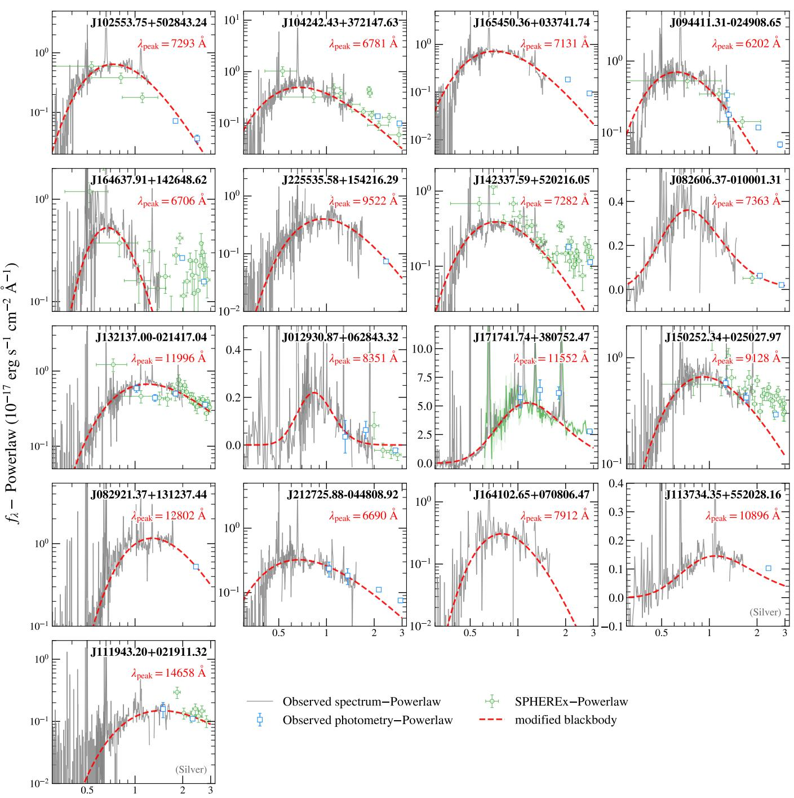  
Rest-frame wavelength ( m)  
Figure B.1. Targets in our sample with near-infrared spectra or photometry that sufficiently sample their blackbody-like continua and allow the peak wavelength to be determined. The spectrum and photometry shown for each object (gray lines and squares) have been subtracted by the power-law component fitted to the continuum blueward of the inflection points.

## C. LIGHT CURVES OF J1646+1426 AND J1909+5831

In Section 6.7, we present a variability analysis of our DESI LRD sample. In addition to the robustly variable source J1717+3807, J1646+1426 marginally satisfies the variability criteria in the ZTF i band and WISE W2, but only at ∼ 3σ significance. Its variability requires further confirmation. Its light curves are shown in Figure C.1.

J1909+5831’s WISE W1 light curve also passes the variability criteria. As shown in Figure C.2, J1909+5831 exhibits a brightening by 1.0 ± 0.2 mag from 2010-2014 to 2016-2019. However, we note that the light curve is derived from forced photometry anchored to the source position in the Legacy Survey images and measured on the unWISE coadds. The source is too faint to be reliably detected in individual WISE single-exposure frames. The light curve should be remeasured using more robust photometric methods to ensure a reliable variability assessment.

REFERENCES  
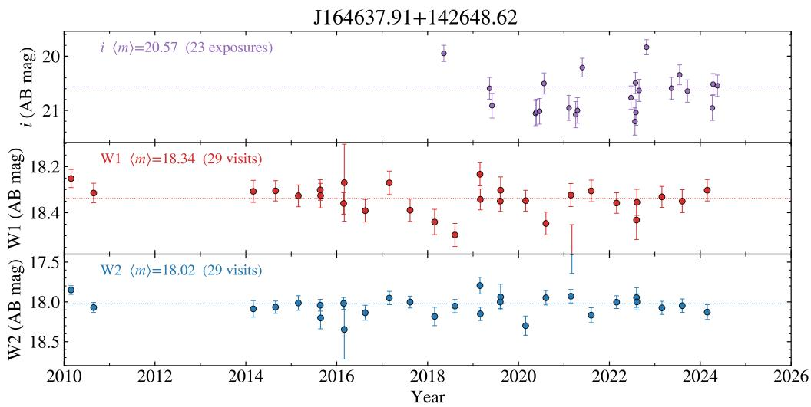  
Figure C.1. The ZTF i-band and WISE W1 and W2 light curves of J1646+1426. The i-band variability is based on only 23 exposures and thus lacks statistical significance. The W2 light curve, although marginally passing our selection criteria, shows low significance (only 3σ).

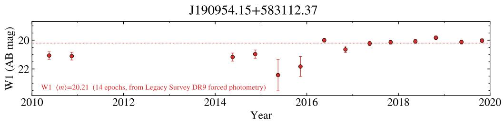  
Figure C.2. The W1 light curve of J1909+5831.

Abazajian, K. N., Adelman-McCarthy, J. K., Ag¨ueros, M. A., et al. 2009, ApJS, 182, 543, doi: 10.1088/0067-0049/182/2/543

Abdurro’uf, Accetta, K., Aerts, C., et al. 2022, ApJS, 259, 35, doi: 10.3847/1538-4365/ac4414

Akins, H. B., Casey, C. M., Lambrides, E., et al. 2024, arXiv e-prints, arXiv:2406.10341, doi: 10.48550/arXiv.2406.10341

Ananna, T. T., Bogd´an, A., Kov´acs, O. E., Natarajan, P.,´ & Hickox, R. C. 2024, ApJL, 969, L18, doi: 10.3847/2041-8213/ad5669

Arita, J., Kashikawa, N., Onoue, M., et al. 2025, MNRAS, 536, 3677, doi: 10.1093/mnras/stae2765

Asada, Y., Inayoshi, K., Fei, Q., Fujimoto, S., & Willott, C. 2026, arXiv e-prints, arXiv:2601.10573, doi: 10.48550/arXiv.2601.10573

Baggen, J. F. W., van Dokkum, P., Brammer, G., et al. 2024, ApJL, 977, L13, doi: 10.3847/2041-8213/ad90b8

Baldwin, J. A., Phillips, M. M., & Terlevich, R. 1981, PASP, 93, 5, doi: 10.1086/130766

Bao, L., Tsai, C.-W., Wu, J., & Wang, J. 2026, arXiv e-prints, arXiv:2605.04685, doi: 10.48550/arXiv.2605.04685

Barro, G., Perez-Gonzalez, P. G., Kocevski, D., et al. 2025, arXiv e-prints, arXiv:2512.15853, doi: 10.48550/arXiv.2512.15853

Bauer, A., Baltay, C., Coppi, P., et al. 2009, ApJ, 696, 1241, doi: 10.1088/0004-637X/696/2/1241

Begelman, M. C., & Dexter, J. 2026, ApJ, 996, 48, doi: 10.3847/1538-4357/ae274a

Bellm, E. C., Kulkarni, S. R., Graham, M. J., et al. 2019, PASP, 131, 018002, doi: 10.1088/1538-3873/aaecbe

Bevington, P. R., & Robinson, D. K. 2003, Data reduction and error analysis for the physical sciences

Bian, F., Kewley, L. J., Groves, B., & Dopita, M. A. 2020, MNRAS, 493, 580, doi: 10.1093/mnras/staa259

Bianchi, L. 2020, GALEX UV Unique Source Catalogs (”GUVcat”) and Cross-Matches With Gaia and SDSS (”GUVmatch”), STScI/MAST, doi: 10.17909/T9-PYXY-KG53

Bianchi, L., Shiao, B., & Thilker, D. 2017, ApJS, 230, 24, doi: 10.3847/1538-4365/aa7053

Bisigello, L., Rodighiero, G., Fotopoulou, S., et al. 2025, arXiv e-prints, arXiv:2503.15323, doi: 10.48550/arXiv.2503.15323

Bock, J. J., Aboobaker, A. M., Adamo, J., et al. 2026, ApJ, 999, 139, doi: 10.3847/1538-4357/ae2be2

Bolton, A. S., & Schlegel, D. J. 2010, PASP, 122, 248, doi: 10.1086/651008

Brazzini, M., D’Eugenio, F., Maiolino, R., et al. 2025, arXiv e-prints, arXiv:2507.08929, doi: 10.48550/arXiv.2507.08929

Burke, C. J., Stone, Z., Shen, Y., & Jiang, Y.-F. 2025, arXiv e-prints, arXiv:2511.16082, doi: 10.48550/arXiv.2511.16082

Cantiello, M., Hassan, J. B., Perna, R., et al. 2026, ApJL, 1000, L4, doi: 10.3847/2041-8213/ae4729

Carniani, S., Venturi, G., Parlanti, E., et al. 2024, A&A, 685, A99, doi: 10.1051/0004-6361/202347230

Carranza-Escudero, M., Conselice, C. J., Adams, N., et al. 2025, ApJL, 989, L50, doi: 10.3847/2041-8213/adf73d

Casey, C. M., Akins, H. B., Kokorev, V., et al. 2024, ApJL, 975, L4, doi: 10.3847/2041-8213/ad7ba7

Casey, C. M., Akins, H. B., Finkelstein, S. L., et al. 2025, arXiv e-prints, arXiv:2505.18873, doi: 10.48550/arXiv.2505.18873

Chang, S.-J., Gronke, M., Matthee, J., & Mason, C. 2026, MNRAS, 545, staf2131, doi: 10.1093/mnras/staf2131

Chaussidon, E., Y\`eche, C., Palanque-Delabrouille, N., et al. 2023, ApJ, 944, 107, doi: 10.3847/1538-4357/acb3c2

Chen, C.-H., Ho, L. C., Li, R., & Zhuang, M.-Y. 2025, ApJ, 983, 60, doi: 10.3847/1538-4357/ada93a

Chen, K., Li, Z., Inayoshi, K., & Ho, L. C. 2025, arXiv e-prints, arXiv:2505.22600, doi: 10.48550/arXiv.2505.22600

Chen, Y.-X., Liu, H., Li, R., et al. 2026, arXiv e-prints, arXiv:2602.06954, doi: 10.48550/arXiv.2602.06954

Collier, S., & Peterson, B. M. 2001, ApJ, 555, 775, doi: 10.1086/321517

Cooper, R. A., Caputi, K. I., Iani, E., et al. 2025, ApJ, 994, 102, doi: 10.3847/1538-4357/ae0580

Cutri, R. M., Wright, E. L., Conrow, T., et al. 2021, VizieR Online Data Catalog: AllWISE Data Release (Cutri+ 2013),, VizieR On-line Data Catalog: II/328. Originally published in: IPAC/Caltech (2013)

de Graaff, A., Rix, H.-W., Naidu, R. P., et al. 2025a, arXiv e-prints, arXiv:2503.16600, doi: 10.48550/arXiv.2503.16600

de Graaff, A., Hviding, R. E., Naidu, R. P., et al. 2025b, arXiv e-prints, arXiv:2511.21820, doi: 10.48550/arXiv.2511.21820

DESI Collaboration. 2025, arXiv e-prints, arXiv:2503.14745, doi: 10.48550/arXiv.2503.14745

DESI Collaboration, Adame, A. G., Aguilar, J., et al. 2024, AJ, 168, 58, doi: 10.3847/1538-3881/ad3217

D’Eugenio, F., Maiolino, R., Perna, M., et al. 2025a, arXiv e-prints, arXiv:2503.11752, doi: 10.48550/arXiv.2503.11752

D’Eugenio, F., Nelson, E., Ji, X., et al. 2025b, arXiv e-prints, arXiv:2510.00101, doi: 10.48550/arXiv.2510.00101

Dey, A., Schlegel, D. J., Lang, D., et al. 2019, AJ, 157, 168, doi: 10.3847/1538-3881/ab089d

Ding, W., Kong, X., Guo, W.-J., et al. 2026, arXiv e-prints, arXiv:2604.14551, doi: 10.48550/arXiv.2604.14551

Fitzpatrick, M. J., Olsen, K., Economou, F., et al. 2014, in Observatory Operations: Strategies, Processes, and Systems V, ed. A. B. Peck, C. R. Benn, & R. L. Seaman, Vol. 9149, International Society for Optics and Photonics (SPIE), 91491T, doi: 10.1117/12.2057445

Flewelling, H. A., Magnier, E. A., Chambers, K. C., et al. 2020, ApJS, 251, 7, doi: 10.3847/1538-4365/abb82d

Fu, S., Zhang, Z., Jiang, D., et al. 2025, arXiv e-prints, arXiv:2512.02096, doi: 10.48550/arXiv.2512.02096

Furtak, L. J., Labb´e, I., Zitrin, A., et al. 2024, Nature, 628, 57, doi: 10.1038/s41586-024-07184-8

Furtak, L. J., Secunda, A. R., Greene, J. E., et al. 2025, A&A, 698, A227, doi: 10.1051/0004-6361/202554110

Gaia Collaboration, Vallenari, A., Brown, A. G. A., et al. 2023, A&A, 674, A1, doi: 10.1051/0004-6361/202243940

Greene, J. E., & Ho, L. C. 2005, ApJ, 630, 122, doi: 10.1086/431897

Greene, J. E., Labbe, I., Goulding, A. D., et al. 2024, ApJ, 964, 39, doi: 10.3847/1538-4357/ad1e5f

Greene, J. E., Setton, D. J., Furtak, L. J., et al. 2025, arXiv e-prints, arXiv:2509.05434, doi: 10.48550/arXiv.2509.05434

Guy, J., Bailey, S., Kremin, A., et al. 2023, AJ, 165, 144, doi: 10.3847/1538-3881/acb212

Henry, A., Berg, D. A., Scarlata, C., Verhamme, A., & Erb, D. 2018, ApJ, 855, 96, doi: 10.3847/1538-4357/aab099

Ho, I.-T., Kewley, L. J., Dopita, M. A., et al. 2014, MNRAS, 444, 3894, doi: 10.1093/mnras/stu1653

Hughes, P. A., Aller, H. D., & Aller, M. F. 1992, ApJ, 396, 469, doi: 10.1086/171734

Hviding, R. E., de Graaff, A., Miller, T. B., et al. 2025, arXiv e-prints, arXiv:2506.05459, doi: 10.48550/arXiv.2506.05459

Hviding, R. E., de Graaff, A., Liu, H., et al. 2026, arXiv e-prints, arXiv:2601.09778, doi: 10.48550/arXiv.2601.09778

Inayoshi, K., & Maiolino, R. 2024, arXiv e-prints, arXiv:2409.07805, doi: 10.48550/arXiv.2409.07805

Inayoshi, K., Murase, K., & Kashiyama, K. 2025a, arXiv e-prints, arXiv:2509.19422, doi: 10.48550/arXiv.2509.19422

Inayoshi, K., Shangguan, J., Chen, X., Ho, L. C., & Haiman, Z. 2025b, arXiv e-prints, arXiv:2505.05322, doi: 10.48550/arXiv.2505.05322

Izotov, Y. I., Chisholm, J., Worseck, G., et al. 2022, MNRAS, 515, 2864, doi: 10.1093/mnras/stac1899

Izotov, Y. I., Schaerer, D., Thuan, T. X., et al. 2016, MNRAS, 461, 3683, doi: 10.1093/mnras/stw1205

Izotov, Y. I., Schaerer, D., Worseck, G., et al. 2025, A&A, 704, A19, doi: 10.1051/0004-6361/202556004

Izotov, Y. I., Worseck, G., Schaerer, D., et al. 2018, MNRAS, 478, 4851, doi: 10.1093/mnras/sty1378

Ji, X., Maiolino, R., Ubler, H., et al. 2025a, arXiv e-prints,¨ arXiv:2501.13082, doi: 10.48550/arXiv.2501.13082

Ji, X., D’Eugenio, F., Juodˇzbalis, I., et al. 2025b, arXiv e-prints, arXiv:2507.23774, doi: 10.48550/arXiv.2507.23774

Ji, X., Pezzulli, G., D’Eugenio, F., et al. 2026, arXiv e-prints, arXiv:2604.03370, doi: 10.48550/arXiv.2604.03370

Juodˇzbalis, I., Ji, X., Maiolino, R., et al. 2024, MNRAS, 535, 853, doi: 10.1093/mnras/stae2367

Karouzos, M., Woo, J.-H., & Bae, H.-J. 2016, ApJ, 819, 148, doi: 10.3847/0004-637X/819/2/148

Kauffmann, G., Heckman, T. M., Tremonti, C., et al. 2003, MNRAS, 346, 1055, doi: 10.1111/j.1365-2966.2003.07154.x

Kewley, L. J., Groves, B., Kauffmann, G., & Heckman, T. 2006, MNRAS, 372, 961, doi: 10.1111/j.1365-2966.2006.10859.x

Kido, D., Ioka, K., Hotokezaka, K., Inayoshi, K., & Irwin, C. M. 2025, arXiv e-prints, arXiv:2505.06965, doi: 10.48550/arXiv.2505.06965

Kocevski, D. D., Finkelstein, S. L., Barro, G., et al. 2024, arXiv e-prints, arXiv:2404.03576, doi: 10.48550/arXiv.2404.03576

Kocevski, D. D., Finkelstein, S. L., Barro, G., et al. 2025, ApJ, 986, 126, doi: 10.3847/1538-4357/adbc7d

Kokorev, V., Caputi, K. I., Greene, J. E., et al. 2024, ApJ, 968, 38, doi: 10.3847/1538-4357/ad4265

Kokubo, M., & Harikane, Y. 2024, arXiv e-prints, arXiv:2407.04777, doi: 10.48550/arXiv.2407.04777

Koz lowski, S., Kochanek, C. S., Udalski, A., et al. 2010, ApJ, 708, 927, doi: 10.1088/0004-637X/708/2/927

Labbe, I., Greene, J. E., Matthee, J., et al. 2024, arXiv e-prints, arXiv:2412.04557, doi: 10.48550/arXiv.2412.04557

Labbe, I., Greene, J. E., Bezanson, R., et al. 2025, ApJ, 978, 92, doi: 10.3847/1538-4357/ad3551

Lawrence, A., Warren, S. J., Almaini, O., et al. 2007, MNRAS, 379, 1599, doi: 10.1111/j.1365-2966.2007.12040.x

Li, Z., Inayoshi, K., Chen, K., Ichikawa, K., & Ho, L. C. 2025, ApJ, 980, 36, doi: 10.3847/1538-4357/ada5fb

Lin, R., Zheng, Z.-Y., Jiang, C., et al. 2025, ApJL, 980, L34, doi: 10.3847/2041-8213/adaaf1

Lin, X., Wang, F., Fan, X., et al. 2024, ApJ, 974, 147, doi: 10.3847/1538-4357/ad6565

Lin, X., Fan, X., Wang, F., et al. 2025, arXiv e-prints, arXiv:2504.08039, doi: 10.48550/arXiv.2504.08039

Lin, X., Fan, X., Sun, F., et al. 2026a, ApJ, 997, 61, doi: 10.3847/1538-4357/ae1eef

Lin, X., Fan, X., Cai, Z., et al. 2026b, ApJ, 997, 364, doi: 10.3847/1538-4357/ae2bdf

Liu, H., Jiang, Y.-F., Quataert, E., Greene, J. E., & Ma, Y. 2025, arXiv e-prints, arXiv:2507.07190. https://arxiv.org/abs/2507.07190

Liu, H., Jiang, Y.-F., Quataert, E., et al. 2026, arXiv e-prints, arXiv:2603.02317, doi: 10.48550/arXiv.2603.02317

Liu, W., Veilleux, S., Canalizo, G., et al. 2020, ApJ, 905, 166, doi: 10.3847/1538-4357/abc269

Liu, W., Fan, X., Yang, J., et al. 2024, ApJ, 976, 33, doi: 10.3847/1538-4357/ad7de4

Liu, Z., Naidu, R. P., Secunda, A., et al. 2026, arXiv e-prints, arXiv:2604.13000, doi: 10.48550/arXiv.2604.13000

Loiacono, F., Gilli, R., Mignoli, M., et al. 2025, arXiv e-prints, arXiv:2506.12141, doi: 10.48550/arXiv.2506.12141

Ma, Y., Greene, J. E., Setton, D. J., et al. 2025a, arXiv e-prints, arXiv:2504.08032, doi: 10.48550/arXiv.2504.08032

Ma, Y., Greene, J. E., Volonteri, M., et al. 2025b, arXiv e-prints, arXiv:2509.02662, doi: 10.48550/arXiv.2509.02662

MacLeod, C. L., Ivezi´c, Z., Kochanek, C. S., et al. 2010,ˇ ApJ, 721, 1014, doi: 10.1088/0004-637X/721/2/1014

Madau, P., & Maiolino, R. 2026, arXiv e-prints, arXiv:2602.22386. https://arxiv.org/abs/2602.22386

Mainzer, A., Bauer, J., Cutri, R. M., et al. 2014, ApJ, 792, 30, doi: 10.1088/0004-637X/792/1/30

Maiolino, R., Scholtz, J., Curtis-Lake, E., et al. 2024, A&A, 691, A145, doi: 10.1051/0004-6361/202347640

Maiolino, R., Risaliti, G., Signorini, M., et al. 2025, MNRAS, 538, 1921, doi: 10.1093/mnras/staf359

Manzano-King, C. M., Canalizo, G., & Sales, L. V. 2019, ApJ, 884, 54, doi: 10.3847/1538-4357/ab4197

Masci, F. J., Laher, R. R., Rusholme, B., et al. 2019, PASP, 131, 018003, doi: 10.1088/1538-3873/aae8ac

Matthee, J., Naidu, R. P., Brammer, G., et al. 2024, ApJ, 963, 129, doi: 10.3847/1538-4357/ad2345

Matthee, J., Naidu, R. P., Kotiwale, G., et al. 2025, ApJ, 988, 246, doi: 10.3847/1538-4357/ade886

Mazzolari, G., Gilli, R., Maiolino, R., et al. 2024, arXiv e-prints, arXiv:2412.04224, doi: 10.48550/arXiv.2412.04224

Moustakas, J., Scholte, D., Dey, B., & Khederlarian, A. 2023, FastSpecFit: Fast spectral synthesis and emission-line fitting of DESI spectra,, Astrophysics Source Code Library, record ascl:2308.005 http://ascl.net/2308.005

Myers, A. D., Moustakas, J., Bailey, S., et al. 2023, AJ, 165, 50, doi: 10.3847/1538-3881/aca5f9

Naidu, R. P., Matthee, J., Katz, H., et al. 2025, arXiv e-prints, arXiv:2503.16596, doi: 10.48550/arXiv.2503.16596

Newville, M., Otten, R., Nelson, A., et al. 2025, LMFIT: Non-Linear Least-Squares Minimization and Curve-Fitting for Python, 1.3.4 Zenodo, doi: 10.5281/zenodo.16175987

Nikutta, R., Fitzpatrick, M., Scott, A., & Weaver, B. 2020, Astronomy and Computing, 33, 100411, doi: https://doi.org/10.1016/j.ascom.2020.100411

Pacucci, F., & Narayan, R. 2024, ApJ, 976, 96, doi: 10.3847/1538-4357/ad84f7

Palanque-Delabrouille, N., Yeche, C., Myers, A. D., et al. 2011, A&A, 530, A122, doi: 10.1051/0004-6361/201016254

Park, K., Torralba, A., Matthee, J., et al. 2026, arXiv e-prints, arXiv:2605.14233. https://arxiv.org/abs/2605.14233

P´erez-Gonz´alez, P. G., Barro, G., Rieke, G. H., et al. 2024, ApJ, 968, 4, doi: 10.3847/1538-4357/ad38bb

P´erez-Gonz´alez, P. G., Barro, G., Carniani, S., et al. 2026, arXiv e-prints, arXiv:2602.20247, doi: 10.48550/arXiv.2602.20247

Perger, K., Fogasy, J., Frey, S., & Gab´anyi, K. E. 2025, ´ A&A, 693, L2, doi: 10.1051/0004-6361/202452422

Pizzati, E., Hennawi, J. F., Schaye, J., et al. 2025, MNRAS, 539, 2910, doi: 10.1093/mnras/staf660

Planck Collaboration, Aghanim, N., Akrami, Y., et al. 2020, A&A, 641, A6, doi: 10.1051/0004-6361/201833910

Prochaska, J., Hennawi, J., Westfall, K., et al. 2020, The Journal of Open Source Software, 5, 2308, doi: 10.21105/joss.02308

Raichoor, A., Moustakas, J., Newman, J. A., et al. 2023, AJ, 165, 126, doi: 10.3847/1538-3881/acb213

Reines, A. E., & Volonteri, M. 2015, ApJ, 813, 82, doi: 10.1088/0004-637X/813/2/82

Rinaldi, P., Rieke, G. H., Wu, Z., et al. 2025, arXiv e-prints, arXiv:2507.17738, doi: 10.48550/arXiv.2507.17738

Rupke, D. S., Veilleux, S., & Sanders, D. B. 2005, ApJS, 160, 87, doi: 10.1086/432886

Rusakov, V., Watson, D., Nikopoulos, G. P., et al. 2025, arXiv e-prints, arXiv:2503.16595, doi: 10.48550/arXiv.2503.16595

Sacchi, A., & Bogd´an, A. 2025, ApJL, 989, L30, ´ doi: 10.3847/2041-8213/adf5c8

Salehirad, S., Reines, A. E., & Molina, M. 2025, ApJ, 979, 26, doi: 10.3847/1538-4357/ad9a57

Sanders, R. L., Shapley, A. E., Topping, M. W., Reddy, N. A., & Brammer, G. B. 2023, ApJ, 955, 54, doi: 10.3847/1538-4357/acedad

Santarelli, A. D., Farag, E., Bellinger, E. P., et al. 2026, ApJL, 998, L4, doi: 10.3847/2041-8213/ae3713

Sun, W. Q., Naidu, R. P., Matthee, J., et al. 2026, arXiv e-prints, arXiv:2601.20929, doi: 10.48550/arXiv.2601.20929

Schaerer, D., Fragos, T., & Izotov, Y. I. 2019, A&A, 622, L10, doi: 10.1051/0004-6361/201935005

Schlafly, E. F., Meisner, A. M., & Green, G. M. 2019, ApJS, 240, 30, doi: 10.3847/1538-4365/aafbea

Seifert, W., Appenzeller, I., Baumeister, H., et al. 2003, in Society of Photo-Optical Instrumentation Engineers (SPIE) Conference Series, Vol. 4841, Instrument Design and Performance for Optical/Infrared Ground-based Telescopes, ed. M. Iye & A. F. M. Moorwood, 962–973, doi: 10.1117/12.459494

Senchyna, P., Stark, D. P., Vidal-Garc´ıa, A., et al. 2017, MNRAS, 472, 2608, doi: 10.1093/mnras/stx2059

Setton, D. J., Greene, J. E., de Graaff, A., et al. 2024, arXiv e-prints, arXiv:2411.03424, doi: 10.48550/arXiv.2411.03424

Setton, D. J., Greene, J. E., Spilker, J. S., et al. 2025, arXiv e-prints, arXiv:2503.02059, doi: 10.48550/arXiv.2503.02059

Shapley, A. E., Sanders, R. L., Topping, M. W., et al. 2025, ApJ, 980, 242, doi: 10.3847/1538-4357/adad68

Shirazi, M., & Brinchmann, J. 2012, MNRAS, 421, 1043, doi: 10.1111/j.1365-2966.2012.20439.x

Simcoe, R. A., Burgasser, A. J., Schechter, P. L., et al. 2013, PASP, 125, 270, doi: 10.1086/670241

Stanway, E. R., & Eldridge, J. J. 2018, MNRAS, 479, 75, doi: 10.1093/mnras/sty1353

Stern, D., McKernan, B., Graham, M. J., et al. 2018, ApJ, 864, 27, doi: 10.3847/1538-4357/aac726

Tang, M., Stark, D. P., Plat, A., et al. 2025, ApJ, 991, 217, doi: 10.3847/1538-4357/adfd57

Tang, M., Stark, D. P., Mason, C. A., et al. 2026, arXiv e-prints, arXiv:2604.03563, doi: 10.48550/arXiv.2604.03563

Tee, W. L., Fan, X., Wang, F., & Yang, J. 2025, ApJL, 983, L26, doi: 10.3847/2041-8213/adc5e3

Umeda, H., Inayoshi, K., Harikane, Y., & Murase, K. 2026, ApJ, 999, 183, doi: 10.3847/1538-4357/ae4101

Vaida, D. D., & Farber, R. J. 2025, arXiv e-prints, arXiv:2601.00089, doi: 10.48550/arXiv.2601.00089

Vaughan, S., Edelson, R., Warwick, R. S., & Uttley, P. 2003, MNRAS, 345, 1271, doi: 10.1046/j.1365-2966.2003.07042.x

Wang, B., Leja, J., de Graaff, A., et al. 2024, ApJL, 969, L13, doi: 10.3847/2041-8213/ad55f7

Wang, B., Leja, J., Katz, H., et al. 2025, arXiv e-prints, arXiv:2508.18358, doi: 10.48550/arXiv.2508.18358

Wang, B., Leja, J., Labbe, I., et al. 2026a, arXiv e-prints, arXiv:2602.06024, doi: 10.48550/arXiv.2602.06024

Wang, B., Leja, J., Labbe, I., et al. 2026b, arXiv e-prints, arXiv:2602.06024, doi: 10.48550/arXiv.2602.06024

Williams, C. C., Alberts, S., Ji, Z., et al. 2024, ApJ, 968, 34, doi: 10.3847/1538-4357/ad3f17

Wilson, J. C., Henderson, C. P., Herter, T. L., et al. 2004, in Society of Photo-Optical Instrumentation Engineers (SPIE) Conference Series, Vol. 5492, Ground-based Instrumentation for Astronomy, ed. A. F. M. Moorwood & M. Iye, 1295–1305, doi: 10.1117/12.550925

Wright, E. L., Eisenhardt, P. R. M., Mainzer, A. K., et al. 2010, AJ, 140, 1868, doi: 10.1088/0004-6256/140/6/1868

Xu, X., Henry, A., Heckman, T., et al. 2023, ApJ, 943, 94, doi: 10.3847/1538-4357/aca89a

Xu, Y., Ouchi, M., Nakajima, K., et al. 2025, ApJ, 984, 182, doi: 10.3847/1538-4357/adc733

Xu, Y., Ouchi, M., Rauch, M., et al. 2022, ApJ, 929, 134, doi: 10.3847/1538-4357/ac5e32

Yan, Z., Inayoshi, K., Chen, K., & Guo, J. 2025, arXiv e-prints, arXiv:2512.11050, doi: 10.48550/arXiv.2512.11050

Yue, M., Eilers, A.-C., Ananna, T. T., et al. 2024, ApJL, 974, L26, doi: 10.3847/2041-8213/ad7eba

Zhang, C., Wu, Q., Fan, X., et al. 2026, Nature Astronomy, doi: 10.1038/s41550-026-02785-x

Zhang, J., Egami, E., Sun, F., et al. 2025, arXiv e-prints, arXiv:2505.02895, doi: 10.48550/arXiv.2505.02895

Zhang, Y., Ding, X., Yang, L., et al. 2025, arXiv e-prints, arXiv:2510.25830, doi: 10.48550/arXiv.2510.25830

Zhang, Z., Jiang, L., Liu, W., & Ho, L. C. 2025a, ApJ, 985, 119, doi: 10.3847/1538-4357/adcb3e

Zhang, Z., Li, M., Oguri, M., et al. 2025b, arXiv e-prints, arXiv:2512.05180, doi: 10.48550/arXiv.2512.05180

Zhou, R., Dey, B., Newman, J. A., et al. 2023, AJ, 165, 58, doi: 10.3847/1538-3881/aca5fb

Zou, H., Sui, J., Saintonge, A., et al. 2024, ApJ, 961, 173, doi: 10.3847/1538-4357/ad1409

Zwick, L., Tiede, C., & Mayer, L. 2025, arXiv e-prints, arXiv:2507.22014, doi: 10.48550/arXiv.2507.22014