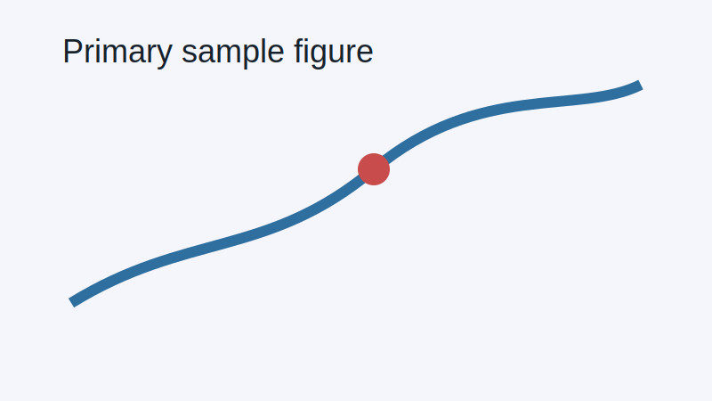
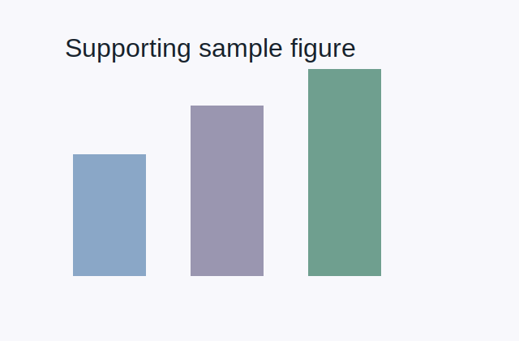

# Sample MinerU Paper

This compact sample mimics a MinerU-style paper directory for deterministic tests. It includes enough prose to exercise word counting, heading extraction, figure inventory, scaffold generation, and local asset copying without depending on a large external paper.

## Main Result

The first figure is a simple wide panel representing a primary result. The second figure is a smaller supporting panel. Together they provide a stable fixture for layout and ingestion tests.

